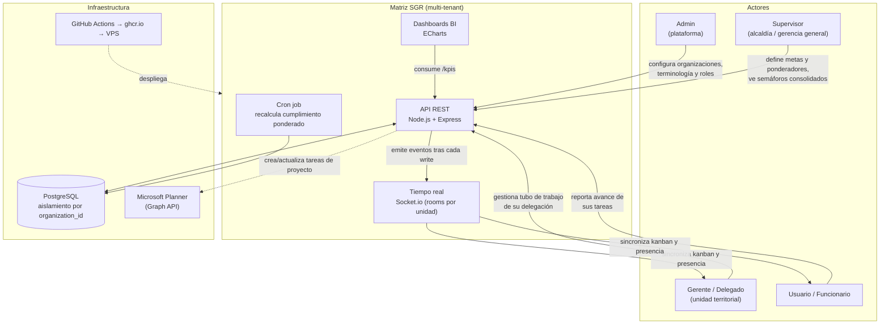
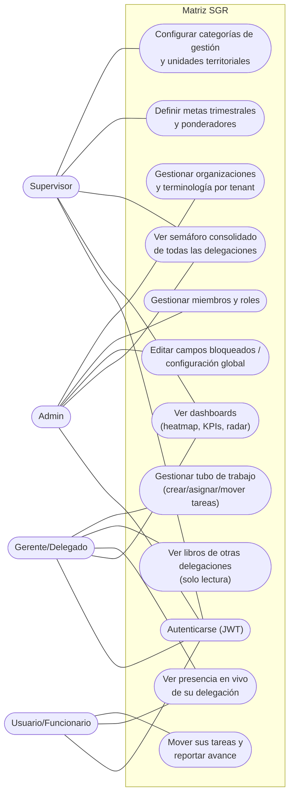
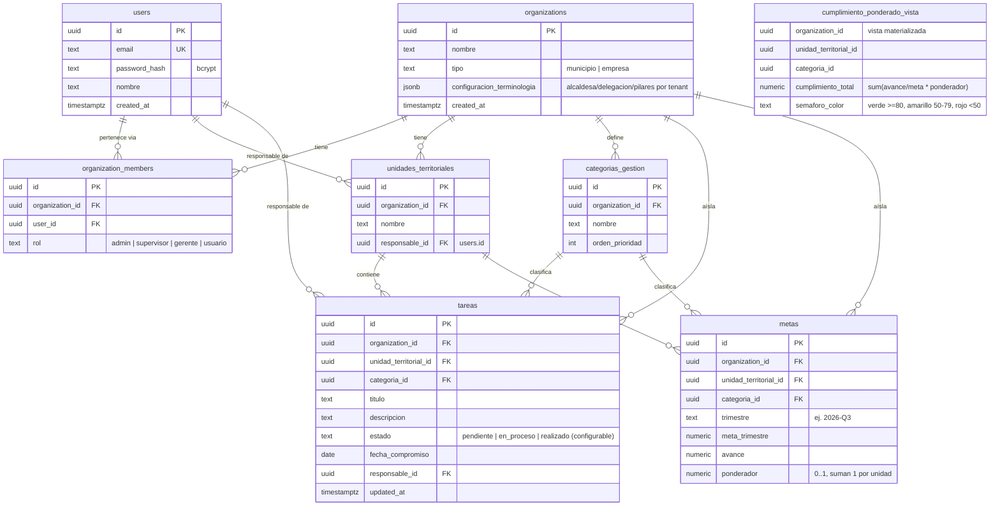
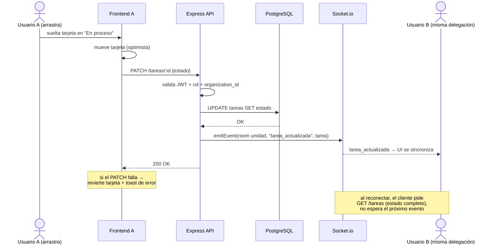

# Diagramas — Matriz SGR

**Versión**: 1.0 · **Fecha**: 25 de agosto de 2026
Formato Mermaid: se renderiza directo en GitHub/VS Code (extensión Markdown Preview Mermaid).

---

## 1. Diagrama de contexto y actores

---

## 2. Casos de uso por actor

Notas de alcance por rol (resumen de la matriz de permisos del documento maestro):

| Caso de uso | Admin | Supervisor | Gerente | Usuario |
|---|---|---|---|---|
| Configuración global / terminología | ✔ | — | — | — |
| Metas y ponderadores | ✔ | ✔ | — | — |
| Semáforos consolidados (toda la org) | ✔ | ✔ | lectura | — |
| Tubo de trabajo de su delegación | ✔ | ✔ | ✔ | solo sus tareas |
| Libros de otras delegaciones | ✔ | ✔ | lectura | — |
| Presencia en vivo | ✔ | ✔ | ✔ | ✔ |

---

## 3. Diagrama entidad-relación (ERD)

Decisiones registradas:
- **Toda tabla lleva `organization_id`** (incluso las que podrían derivarlo por FK) para que el middleware de Express filtre por tenant sin joins y los índices compuestos `(organization_id, ...)` sean directos.
- `users` es global (un email puede pertenecer a varias organizaciones vía `organization_members`); el rol vive en la membresía, no en el usuario.
- `cumplimiento_ponderado_vista` es **vista materializada** refrescada por cron (no trigger) según la arquitectura B del documento maestro.
- Columnas exactas de asistencia (licencia, vacaciones, compensatorios, días totales) quedan **pendientes de la definición del profesor**; se agregarán como tabla `asistencia` o columnas en `metas` sin romper el esquema.

---

## 4. Secuencia: drag & drop con actualización optimista + tiempo real

