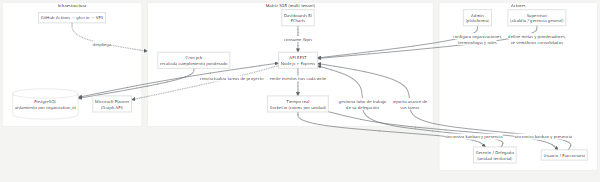
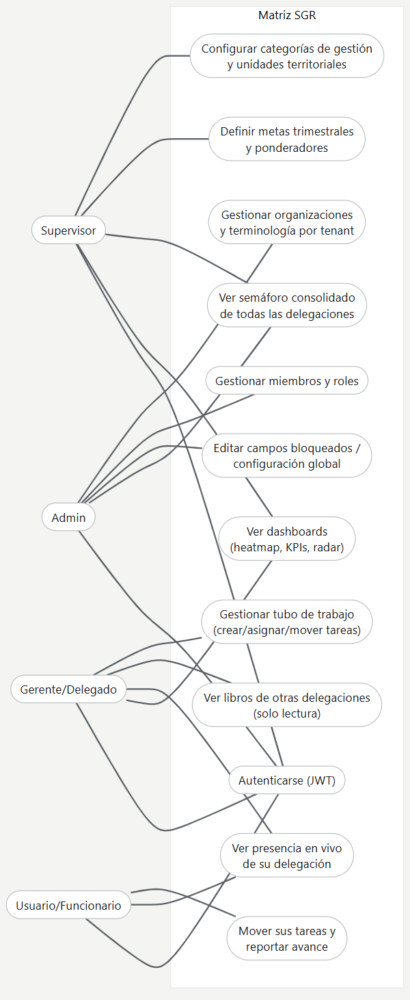
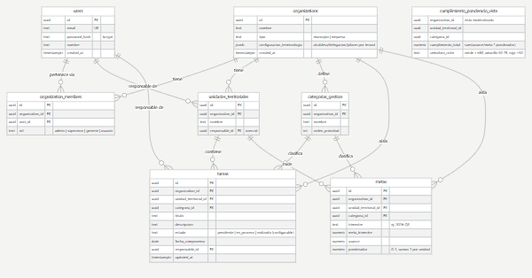
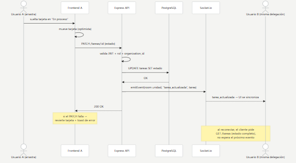

# Diagramas exportados

Generados desde los bloques `mermaid` de [../diagramas.md](../diagramas.md) con `node scripts/diagramas.mjs` (en `frontend/`). **La fuente es el .md**: si un diagrama cambia, se edita allá y se vuelve a exportar.

Están en PNG porque en Planner se adjuntan archivos y ahí no se renderiza mermaid.

## 1. Diagrama de contexto y actores

## 2. Casos de uso por actor

## 3. Diagrama entidad-relación (ERD)

## 4. Secuencia: drag & drop con actualización optimista + tiempo real

