# Casos de uso detallados — SGR

**Criterio 4 de la rúbrica — 20 puntos.** 10 de septiembre de 2026 · Equipo Origami SpA

Los **doce casos de uso específicos**, cada uno con su diagrama y su ficha completa. La rúbrica exige un mínimo de diez: presentar menos deja el criterio en «Insuficiente», con tope de 7 de 20 puntos.

Este documento va después del [caso de uso general](casos-uso-general.md), que dice **qué** hace el sistema y quién lo ejecuta. Aquí se dice **cómo**, paso a paso.

---

## 1. Cómo se lee cada ficha

La plantilla es la **ficha mínima de la rúbrica §5.4**, con sus doce campos. Se agregan dos filas —**Casos incluidos** y **Casos de extensión**— para que las relaciones UML del diagrama queden también en texto, y una fila de **Pantalla**, que es lo que cierra la cadena hasta el mockup.

| Campo | Qué contiene |
|---|---|
| **ID** y **Nombre** | El identificador `CU-nn` y el nombre funcional |
| **Objetivo** | El resultado que debe lograr quien lo ejecuta |
| **Actor principal** | Quien inicia el caso |
| **Actores secundarios** | Actores de apoyo. Cuando dice **Sistema** es porque ese trabajo lo hace el servidor sin intervención humana |
| **Precondiciones** | Lo que tiene que ser cierto antes de empezar |
| **Disparador** | El hecho que lo inicia |
| **Flujo principal** | La secuencia normal, numerada |
| **Flujos alternativos** | Variantes **válidas**: caminos distintos que igual terminan bien |
| **Excepciones** | Lo que **impide** completarlo, con la respuesta que devuelve el sistema |
| **Postcondiciones** | El estado en que queda el sistema |
| **Casos incluidos / de extensión** | Las relaciones UML del diagrama, en texto |
| **Reglas y requisitos** | RF, RNF, reglas de negocio y decisiones técnicas vinculadas |

### Cada ficha empieza por el requerimiento

Antes de la tabla va **el texto oficial del RF** que el caso satisface, citado de [requerimientos-oficiales.md](../requerimientos-oficiales.md). No es adorno: es la correspondencia con los RF que pide la rúbrica, y es lo que evita que la ficha describa **lo que el sistema hace** en vez de **lo que se le pidió que hiciera**.

Donde las dos cosas no coinciden, la ficha lo dice en un recuadro **⚠ Desvío**. Hay tres en este documento. Ninguno se disimula: un artefacto que describe el código como si fuera el requisito hace que el incumplimiento sea invisible, y es justo lo contrario de lo que sirve para planificar.

### Los flujos no están inventados

Los pasos y las respuestas salen del código y de las **332 comprobaciones automatizadas** del proyecto, en particular las 191 de `backend/scripts/verificar-api-v2.ts`. Por eso las fichas nombran códigos concretos (400, 403, 404, 409, 413, 415, 422) en vez de decir «el sistema muestra un error»: así el mismo documento sirve de base para las pruebas, que es el propósito que le da el docente.

### Un aviso sobre el vocabulario

El nombre técnico del rol **no** es el municipal: `supervisor` se dice **Coordinador** y `gerente` se dice **Delegado**. La equivalencia completa está en [casos-uso-general.md §3](casos-uso-general.md). En las fichas se usa el nombre municipal, que es el que ve el usuario.

---

## 2. Índice de los doce casos

| ID | Caso de uso | Actor principal | Módulo | Diagrama |
|---|---|---|---|---|
| [CU-01](#cu-01--registrar-actividad-diaria) | Registrar actividad diaria | Funcionario | M2 | [`11-cu-01`](puml/11-cu-01.png) |
| [CU-02](#cu-02--adjuntar-evidencia-a-una-actividad) | Adjuntar evidencia a una actividad | Funcionario | M2 | [`12-cu-02`](puml/12-cu-02.png) |
| [CU-03](#cu-03--validar-o-rechazar-una-evidencia) | Validar o rechazar una evidencia | Verificador | M2 | [`13-cu-03`](puml/13-cu-03.png) |
| [CU-04](#cu-04--configurar-metas-y-ponderadores) | Configurar metas y ponderadores | Administrador · Coordinador | M1 | [`14-cu-04`](puml/14-cu-04.png) |
| [CU-05](#cu-05--consultar-la-ficha-personal-y-el-semáforo) | Consultar la ficha personal y el semáforo | Funcionario | M2 | [`15-cu-05`](puml/15-cu-05.png) |
| [CU-06](#cu-06--registrar-un-compromiso-del-vecino-en-el-tubo) | Registrar un compromiso del vecino en el tubo | Funcionario · Delegado | M3 | [`16-cu-06`](puml/16-cu-06.png) |
| [CU-07](#cu-07--mover-un-compromiso-de-estado) | Mover un compromiso de estado | Funcionario · Delegado | M3 | [`17-cu-07`](puml/17-cu-07.png) |
| [CU-08](#cu-08--registrar-una-atención-social-y-sus-gestiones) | Registrar una atención social y sus gestiones | Funcionario | M2 | [`18-cu-08`](puml/18-cu-08.png) |
| [CU-09](#cu-09--consultar-el-tablero-consolidado) | Consultar el tablero consolidado | Delegado · Usuario de consulta | M4 | [`19-cu-09`](puml/19-cu-09.png) |
| [CU-10](#cu-10--anular-una-actividad-con-motivo) | Anular una actividad con motivo | Funcionario · Delegado | M5 | [`20-cu-10`](puml/20-cu-10.png) |
| [CU-11](#cu-11--buscar-el-historial-de-un-vecino-entre-delegaciones) | Buscar el historial de un vecino entre delegaciones | Funcionario · Coordinador | M5 | [`21-cu-11`](puml/21-cu-11.png) |
| [CU-12](#cu-12--controlar-la-actividad-de-usuarios) | Controlar la actividad de usuarios | Administrador · Coordinador | M4 | [`22-cu-12`](puml/22-cu-12.png) |

Los tres casos **incluidos** (CU-I1, CU-I2, CU-I3) y los seis de **extensión** (CU-E1 a CU-E6) no llevan ficha larga: aparecen en el diagrama del caso que los usa y su ficha corta está en [casos-uso-general.md §7 y §8](casos-uso-general.md), con el formato que el docente reserva para ellos.

---

## CU-01 · Registrar actividad diaria

> **RF-009** — Registrar actividades (fecha, actividad, acción, contacto, teléfono, ítem, ingreso a tubo).
> **RF-010** — Validar campos: obligatoriedad, formatos, coherencia.
> **RF-011** — Generar código de evidencia único e **inmutable**.

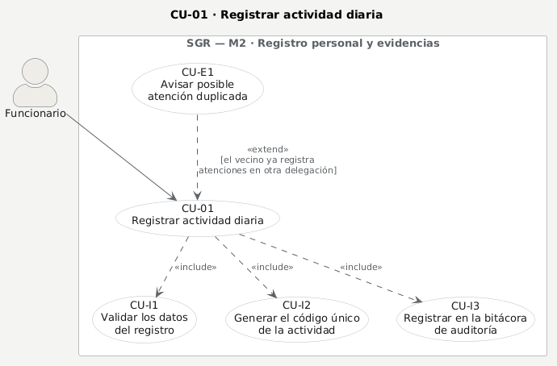

| Campo | Contenido |
|---|---|
| **ID** | CU-01 |
| **Nombre** | Registrar actividad diaria |
| **Objetivo** | Dejar asentada una atención realizada, con su fecha, su ítem de medición y su código único, para que después pueda respaldarse con evidencia y sumar al avance del período |
| **Actor principal** | Funcionario |
| **Actores secundarios** | **Sistema** (genera el código, resuelve la ficha del vecino, audita y emite el evento) |
| **Precondiciones** | Sesión iniciada · el funcionario pertenece a la organización y **tiene delegación asignada** · existe un **período abierto** · su cargo tiene ítems de medición configurados |
| **Disparador** | El funcionario termina una atención y la registra en su ficha personal |
| **Postcondiciones** | Actividad creada **con código único e inmutable** y **sin puntaje** · visible en su ficha y en el libro de su delegación · asiento en la bitácora · evento emitido a quienes estén conectados a esa delegación |
| **Casos incluidos** | CU-I1 validar los datos · CU-I2 generar el código único · CU-I3 auditar |
| **Casos de extensión** | CU-E1 avisar posible atención duplicada |
| **Reglas y requisitos** | RF-009, RF-010, RF-011 · RN-009, RN-013 · RNF-008 · ADR-001, ADR-004, ADR-008 |
| **Pantalla** | [`03-ficha`](../mockups/03-ficha.png) |

**Flujo principal**

1. El funcionario abre su **ficha personal** y elige registrar una actividad.
2. El sistema muestra el formulario con **los ítems de su cargo** y el período abierto vigente.
3. El funcionario ingresa la fecha, la descripción, la acción realizada y el ítem al que corresponde.
4. Si la atención fue a una persona, el funcionario la identifica y agrega su contacto.
5. El funcionario confirma el registro.
6. El sistema **valida los datos** (CU-I1): obligatoriedad, formato del RUT y del teléfono, fecha dentro del período e ítem perteneciente al cargo.
7. El sistema **resuelve la ficha del vecino**: si el RUT ya existe en la organización la reutiliza, y si no, la crea. El RUT es único **por organización, no por delegación**.
8. El sistema **genera el código único** de la actividad (CU-I2), correlativo por área y día.
9. El sistema guarda la actividad **sin puntaje** y la registra en la bitácora (CU-I3).
10. El sistema emite el evento a la delegación: la ficha y el tubo de quienes estén conectados se actualizan solos.
11. El sistema devuelve la actividad con su código y el funcionario la ve en su ficha.

**Flujos alternativos**

- **A1 · Registro a nombre de otra persona.** El Administrador, el Coordinador o el Delegado **responsable de esa delegación** pueden registrar por un funcionario. El registro queda a nombre del funcionario, no de quien lo escribió, y la bitácora guarda a los dos.
- **A2 · La actividad nace de un compromiso del tubo.** Llega con el compromiso asociado y queda enlazada a él, de modo que lo comprometido y lo ejecutado son el mismo hecho y no se cuentan dos veces.
- **A3 · El vecino ya tenía ficha.** El sistema la reutiliza por RUT en vez de crear una segunda. Es lo que hace detectable la duplicidad entre delegaciones.
- **A4 · El vecino ya fue atendido en otra delegación.** Se dispara **CU-E1**: la respuesta trae un aviso con las delegaciones donde ya registra atenciones. **No bloquea el registro**, informa.

**Excepciones**

- **E1 · Datos incompletos o mal formados** → **400**, con el detalle del campo que falla.
- **E2 · Fecha fuera del período** → **422**, indicando el rango exacto del período.
- **E3 · Ítem que no corresponde al cargo, o desactivado** → **422**, nombrando el ítem y el cargo.
- **E4 · Período cerrado** → **422**. Un período cerrado no admite registros nuevos (RN-013).
- **E5 · Rol sin permiso** → **403**. El Verificador y el Usuario de consulta no registran actividades (RNF-005), y registrar por otra persona sin jefatura tampoco se permite.
- **E6 · Período o funcionario inexistentes, o de otra organización** → **404**. Lo de otro organismo **no existe**, no «está prohibido»: un 403 ya revelaría que existe.
- **E7 · RUT o teléfono con formato inválido** → **422**, con el valor rechazado. El RUT se comprueba con módulo 11.

---

## CU-02 · Adjuntar evidencia a una actividad

> **RF-012** — Asociar evidencia (foto) al código, con fecha y autor de carga.
> **RNF-017** — Gestión de evidencias: formatos, tamaño, metadatos, acceso y retención.

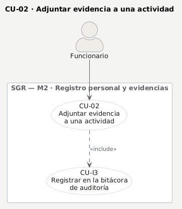

| Campo | Contenido |
|---|---|
| **ID** | CU-02 |
| **Nombre** | Adjuntar evidencia a una actividad |
| **Objetivo** | Respaldar una actividad con su fotografía, quedando asociada al código de la actividad, con su fecha y su autor de carga |
| **Actor principal** | Funcionario |
| **Actores secundarios** | **Sistema** (deriva la ruta desde el código, controla formato y tamaño, audita y avisa a la bandeja) |
| **Precondiciones** | La actividad existe y **no está anulada** · su período está **abierto** · quien sube puede editar esa actividad: su autor, la jefatura de esa delegación o el nivel central |
| **Disparador** | El funcionario tiene la fotografía que respalda lo que registró |
| **Postcondiciones** | Evidencia guardada y **pendiente de validación** · visible en la bandeja del verificador · asiento en la bitácora · dos eventos: uno a la delegación y otro a toda la organización |
| **Casos incluidos** | CU-I3 auditar |
| **Casos de extensión** | — |
| **Reglas y requisitos** | RF-011, RF-012 · RNF-017 · RN-013 · ADR-007 |
| **Pantalla** | [`03-ficha`](../mockups/03-ficha.png) |

**Flujo principal**

1. El funcionario abre la actividad en su ficha personal.
2. El funcionario elige el archivo de la evidencia.
3. El sistema comprueba que el **formato** esté entre los vigentes del catálogo.
4. El sistema comprueba que el **tamaño** no supere el máximo configurado en los parámetros.
5. El sistema guarda el archivo en una ruta **derivada del código de la actividad**, nunca del nombre que envió el cliente.
6. El sistema guarda el nombre original **saneado**, solo como metadato, junto al tipo, el tamaño y el autor de carga.
7. El sistema registra la operación en la bitácora (CU-I3).
8. El sistema avisa a la delegación y, además, a toda la organización que hay una evidencia pendiente: la bandeja del verificador es transversal.
9. La evidencia queda a la espera de CU-03.

**Flujos alternativos**

- **A1 · Varias evidencias para la misma actividad.** Cada una recibe su número de secuencia dentro del código; ninguna pisa a la anterior.
- **A2 · La jefatura sube la evidencia** de una actividad de su delegación, con el mismo flujo. El autor de carga que se guarda es quien subió, no el funcionario de la actividad.

**Excepciones**

- **E1 · Cuerpo vacío o sin archivo** → **400**.
- **E2 · Formato no permitido** → **415**, devolviendo **la lista de formatos aceptados**, que sale del catálogo y no del código.
- **E3 · Archivo demasiado grande** → **413**, diciendo cuánto pesa y cuál es el máximo configurado.
- **E4 · Sin permisos sobre la actividad** → **403**.
- **E5 · Actividad anulada** → **422**: una actividad anulada no admite evidencia nueva.
- **E6 · Período cerrado** → **422** (RN-013).
- **E7 · Actividad de otra organización** → **404**.
- **E8 · El archivo ya no está en el almacén al pedirlo** → **410**, que dice que se perdió el archivo, no que nunca existió.

---

## CU-03 · Validar o rechazar una evidencia

> **RF-013** — Validar evidencia: aprobar, rechazar o **solicitar corrección**, con observación.
> **RF-014** — **Solo lo validado suma al avance.**
> **RNF-005** — Autorización por rol, delegación y operación, con mínimo privilegio.

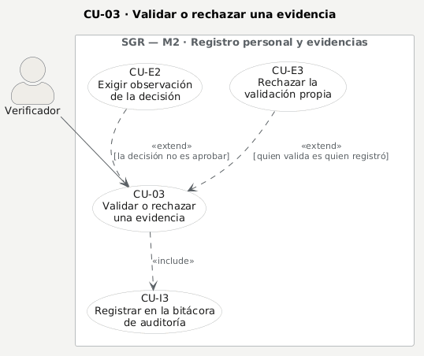

| Campo | Contenido |
|---|---|
| **ID** | CU-03 |
| **Nombre** | Validar o rechazar una evidencia |
| **Objetivo** | Decidir si la evidencia respalda lo que se registró, dejando constancia de quién decidió, cuándo y por qué. Es el único acto que convierte una actividad en puntaje |
| **Actor principal** | Verificador |
| **Actores secundarios** | **Sistema** (comprueba la segregación de funciones, audita y avisa que el cumplimiento cambió) |
| **Precondiciones** | Existe una evidencia pendiente · la actividad **no está anulada** · el período está **abierto** · quien valida **no es** quien registró la actividad ni quien subió la evidencia |
| **Disparador** | Hay evidencia esperando en la bandeja de verificación |
| **Postcondiciones** | Validación registrada con su verificador, su fecha y su observación · si fue **aprobada**, la actividad suma al avance **una sola vez** y el tablero se refresca · asiento en la bitácora con la decisión anterior y la nueva |
| **Casos incluidos** | CU-I3 auditar |
| **Casos de extensión** | CU-E2 exigir observación · CU-E3 rechazar la validación propia |
| **Reglas y requisitos** | RF-013, RF-014 · RN-009 · RNF-005, RNF-008 · CA-01 |
| **Pantalla** | [`04-verificacion`](../mockups/04-verificacion.png) |

**Flujo principal**

1. El verificador abre su bandeja.
2. El sistema muestra la cola de pendientes **con lo más antiguo primero**: lo pendiente es una cola, no un historial.
3. El verificador abre una evidencia y ve la fotografía en grande junto al código de la actividad.
4. El verificador elige una de las tres decisiones: **aprobar**, **rechazar** o **solicitar corrección**.
5. Si la decisión no es aprobar, el verificador escribe la observación que la sustenta (CU-E2).
6. El sistema comprueba que quien valida no sea quien registró ni quien subió (CU-E3).
7. El sistema registra la validación con el verificador, la fecha y la observación.
8. El sistema deja el asiento en la bitácora, guardando también la decisión anterior si la había (CU-I3).
9. El sistema avisa a la delegación y, si aprobó, avisa además que el cumplimiento cambió.
10. Solo entonces la actividad pasa a sumar en el cálculo de avance.

**Flujos alternativos**

- **A1 · Solicitar corrección.** La evidencia no se aprueba ni se rechaza definitivamente: vuelve al funcionario con la observación, que la corrige y sube una nueva (CU-02).
- **A2 · Revisión por teclado.** La bandeja se recorre con `J` y `K` y se decide con `Enter`, para revisar muchas seguidas sin soltar el teclado.
- **A3 · Valida el Coordinador o el Administrador.** Cuando el verificador no da abasto, pueden decidir, **con la misma prohibición** de validar lo propio.

**Excepciones**

- **E1 · Decisión distinta de aprobar sin observación** → **400**. Rechazar sin decir por qué no es trazabilidad (CU-E2).
- **E2 · Validar la propia evidencia o la propia actividad** → **403**, con el motivo escrito: segregación de funciones (CU-E3, RNF-005).
- **E3 · La evidencia ya fue aprobada** → **422**. Una aprobación es definitiva y su punto ya está contabilizado; para revertirla se **anula la actividad** con motivo (CU-10), que deja rastro. Cambiar la decisión borraría un puntaje ya contado.
- **E4 · Actividad anulada** → **422**: su evidencia ya no se valida.
- **E5 · Período cerrado** → **422** (RN-013).
- **E6 · Rol sin función de verificación** → **403**.
- **E7 · Evidencia de otra organización** → **404**.

---

## CU-04 · Configurar metas y ponderadores

> **RF-006** — Configurar ponderaciones por ítem, cargo y período.
> **RF-007** — Configurar metas y umbrales, **versionado**, rige desde el período.
> **RN-001** — Los ponderadores de un funcionario suman 100%.

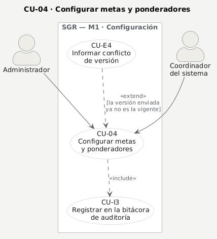

| Campo | Contenido |
|---|---|
| **ID** | CU-04 |
| **Nombre** | Configurar metas y ponderadores |
| **Objetivo** | Dejar definido, para un funcionario y un período, cuánto se le pide de cada ítem y cuánto pesa cada uno, de modo que el cálculo de cumplimiento tenga contra qué medir |
| **Actor principal** | Administrador · Coordinador |
| **Actores secundarios** | **Sistema** (comprueba RN-001, protege el puntaje ya validado, audita) |
| **Precondiciones** | El período existe y está **abierto** · el funcionario pertenece a la organización y **tiene cargo** · el cargo tiene ítems de medición asociados |
| **Disparador** | Empieza un período nuevo, o cambian las metas de un funcionario dentro del vigente |
| **Postcondiciones** | El conjunto de metas del funcionario para ese período queda guardado **cuadrado al 100%** · la configuración del período anterior **no se toca** · asiento en la bitácora con el conjunto anterior y el nuevo · aviso de que el cumplimiento cambió |
| **Casos incluidos** | CU-I3 auditar |
| **Casos de extensión** | CU-E4 informar conflicto de versión |
| **Reglas y requisitos** | RF-006, RF-007 · RN-001, RN-009, RN-013 · RNF-008 · CA-08 · ADR-005 |
| **Pantalla** | [`05-metas`](../mockups/05-metas.png) |

**Flujo principal**

1. El Administrador o el Coordinador abre la configuración de metas y elige el período y el funcionario.
2. El sistema muestra **todos los ítems del cargo**, con su meta y su ponderador vigentes, y un **totalizador siempre visible**.
3. Quien configura ajusta metas y ponderadores.
4. El totalizador indica cuánto suman los ponderadores y cuánto falta para el 100%.
5. Quien configura guarda **el conjunto completo**.
6. El sistema comprueba que ningún ítem venga repetido: cada ítem lleva una sola meta.
7. El sistema comprueba que cada ítem pertenezca al cargo del funcionario.
8. El sistema comprueba que los ponderadores sumen **100% exacto** (RN-001).
9. El sistema comprueba que la carga no deje fuera un ítem que **ya acumuló avance aprobado**.
10. El sistema comprueba que cada meta preexistente llegue con su **versión** (CU-E4).
11. El sistema guarda todo **en una transacción**: o queda cuadrado, o no cambia nada.
12. El sistema audita el cambio y avisa a la delegación y a la organización.

**Flujos alternativos**

- **A1 · Alta de a una.** El alta unitaria permite quedarse corta del 100%, porque la configuración se está armando; lo que no admite es **pasarse**. El guardado del conjunto sí exige el 100% exacto: ahí ya no hay excusa.
- **A2 · Reparto en partes iguales.** La pantalla ofrece repartir el 100% entre los ítems del cargo, como punto de partida.
- **A3 · Configurar el período siguiente.** Se hace sin tocar el cerrado: **el versionado es el período**, porque la meta cuelga de él.

**Excepciones**

- **E1 · Los ponderadores no suman 100%** → **422**, diciendo cuánto suman y cuánto falta.
- **E2 · Ítem repetido en la carga** → **422**.
- **E3 · Ítem que no pertenece al cargo, o desactivado** → **422**.
- **E4 · La carga deja fuera un ítem con actividades ya aprobadas** → **422**: eso borraría puntaje validado (RN-009).
- **E5 · Falta la versión de una meta que ya existía** → **409**, devolviendo la configuración vigente para recargar.
- **E6 · Otra persona reconfiguró primero** → **409** con lo vigente, **sin sobrescribir** (CU-E4, CA-08).
- **E7 · Rol sin permiso** → **403**: solo Administrador y Coordinador.
- **E8 · Período o funcionario de otra organización** → **404**.

---

## CU-05 · Consultar la ficha personal y el semáforo

> **RF-008** — Ficha personal: funcionario, cargo, delegación, ítems, metas, avance, ponderado.
> **RF-023** — % de cumplimiento = avance / meta. **RF-026** — Meta esperada al día según días transcurridos y duración.
> **RF-027** — Semáforo verde/ámbar/rojo con **umbrales configurables**.

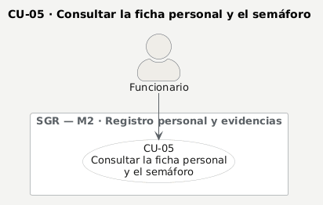

| Campo | Contenido |
|---|---|
| **ID** | CU-05 |
| **Nombre** | Consultar la ficha personal y el semáforo |
| **Objetivo** | Que el funcionario vea, sin pedírselo a nadie, cuánto lleva de cada ítem, cuánto se le pide a esta altura del período y de qué color está |
| **Actor principal** | Funcionario |
| **Actores secundarios** | **Sistema** (calcula el avance, el objetivo al día y el semáforo) |
| **Precondiciones** | Sesión iniciada · existe un período · el funcionario tiene cargo y metas configuradas para ese período |
| **Disparador** | El funcionario entra a su ficha, o vuelve a ella después de registrar |
| **Postcondiciones** | Ninguna: es una consulta y **no modifica nada**. Tampoco se audita, porque son sus propios datos |
| **Casos incluidos** | — |
| **Casos de extensión** | — |
| **Reglas y requisitos** | RF-008, RF-022, RF-023, RF-024, RF-026, RF-027 · RN-007, RN-009 · ADR-007, ADR-014 |
| **Pantalla** | [`03-ficha`](../mockups/03-ficha.png) |

**Flujo principal**

1. El funcionario entra a su ficha personal.
2. El sistema toma el período vigente y las metas del funcionario en ese período.
3. El sistema calcula, por ítem, el avance contando **solo las actividades con validación aprobada** (RN-009).
4. El sistema divide el avance por la meta para obtener el porcentaje de cumplimiento de cada ítem.
5. El sistema calcula la **meta esperada al día** según los días transcurridos del período, **descontando las ausencias** del funcionario.
6. El sistema pondera los ítems y aplica el **tope configurado**, que sale de los parámetros y no del código.
7. El sistema asigna el color comparando el avance con el objetivo al día, usando los **umbrales del parámetro**.
8. La ficha muestra la cabecera con el semáforo, la tabla de ítems y el registro en línea.

**Flujos alternativos**

- **A1 · Funcionario sin metas en el período.** No se le inventa un 0%: sin metas no hay contra qué medir, y el sistema lo dice en vez de mostrar un rojo que no significa nada.
- **A2 · Registrar desde la propia ficha.** Es la puerta de entrada a CU-01, para no obligar a cambiar de pantalla.
- **A3 · La jefatura consulta la ficha de su gente.** Mismo cálculo, dentro de su delegación.

**Excepciones**

- **E1 · Período inexistente o de otra organización** → **404**.
- **E2 · Funcionario sin cargo o sin delegación asignada.** La ficha lo informa como un problema de configuración, que es lo que es, y no como un incumplimiento del funcionario.

---

## CU-06 · Registrar un compromiso del vecino en el tubo

> **RF-016** — Crear compromisos derivados de solicitudes **internas o externas**.
> **RF-017** — Asignar solicitante, territorio, responsable, área de apoyo y fecha comprometida.
> **RF-004** — Catálogo de actividades, servicios, atenciones y subatenciones por área.
> **RF-010** — Validar campos: obligatoriedad, formatos, coherencia.

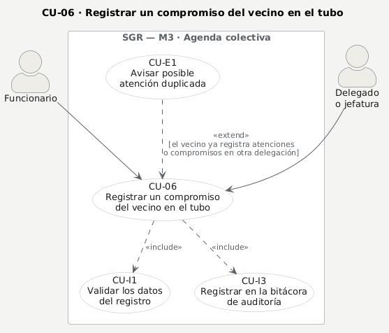

| Campo | Contenido |
|---|---|
| **ID** | CU-06 |
| **Nombre** | Registrar un compromiso del vecino en el tubo |
| **Objetivo** | Dejar en la agenda colectiva de la delegación un compromiso adquirido, con quién lo pidió, dónde, quién responde y para cuándo |
| **Actor principal** | Funcionario · Delegado |
| **Actores secundarios** | **Sistema** (valida el catálogo, audita, avisa a la delegación y detecta duplicidad) |
| **Precondiciones** | La delegación y la categoría existen en la organización · quien registra tiene alcance sobre esa delegación · si se vincula un vecino, su ficha existe |
| **Disparador** | Alguien —vecino, junta de vecinos, otra unidad municipal— pide algo y la delegación se compromete |
| **Postcondiciones** | Compromiso creado en el tubo de esa delegación · visible en tiempo real para quien esté conectado a ella · asiento en la bitácora · si el vecino tiene antecedentes en otra delegación, la respuesta lo avisa |
| **Casos incluidos** | CU-I1 validar los datos · CU-I3 auditar |
| **Casos de extensión** | CU-E1 avisar posible atención duplicada |
| **Reglas y requisitos** | RF-004, RF-010, RF-016, RF-017 · RNF-008 · CA-04 · ADR-008 |
| **Pantalla** | [`02-tubo`](../mockups/02-tubo.png) |

**Flujo principal**

1. Quien registra abre el tubo de su delegación y crea un compromiso.
2. El sistema pregunta si la solicitud es **interna o externa**: es una elección explícita, no un valor por defecto.
3. Si es **externa**, quien registra indica **quién la pidió**, y puede elegir territorio y área de apoyo del catálogo vigente.
4. Opcionalmente busca al vecino por RUT o por nombre y lo vincula al compromiso.
5. Quien registra completa título, categoría, responsable y fecha comprometida.
6. El sistema valida los datos (CU-I1): los campos obligatorios de una solicitud externa y que territorio y área existan en el catálogo.
7. El sistema crea el compromiso en estado inicial y lo audita (CU-I3).
8. El sistema emite el evento y la tarjeta aparece en el tubo de todos los conectados a esa delegación.
9. El sistema revisa si el vecino vinculado ya registra atenciones o compromisos en **otra** delegación y, si los tiene, lo informa (CU-E1).

**Flujos alternativos**

- **A1 · Solicitud interna.** No pide solicitante ni territorio: esos campos solo viajan cuando la solicitud es externa, para no dejar datos que nadie pidió ni va a mirar.
- **A2 · Sin vincular vecino.** El vínculo con la ficha del vecino es **opcional**: el solicitante puede ser una organización, y por eso es texto libre. Sin vínculo no hay historial que cruzar, y por lo tanto tampoco aviso de duplicidad.
- **A3 · El compromiso se cumple y se registra.** Al ejecutarlo se crea la actividad enlazada (CU-01, A2).

**Excepciones**

- **E1 · Datos inválidos** → **400**.
- **E2 · Solicitud externa sin decir quién la pidió** → **422** (RF-017). Sin eso el campo no significaba nada.
- **E3 · Territorio o área que no están en el catálogo vigente** → **422** (RF-004).
- **E4 · Delegación o categoría inexistentes, o de otra organización** → **404**.
- **E5 · Vecino vinculado inexistente** → **404**.
- **E6 · Delegado que intenta crear fuera de su delegación** → **403**.

> ⚠ **Desvío respecto de RF-016.** El requerimiento asigna la creación de compromisos al **Funcionario** y al Delegado. Hoy la implementación la **restringe a jefatura y nivel central** (`admin`, `supervisor`, `gerente`): un funcionario puede **mover** sus compromisos, pero no **crearlos**. La restricción viene de la matriz de permisos del Documento Maestro, que es la fuente **más baja** de la jerarquía del proyecto y quedó por encima del RF sin que nadie lo decidiera. Como manda el requerimiento, la ficha describe el actor que el RF define, y el ajuste del permiso queda como pendiente de código, no como una decisión de diseño.

---

## CU-07 · Mover un compromiso de estado

> **RF-018** — Estados **Ingresado → Pendiente → En proceso → Realizado** con transiciones controladas.
> **RF-019** — Controlar plazos: próximos a vencer, vencidos, realizados fuera de plazo.
> **RF-034** — Trabajo simultáneo **sin sobrescritura**.

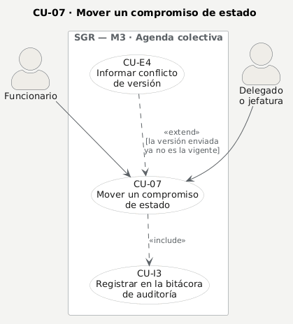

| Campo | Contenido |
|---|---|
| **ID** | CU-07 |
| **Nombre** | Mover un compromiso de estado |
| **Objetivo** | Reflejar el avance real de un compromiso moviéndolo de estado, sin que dos personas que miran el mismo tubo se pisen |
| **Actor principal** | Funcionario · Delegado |
| **Actores secundarios** | **Sistema** (control de versión, bitácora del recorrido y aviso en tiempo real) |
| **Precondiciones** | El compromiso existe en la organización · quien lo mueve tiene alcance: es su responsable, la jefatura de esa delegación o el nivel central · quien mueve trae **la versión** sobre la que estaba mirando |
| **Disparador** | El trabajo avanza: alguien toma el compromiso, lo empieza o lo termina |
| **Postcondiciones** | Compromiso en su nuevo estado, con la versión incrementada · la bitácora distingue **cambio de estado** de una edición cualquiera, para poder reconstruir el recorrido · el tubo de todos los conectados se mueve solo |
| **Casos incluidos** | CU-I3 auditar |
| **Casos de extensión** | CU-E4 informar conflicto de versión |
| **Reglas y requisitos** | RF-018, RF-019, RF-034 · RNF-003, RNF-008 · CA-08 · ADR-005 |
| **Pantalla** | [`02-tubo`](../mockups/02-tubo.png) |

**Flujo principal**

1. Quien trabaja el compromiso arrastra la tarjeta a la columna del nuevo estado.
2. El cliente envía el cambio junto con **la versión** que tenía a la vista.
3. El sistema comprueba que quien mueve tenga alcance sobre ese compromiso.
4. El sistema comprueba que la versión enviada siga siendo la vigente (CU-E4).
5. El sistema guarda el nuevo estado e incrementa la versión.
6. El sistema audita la operación **como cambio de estado**, guardando el valor anterior y el nuevo (CU-I3).
7. El sistema emite el evento y la tarjeta se mueve en la pantalla de todos los conectados a esa delegación.

**Flujos alternativos**

- **A1 · Mover el compromiso a otra delegación.** Exige permisos **también en la delegación de destino**, y la de origen recibe el aviso de que la tarjeta se fue.
- **A2 · Editar otros campos.** El mismo camino sirve para corregir responsable o fecha comprometida; la bitácora entonces lo registra como edición, no como cambio de estado.
- **A3 · Recuperación tras desconexión.** Si se cae la conexión, el cliente recarga el tubo completo en vez de quedarse con una vista vieja.

**Excepciones**

- **E1 · Datos inválidos o sin versión** → **400**.
- **E2 · Otra persona movió la tarjeta primero** → **409** con el estado vigente. La pantalla lo dice: **nunca revierte en silencio** (CU-E4, CA-08).
- **E3 · Sin permisos sobre el compromiso** → **403**.
- **E4 · Sin permisos en la delegación de destino** → **403**.
- **E5 · Solicitud que pasa a externa sin solicitante** → **422**, aunque el cuerpo no lo traiga: se valida sobre el resultado de la fusión, no sobre lo enviado.
- **E6 · Compromiso de otra organización** → **404**.

> ⚠ **Desvío respecto de RF-018 y RF-019.** El requerimiento pide **cuatro** estados (Ingresado, Pendiente, En proceso, Realizado) con **historial de transiciones**, y alertas de «próximo a vencer» y «realizado fuera de plazo». Hoy hay **tres** estados y solo se marcan los vencidos.
>
> Y hay algo peor que una ausencia: la tabla **`tarea_historial` existe en el modelo y el seed la llena, pero la aplicación nunca escribe en ella**. El recorrido real se reconstruye desde la bitácora de auditoría, que distingue el cambio de estado de una edición cualquiera. Es decir: en la demostración el historial se ve poblado, y en el uso real no se llenaría. Está en el DER porque está en el esquema, y aquí queda dicho para que nadie lo lea como funcionalidad terminada.
>
> Los dos RF están declarados **parciales** en la tabla de trazabilidad del [criterio 2](requerimientos.md); esta ficha describe el flujo pedido y deja marcado lo que falta.

---

## CU-08 · Registrar una atención social y sus gestiones

> **RF-015** — Atención social con **hasta 3 gestiones** para el mismo usuario.
> **RF-004** — Catálogo de actividades, servicios, atenciones y subatenciones por área.

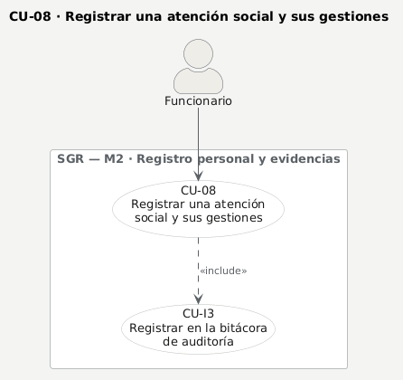

| Campo | Contenido |
|---|---|
| **ID** | CU-08 |
| **Nombre** | Registrar una atención social y sus gestiones |
| **Objetivo** | Seguir un caso social a lo largo del tiempo: no un registro suelto, sino una secuencia de hasta tres gestiones sobre la misma persona, que se puede consultar después aunque cambie la delegación |
| **Actor principal** | Funcionario |
| **Actores secundarios** | **Sistema** (decide qué gestión corresponde, valida el catálogo y audita, incluso la consulta) |
| **Precondiciones** | Existe la actividad de la que cuelga la atención · la actividad **no está anulada** · el período está **abierto** · quien registra puede editar esa actividad |
| **Disparador** | Una atención requiere seguimiento, y no se agota en el registro del día |
| **Postcondiciones** | Atención creada colgando de su actividad (relación 1:1) y con su avance actualizado · aparece en la ficha personal como caso con su escalera de tres peldaños · aparece en el historial del vecino cruzando delegaciones · asiento en la bitácora, **también al consultarla** |
| **Casos incluidos** | CU-I3 auditar |
| **Casos de extensión** | — |
| **Reglas y requisitos** | RF-004, RF-015 · RN-013 · RNF-008, RNF-009 · CA-04 · ADR-006, ADR-012, ADR-013 |
| **Pantalla** | [`03-ficha`](../mockups/03-ficha.png), modal del caso |

**Flujo principal**

1. El funcionario registra la actividad de la atención (CU-01) y abre su caso social.
2. El funcionario elige el **tipo de atención** y la **sub-atención** del catálogo vigente.
3. El funcionario registra la **primera gestión**, eligiendo su valor del catálogo que le corresponde.
4. El sistema comprueba el bloqueo de escritura: permisos, actividad no anulada y período abierto.
5. El sistema **decide qué número de gestión corresponde**: el cliente manda la gestión, no el casillero.
6. El sistema comprueba que el valor pertenezca al catálogo de **esa** gestión.
7. El sistema comprueba que solo lleguen las fechas que esa gestión admite.
8. El sistema guarda la gestión, deja el asiento en la bitácora y devuelve el avance.
9. Más adelante, el funcionario registra la segunda y la tercera gestión por el mismo camino.

**Flujos alternativos**

- **A1 · Corregir la cabecera.** El tipo, la sub-atención, si requiere visita y la observación se corrigen aparte; **las gestiones no se corrigen por ahí**: son un avance, no un formulario.
- **A2 · El caso se consulta desde otra delegación.** Viaja **el avance**, no el contenido: saber que la persona lleva 2 de 3 gestiones evita duplicar la ayuda; saber qué pidió no hace falta para eso.
- **A3 · El caso queda abierto.** Una atención con menos de tres gestiones sigue abierta, y eso es información, no un pendiente administrativo.

**Excepciones**

- **E1 · Datos inválidos** → **400**.
- **E2 · Intentar una cuarta gestión** → **422**: RF-015 admite tres, y el servidor lo impide en vez de confiar en la pantalla.
- **E3 · Valor que no está en el catálogo de esa gestión** → **422** (RF-004).
- **E4 · Fechas que no corresponden a esa gestión** → **422**, diciendo cuáles acepta.
- **E5 · Sin permisos sobre la atención** → **403**. El Verificador y el Usuario de consulta no ven el detalle social.
- **E6 · Actividad anulada** → **422**.
- **E7 · Período cerrado** → **422** (RN-013).
- **E8 · Identificador mal formado** → **400**; **de otra organización** → **404**. Son cosas distintas y se responden distinto.

---

## CU-09 · Consultar el tablero consolidado

> **RF-022** — Calcular avance con actividades **válidas** por ítem, funcionario, delegación y período.
> **RF-024** — Cumplimiento ponderado respetando el **máximo configurado**. **RF-029** — Tablero de delegación consolidado.

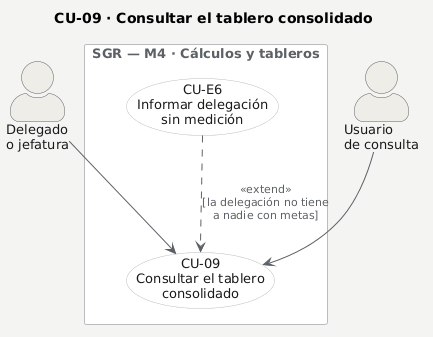

| Campo | Contenido |
|---|---|
| **ID** | CU-09 |
| **Nombre** | Consultar el tablero consolidado |
| **Objetivo** | Ver cómo va cada delegación y cada área del cargo en el período, con una sola fuente de cálculo, para comparar sin discutir de dónde salió el número |
| **Actor principal** | Delegado · Usuario de consulta |
| **Actores secundarios** | **Sistema** (mide por funcionario y consolida) |
| **Precondiciones** | Sesión iniciada · existe el período · hay funcionarios con metas configuradas en él |
| **Disparador** | Alguien quiere saber cómo va su delegación, o compararla con las demás |
| **Postcondiciones** | Ninguna: es una consulta. **El semáforo consolidado lo ve todo el mundo**; el libro de cada delegación sigue siendo privado |
| **Casos incluidos** | — |
| **Casos de extensión** | CU-E6 informar delegación sin medición |
| **Reglas y requisitos** | RF-022, RF-024, RF-027, RF-029 · RN-003 a RN-009 · ADR-007, ADR-014 |
| **Pantalla** | [`07-dashboard`](../mockups/07-dashboard.png) |

**Flujo principal**

1. Quien consulta abre el tablero y elige el período.
2. El sistema calcula el cumplimiento **por funcionario**, contando solo lo validado.
3. El sistema **agrega** ese resultado por delegación y por **área del cargo**: la delegación es el promedio simple de su gente.
4. El sistema aplica el tope y los umbrales que salen de los parámetros del período.
5. El tablero muestra los indicadores, el mapa de calor por área, la proyección al cierre, el radar y la tabla.
6. Quien consulta cruza los filtros y todas las piezas responden al mismo recorte.

**Flujos alternativos**

- **A1 · Delegación sin nadie con metas.** Se informa como **«sin medición»**, nunca como 0% (CU-E6).
- **A2 · Delegación dada de baja.** No aparece como hueco de configuración: una delegación desactivada no es algo que alguien deba ir a llenar.
- **A3 · Proyección al cierre.** Se calcula con el mismo tope que el cumplimiento, para no proyectar un número que el propio sistema no admitiría.

**Excepciones**

- **E1 · Período inexistente o de otra organización** → **404**.
- **E2 · Período sin ningún funcionario con metas.** El tablero lo dice; no muestra un cero que se leería como «trabajaron y no cumplieron».

---

## CU-10 · Anular una actividad con motivo

> **RF-036** — **Trazabilidad** de altas, modificaciones, validaciones y cambios de estado.
> **RN-009** — Solo lo validado suma; y lo que ya sumó no se borra en silencio.

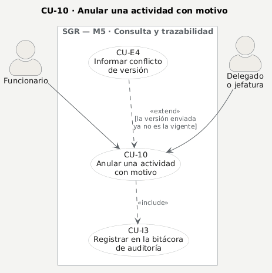

| Campo | Contenido |
|---|---|
| **ID** | CU-10 |
| **Nombre** | Anular una actividad con motivo |
| **Objetivo** | Dejar sin efecto una actividad mal registrada **sin borrarla**, dejando escrito quién la anuló y por qué. Es el único camino para revertir algo que ya sumó |
| **Actor principal** | Funcionario · Delegado |
| **Actores secundarios** | **Sistema** (baja lógica, control de versión y bitácora) |
| **Precondiciones** | La actividad existe y **no está ya anulada** · el período está **abierto** · quien anula puede editarla · se envía **un motivo de al menos cinco caracteres** y la versión vigente |
| **Disparador** | Se detecta un registro erróneo, duplicado o mal imputado —incluso uno que ya fue aprobado |
| **Postcondiciones** | La actividad queda **anulada con su motivo**: la fila permanece y deja de sumar · su evidencia ya no se valida · asiento en la bitácora con el valor anterior y el nuevo · aviso a la delegación |
| **Casos incluidos** | CU-I3 auditar |
| **Casos de extensión** | CU-E4 informar conflicto de versión |
| **Reglas y requisitos** | RF-036 · RN-009, RN-013 · RNF-008 · CA-08 · ADR-005, ADR-006 |
| **Pantalla** | [`03-ficha`](../mockups/03-ficha.png) |

**Flujo principal**

1. Quien detecta el error abre la actividad en la ficha y elige anularla.
2. El sistema **exige un motivo escrito**: sin motivo no hay anulación.
3. Quien anula escribe el motivo y confirma, enviando la versión que tenía a la vista.
4. El sistema comprueba permisos, que no esté ya anulada y que el período siga abierto.
5. El sistema comprueba la versión (CU-E4).
6. El sistema marca la actividad como anulada y guarda el motivo. **La fila no se borra**: es una baja lógica.
7. El sistema audita la operación con el estado anterior y el nuevo (CU-I3).
8. El sistema avisa a la delegación y el avance deja de contar esa actividad.

**Flujos alternativos**

- **A1 · Anular una actividad ya aprobada.** Es el caso que justifica este caso de uso: una aprobación no se revierte cambiando la decisión —eso borraría un puntaje contado sin dejar rastro—, se anula la actividad con motivo.
- **A2 · Anula la jefatura o el nivel central.** El Coordinador y el Administrador pueden anular cualquiera; el Delegado, solo en su delegación; el funcionario, las suyas.

**Excepciones**

- **E1 · Sin motivo, motivo demasiado corto o sin versión** → **400**.
- **E2 · La actividad ya estaba anulada** → **422**.
- **E3 · Período cerrado** → **422** (RN-013). Un período cerrado no se retoca ni para anular.
- **E4 · Sin permisos sobre la actividad** → **403**.
- **E5 · Otra persona la modificó primero** → **409** (CU-E4).
- **E6 · Actividad de otra organización** → **404**.

> ⚠ **Desvío respecto de RF-036.** La trazabilidad se registra en cada operación crítica, pero **falta la pantalla para consultarla**: hoy la bitácora se lee desde la base, no desde el sistema. RF-036 está declarado **parcial** en el [criterio 2](requerimientos.md).

---

## CU-11 · Buscar el historial de un vecino entre delegaciones

> **RF-032** — Buscar y filtrar por delegación, área, funcionario, cargo, período, ítem, estado y fechas.
> **CA-04** — El sistema detecta a la misma persona atendida en varias delegaciones.

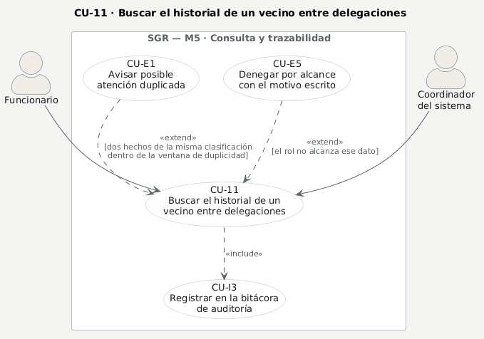

| Campo | Contenido |
|---|---|
| **ID** | CU-11 |
| **Nombre** | Buscar el historial de un vecino entre delegaciones |
| **Objetivo** | Responder si una persona ya fue atendida en otra delegación por lo mismo, que es el control que el municipio no tenía: el vecino que pide lo mismo en cinco delegaciones y nadie lo cruza |
| **Actor principal** | Funcionario · Coordinador |
| **Actores secundarios** | **Sistema** (cruza delegaciones, calcula el aviso y **audita la consulta**) |
| **Precondiciones** | Sesión iniciada · el rol alcanza los datos personales de vecinos · la persona existe en la organización |
| **Disparador** | Antes de comprometer una ayuda, alguien quiere saber qué se le dio ya a esa persona |
| **Postcondiciones** | No modifica datos, pero **deja asiento en la bitácora**: acceder a datos personales identificados se registra, no solo modificarlos (Leyes 19.628 y 21.719) |
| **Casos incluidos** | CU-I3 auditar |
| **Casos de extensión** | CU-E1 avisar posible atención duplicada · CU-E5 denegar por alcance |
| **Reglas y requisitos** | RF-032 · CA-04 · RNF-005, RNF-008, RNF-009 · ADR-008, ADR-012 |
| **Pantalla** | [`06-vecino`](../mockups/06-vecino.png) |

**Flujo principal**

1. Quien consulta busca por **RUT o por nombre**.
2. El sistema reconoce un RUT **por su dígito verificador, no por su forma**: con puntos, sin puntos o sin guion es la misma búsqueda; cualquier otra cosa se trata como nombre.
3. El sistema devuelve las coincidencias y quien consulta elige una.
4. El sistema arma el historial de esa persona **cruzando todas las delegaciones**.
5. El sistema reduce lo que viene de una delegación ajena: fecha, delegación, tipo y estado, **nunca la descripción, la acción ni el contacto**.
6. El sistema busca coincidencias de la misma clasificación dentro de la **ventana de duplicidad** que sale de los parámetros y, si las hay, arma el aviso (CU-E1).
7. El sistema **registra la consulta** en la bitácora, con quién consultó, a quién y con qué alcance (CU-I3).
8. La pantalla muestra la ficha, el historial y —si corresponde— el aviso ámbar señalando **los hechos concretos** que lo componen.

**Flujos alternativos**

- **A1 · Sin coincidencias.** El sistema lo dice explícitamente. Que no aparezca nada es una respuesta, no un error.
- **A2 · Búsqueda demasiado corta.** Por debajo del mínimo de caracteres no se consulta: teclear no es buscar.
- **A3 · Historial en una sola delegación.** No se levanta aviso: no hay duplicidad que informar.
- **A4 · Consulta el Delegado.** Puede, y lo de otras delegaciones le llega **reducido** igual.

**Excepciones**

- **E1 · Rol sin alcance** → **403** con el motivo escrito. El Verificador y el Usuario de consulta no acceden a datos personales de vecinos (CU-E5, ADR-012).
- **E2 · Identificador mal formado** → **400**; **persona de otra organización** → **404**. Se distinguen a propósito.
- **E3 · Persona inexistente** → **404**.

> ⚠ **La ventana de duplicidad no está confirmada.** Es la [consulta abierta nº 12](../requerimientos-oficiales.md) al docente. El parámetro existe y es configurable, y la respuesta **declara** que su valor está sin confirmar en vez de presentarlo como definitivo.

---

## CU-12 · Controlar la actividad de usuarios

> **RF-030** — Actividad reciente: último ingreso, días sin ingreso, cantidad y promedio diario.

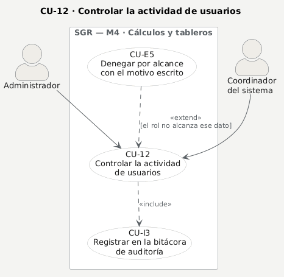

| Campo | Contenido |
|---|---|
| **ID** | CU-12 |
| **Nombre** | Controlar la actividad de usuarios |
| **Objetivo** | Saber quién está registrando, **quién no** y quién está conectado, para acompañar a tiempo a un equipo que se está quedando atrás |
| **Actor principal** | Administrador · Coordinador |
| **Actores secundarios** | **Sistema** (cruza el registro con la presencia en línea y audita la consulta) |
| **Precondiciones** | Sesión iniciada con rol de Administrador o Coordinador · existe el período consultado |
| **Disparador** | El Coordinador quiere saber dónde hace falta apoyo antes de que el período se acabe |
| **Postcondiciones** | No modifica datos, pero **abrir el panel se audita**: qué período, qué delegación y qué se vio |
| **Casos incluidos** | CU-I3 auditar |
| **Casos de extensión** | CU-E5 denegar por alcance |
| **Reglas y requisitos** | RF-030 · RNF-005, RNF-008, RNF-009 · ADR-015 · Leyes 19.628 y 21.719 |
| **Pantalla** | [`08-actividad`](../mockups/08-actividad.png) |

**Flujo principal**

1. El Administrador o el Coordinador abre el panel de actividad y elige el período.
2. El sistema comprueba el rol y, si corresponde, filtra por delegación.
3. El sistema cuenta lo **registrado** por cada funcionario medido —no solo lo validado—: la pregunta es si la persona está usando el sistema, no si su trabajo ya fue aprobado.
4. El sistema calcula último ingreso, días sin registrar, cantidad y promedio diario.
5. El sistema marca a **quien no ha registrado nada**, comparando contra el umbral que sale de los parámetros.
6. El sistema agrega quién está **conectado ahora**, con la presencia del nivel central.
7. El sistema deja el asiento en la bitácora (CU-I3) y muestra el panel.

**Flujos alternativos**

- **A1 · Filtrar por delegación.** Para mirar un equipo concreto en vez de toda la organización.
- **A2 · Funcionario con metas y cero actividades.** Es el caso que RF-030 pide poder demostrar, y aparece señalado: es el que necesita apoyo.

**Excepciones**

- **E1 · Cualquier rol que no sea Administrador o Coordinador** → **403** con **el motivo redactado**: este panel cruza el trabajo de cada funcionario con su conexión, y por finalidad y proporcionalidad lo ven solo quienes deben acompañar al equipo (CU-E5, ADR-015).
- **E2 · Falta el período** → **400**.
- **E3 · Período o delegación inexistentes, o de otra organización** → **404**.

> **Este panel acompaña, no vigila** (ADR-015). Es la diferencia entre una herramienta de gestión y una de control laboral, y por eso su alcance es el más restringido del sistema, su umbral es configurable y cada apertura queda registrada.
