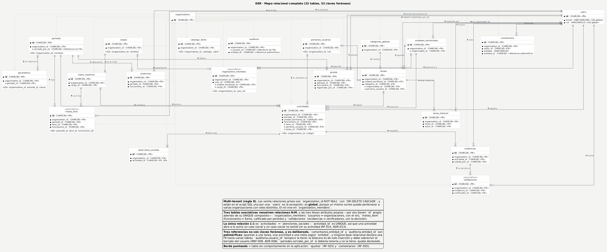
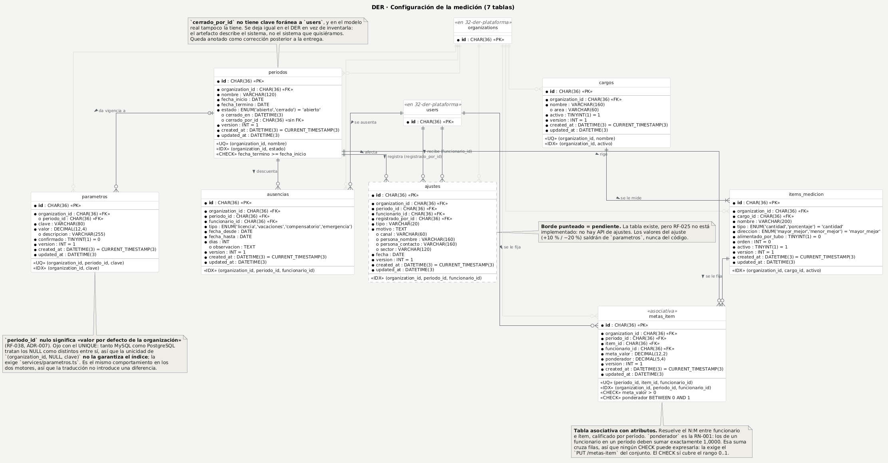
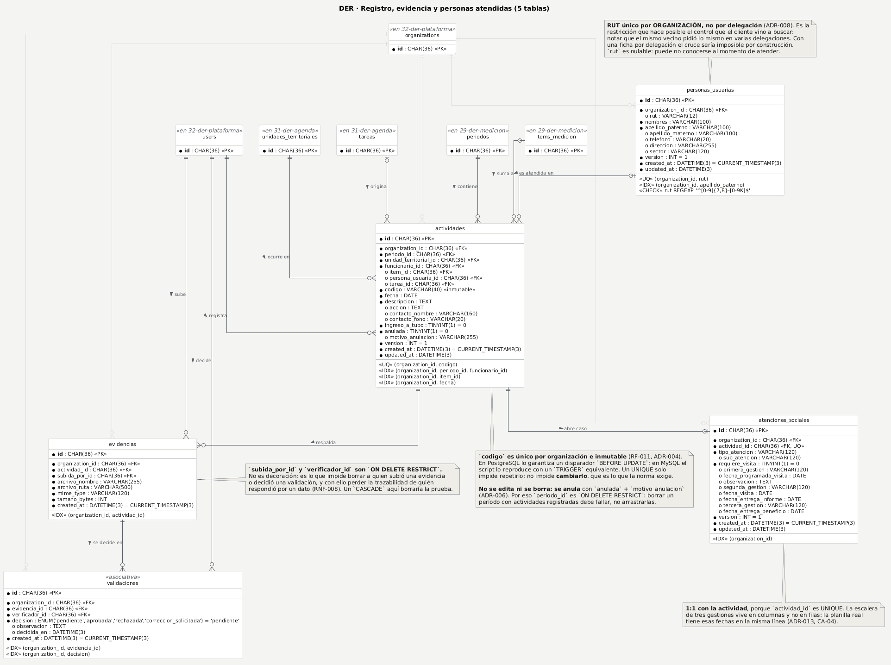
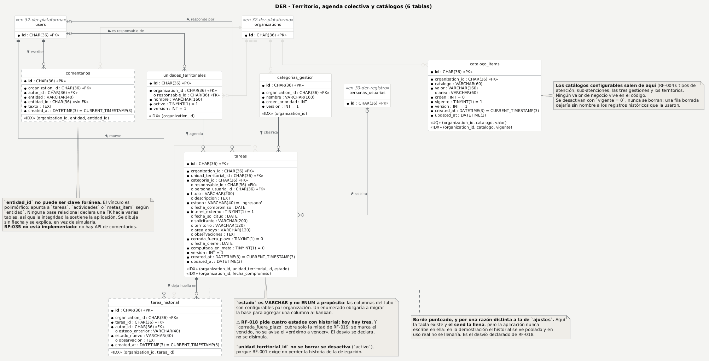
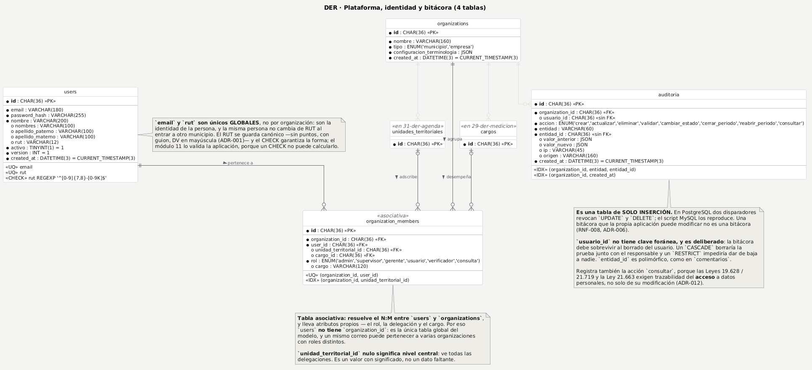

# DER MySQL — SGR

**Criterio 6 de la entrega del 15 de septiembre · 10 puntos.**

El modelo de datos de SGR: **22 tablas, 52 claves foráneas y 8 enumerados**, en cinco diagramas. Sale de `backend/prisma/schema.prisma` y de las migraciones que ya corren en producción, traducido a MySQL con la tabla de equivalencias de [clases.md §9](clases.md).

Los nombres son **exactamente** los del [diagrama de clases](clases.md): una clase, una tabla, sin excepciones. Esa correspondencia es el criterio transversal de la rúbrica, y la comprueba `npm run verificar:entrega`.

---

## 1. Qué pide la rúbrica §5.6, y dónde está

| Lo que pide | Dónde está |
|---|---|
| Entidades correctamente nombradas | Los cinco diagramas · [§13](#13-coherencia-tabla--clase--caso-de-uso) |
| **PK** en cada tabla que lo requiera | Las 22 llevan `id : CHAR(36)`. [§11](#11-claves-primarias-y-por-qué-todas-son-uuid) explica por qué UUID y no autoincremento |
| **FK** y relaciones | [§9](#9-las-52-claves-foráneas-y-su-comportamiento-de-borrado), las 52 con su tabla destino y su `ON DELETE` |
| Cardinalidades **1:1, 1:N, N:M** | [§10](#10-cardinalidades-una-11-cincuenta-y-una-1n-y-tres-nm) |
| **Tablas asociativas** para los N:M | `organization_members`, `metas_item` y `validaciones` — [§10.3](#103-las-tres-tablas-asociativas) |
| Campos y **tipos compatibles con MySQL** | Los diagramas 29 a 32 traen cada columna con su tipo · [§12](#12-los-tipos-postgresql--mysql) |
| Restricciones básicas, sin redundancias | [§12.3](#123-restricciones-unique-check-y-dos-disparadores) |

---

## 2. De dónde sale, y por qué de ahí

**De `backend/prisma/schema.prisma` y de `backend/prisma/migrations/`.** No de un diseño hecho para la entrega.

La diferencia importa: el esquema tiene reglas que no se ven en el modelo Prisma y que sí dan puntos —los `CHECK` de RUT, de fechas y de metas, y los dos disparadores de inmutabilidad— porque viven en el SQL de la migración `20260901120000_modelo_v2_especificacion_oficial`. Un DER dibujado solo desde el `.prisma` las perdería.

**Las 52 claves foráneas de [§9](#9-las-52-claves-foráneas-y-su-comportamiento-de-borrado) están extraídas de las sentencias `ALTER TABLE ... ADD CONSTRAINT ... FOREIGN KEY` de las migraciones**, no transcritas a mano. Es lo que permite afirmar que no falta ni sobra ninguna.

> ⚠ Las migraciones incluyen una tabla `metas` (modelo v1: unidad × categoría × trimestre) con tres FK. **No está en el DER porque ya no existe**: la eliminó la migración `20260903230000_eliminar_cumplimiento_v1` junto con la vista materializada `cumplimiento_ponderado_vista`. Hoy el cálculo vive en `services/cumplimiento.ts` y hay una sola fuente ([ADR-014](../decisiones-tecnicas.md)).

---

## 3. Los cinco diagramas

| # | Diagrama | Qué responde |
|---|---|---|
| 1 | [Mapa relacional completo](#4-mapa-relacional-completo) | Las 22 tablas y las 52 FK de una vez. Es el diagrama de la coherencia relacional |
| 2 | [Configuración de la medición](#5-configuración-de-la-medición) | Período, parámetros, cargo, ítem, meta, ausencia y ajuste, con todas sus columnas |
| 3 | [Registro, evidencia y personas](#6-registro-evidencia-y-personas-atendidas) | La cadena que da el puntaje, y la ficha del vecino |
| 4 | [Territorio, agenda y catálogos](#7-territorio-agenda-colectiva-y-catálogos) | El tubo de trabajo y lo configurable |
| 5 | [Plataforma, identidad y bitácora](#8-plataforma-identidad-y-bitácora) | Multi-tenant, rol y trazabilidad |

**Van separados por legibilidad.** Veintidós tablas con todas sus columnas en un solo lienzo no se leen impresas: el mapa completo muestra solo las claves, y los otros cuatro traen el detalle de campos y tipos. Entre los cuatro cubren las 22 tablas sin repetir ninguna; cuando un diagrama necesita una tabla que se detalla en otro, la dibuja reducida a su `id` y con el estereotipo que dice dónde está completa (por ejemplo `«en 32-der-plataforma»`).

---

## 4. Mapa relacional completo



> Fuente: [`puml/28-der-general.puml`](puml/28-der-general.puml)

**Las veinte relaciones grises son la misma relación repetida veinte veces**: `organization_id` con `ON DELETE CASCADE`, la regla 8 del proyecto. Se dibujan en gris claro porque, en negro, tapan el resto del modelo; están todas, y están una por una en el script SQL.

`users` es la única tabla **sin** `organization_id`, y es deliberado: es global. Ver [§8](#8-plataforma-identidad-y-bitácora).

---

## 5. Configuración de la medición



> Fuente: [`puml/29-der-medicion.puml`](puml/29-der-medicion.puml)

Siete tablas: `periodos`, `parametros`, `cargos`, `items_medicion`, `metas_item`, `ausencias` y `ajustes`. Es la cadena **cargo → ítem medible → meta por funcionario y período**.

Dos cosas que conviene mirar:

- **`parametros.periodo_id` nulo significa «valor por defecto de la organización»** (RF-038, [ADR-007](../decisiones-tecnicas.md)). Ojo con el `UNIQUE (organization_id, periodo_id, clave)`: MySQL y PostgreSQL tratan los `NULL` como distintos entre sí, así que la unicidad de la fila por defecto **no la garantiza el índice** sino `services/parametros.ts`. Es el mismo comportamiento en los dos motores, de modo que la traducción a MySQL no introduce aquí una diferencia.
- **`metas_item.ponderador` es la RN-001**: los de un funcionario en un período deben sumar exactamente `1.0000`. Esa suma cruza filas, y ningún `CHECK` puede expresarla — un `CHECK` solo ve la fila que se escribe. El `CHECK` cubre el rango `0..1`; el 100 % exacto lo exige el `PUT /metas-item` del conjunto.

---

## 6. Registro, evidencia y personas atendidas



> Fuente: [`puml/30-der-registro.puml`](puml/30-der-registro.puml)

Cinco tablas: `personas_usuarias`, `actividades`, `evidencias`, `validaciones` y `atenciones_sociales`. Es la cadena que otorga el puntaje —**solo la evidencia con validación aprobada suma** (RN-009)— y la ficha del vecino.

- **`personas_usuarias` tiene el RUT único por ORGANIZACIÓN, no por delegación** ([ADR-008](../decisiones-tecnicas.md)). Es la restricción que hace posible el control que el cliente vino a buscar: notar que el mismo vecino pidió lo mismo en varias delegaciones. Con una ficha por delegación, ese cruce sería imposible por construcción. `rut` es nulable porque puede no conocerse al momento de atender.
- **`evidencias.subida_por_id` y `validaciones.verificador_id` son `ON DELETE RESTRICT`.** No es decoración: es lo que impide borrar a quien subió una evidencia o decidió una validación y perder con ello la trazabilidad de quién respondió por un dato (RNF-008). Un `CASCADE` ahí borraría la prueba.
- **`actividades.periodo_id` también es `RESTRICT`**: borrar un período con actividades registradas debe fallar, no arrastrarlas (RN-013).

---

## 7. Territorio, agenda colectiva y catálogos



> Fuente: [`puml/31-der-agenda.puml`](puml/31-der-agenda.puml)

Seis tablas: `unidades_territoriales`, `categorias_gestion`, `tareas`, `tarea_historial`, `catalogo_items` y `comentarios`.

- **`tareas.estado` es `VARCHAR` y no `ENUM` a propósito**: las columnas del tubo son configurables por organización. Un enumerado obligaría a migrar la base para agregar una columna al kanban.
- **`unidades_territoriales` no se borra: se desactiva** (`activo`), porque RF-001 exige no perder la historia de la delegación.
- **`comentarios.entidad_id` no puede ser clave foránea**: el vínculo es polimórfico y apunta a `tareas`, `actividades` o `metas_item` según `entidad`. Ninguna base relacional declara una FK hacia varias tablas, así que la integridad la sostiene la aplicación. Se dibuja sin flecha y se explica, en vez de simularla.

---

## 8. Plataforma, identidad y bitácora



> Fuente: [`puml/32-der-plataforma.puml`](puml/32-der-plataforma.puml)

Cuatro tablas: `organizations`, `users`, `organization_members` y `auditoria`.

- **`users` es la única tabla global del modelo.** No lleva `organization_id` porque un mismo correo puede pertenecer a varias organizaciones con roles distintos. `email` y `rut` son únicos **globales**: son la identidad de la persona, y la misma persona no cambia de RUT al entrar a otro municipio.
- **El rol vive en `organization_members`, no en `users`.** Y `unidad_territorial_id` nulo significa **nivel central**: ve todas las delegaciones. Es un valor con significado, no un dato faltante.
- **`auditoria` es una tabla de solo inserción.** La migración revoca `UPDATE` y `DELETE` con dos disparadores; el script MySQL los reproduce. Una bitácora que la propia aplicación puede modificar no es una bitácora (RNF-008, [ADR-006](../decisiones-tecnicas.md)). Registra también la acción `consultar`, porque las Leyes 19.628 / 21.719 y la Ley 21.663 exigen trazabilidad del **acceso** a datos personales, no solo de su modificación ([ADR-012](../decisiones-tecnicas.md)).

---

## 9. Las 52 claves foráneas, y su comportamiento de borrado

**Esta es la tabla que el script SQL tiene que reproducir sin faltar ni sobrar una.** La rúbrica lo valida a mano; nosotros lo comprobaremos con script en el criterio 7.

**El `ON DELETE` no es decoración: es una regla de negocio escrita en la base.** `CASCADE` dice «esto no existe sin su padre», `RESTRICT` dice «no puedes borrar el padre mientras esto exista» y `SET NULL` dice «el vínculo es opcional y se pierde sin perder la fila». Las 52 son `ON UPDATE CASCADE`, así que esa columna se omite.

| Tabla | Columna | Referencia a | `ON DELETE` |
|---|---|---|---|
| `actividades` | `funcionario_id` | `users` | CASCADE |
|  | `item_id` | `items_medicion` | SET NULL |
|  | `organization_id` | `organizations` | CASCADE |
|  | `periodo_id` | `periodos` | **RESTRICT** |
|  | `persona_usuaria_id` | `personas_usuarias` | SET NULL |
|  | `tarea_id` | `tareas` | SET NULL |
|  | `unidad_territorial_id` | `unidades_territoriales` | CASCADE |
| `ajustes` | `funcionario_id` | `users` | CASCADE |
|  | `organization_id` | `organizations` | CASCADE |
|  | `periodo_id` | `periodos` | CASCADE |
|  | `registrado_por_id` | `users` | **RESTRICT** |
| `atenciones_sociales` | `actividad_id` | `actividades` | CASCADE |
|  | `organization_id` | `organizations` | CASCADE |
| `auditoria` | `organization_id` | `organizations` | CASCADE |
| `ausencias` | `funcionario_id` | `users` | CASCADE |
|  | `organization_id` | `organizations` | CASCADE |
|  | `periodo_id` | `periodos` | CASCADE |
| `cargos` | `organization_id` | `organizations` | CASCADE |
| `catalogo_items` | `organization_id` | `organizations` | CASCADE |
| `categorias_gestion` | `organization_id` | `organizations` | CASCADE |
| `comentarios` | `autor_id` | `users` | **RESTRICT** |
|  | `organization_id` | `organizations` | CASCADE |
| `evidencias` | `actividad_id` | `actividades` | CASCADE |
|  | `organization_id` | `organizations` | CASCADE |
|  | `subida_por_id` | `users` | **RESTRICT** |
| `items_medicion` | `cargo_id` | `cargos` | CASCADE |
|  | `organization_id` | `organizations` | CASCADE |
| `metas_item` | `funcionario_id` | `users` | CASCADE |
|  | `item_id` | `items_medicion` | CASCADE |
|  | `organization_id` | `organizations` | CASCADE |
|  | `periodo_id` | `periodos` | CASCADE |
| `organization_members` | `cargo_id` | `cargos` | SET NULL |
|  | `organization_id` | `organizations` | CASCADE |
|  | `unidad_territorial_id` | `unidades_territoriales` | SET NULL |
|  | `user_id` | `users` | CASCADE |
| `parametros` | `organization_id` | `organizations` | CASCADE |
|  | `periodo_id` | `periodos` | CASCADE |
| `periodos` | `organization_id` | `organizations` | CASCADE |
| `personas_usuarias` | `organization_id` | `organizations` | CASCADE |
| `tarea_historial` | `autor_id` | `users` | **RESTRICT** |
|  | `organization_id` | `organizations` | CASCADE |
|  | `tarea_id` | `tareas` | CASCADE |
| `tareas` | `categoria_id` | `categorias_gestion` | **RESTRICT** |
|  | `organization_id` | `organizations` | CASCADE |
|  | `persona_usuaria_id` | `personas_usuarias` | SET NULL |
|  | `responsable_id` | `users` | SET NULL |
|  | `unidad_territorial_id` | `unidades_territoriales` | CASCADE |
| `unidades_territoriales` | `organization_id` | `organizations` | CASCADE |
|  | `responsable_id` | `users` | SET NULL |
| `validaciones` | `evidencia_id` | `evidencias` | CASCADE |
|  | `organization_id` | `organizations` | CASCADE |
|  | `verificador_id` | `users` | **RESTRICT** |

**52 claves foráneas**: 20 de `organization_id` y 32 de negocio.

### 9.1 Cuatro referencias que NO son claves foráneas

No es un olvido. Cada una tiene su razón, y el DER las dibuja como columna sin flecha en vez de simular una integridad que no existe.

| Columna | Por qué no tiene FK |
|---|---|
| `comentarios.entidad_id` | **Polimórfica**: apunta a `tareas`, `actividades` o `metas_item` según `entidad`. Ninguna base relacional declara una FK hacia varias tablas |
| `auditoria.entidad_id` | Polimórfica, por lo mismo: la bitácora registra cambios de cualquiera de las 22 tablas |
| `auditoria.usuario_id` | **Deliberado**: la bitácora es de solo inserción y debe sobrevivir al borrado del usuario. Un `CASCADE` borraría la prueba junto con el responsable, y un `RESTRICT` impediría dar de baja a nadie |
| `periodos.cerrado_por_id` | **Debería tenerla y no la tiene.** Ver [§14](#14-lo-que-el-der-declara-y-no-arregla) |

---

## 10. Cardinalidades: una 1:1, cincuenta y una 1:N y tres N:M

### 10.1 La única relación 1:1

`actividades` **1 ── 0..1** `atenciones_sociales`.

Lo que la hace 1:1 es que `atenciones_sociales.actividad_id` sea **UNIQUE**, no la FK. Una actividad abre a lo sumo un caso social, y un caso social no existe sin su actividad (RF-015, [ADR-013](../decisiones-tecnicas.md)).

La escalera de las **tres gestiones** vive en columnas y no en filas —`primera_gestion`, `segunda_gestion`, `tercera_gestion` con sus fechas— porque así está en la planilla real que el cliente usa hoy: las tres fechas en la misma línea ([estructura-planilla-real](../estructura-planilla-real.md)). Modelarlas como filas de una tabla hija habría sido más «normal» y menos fiel.

### 10.2 Las 1:N

Las otras 51. Los tres N:M de más abajo **no son relaciones aparte**: cada uno es un par de estas 1:N que converge en una tabla asociativa. En el diagrama se distinguen dos formas, y la diferencia es si la FK admite nulo:

| Notación | Significa | Ejemplo |
|---|---|---|
| `A ‖──o<` B | Cada B tiene **exactamente un** A (FK `NOT NULL`) | `periodos` → `metas_item` |
| `A ‖o──o<` B | Cada B tiene **cero o un** A (FK nulable) | `personas_usuarias` → `tareas`: una solicitud puede no venir de un vecino registrado |
| `A ‖──‖<` B | Cada B tiene uno, y cada A tiene **al menos uno** | `cargos` → `items_medicion`: un cargo sin ítems medibles no tiene sentido |

El `1..*` de `cargos → items_medicion` es una **regla de negocio, no una restricción de la base**: ningún motor relacional puede exigir que exista al menos un hijo. La sostiene la aplicación, y se dibuja igual que en el [diagrama de clases](clases.md), donde esa relación es una composición.

### 10.3 Las tres tablas asociativas

Las tres resuelven un N:M **y llevan atributos propios**, así que no son tablas puente puras: por eso tienen `id` propio además de su `UNIQUE` compuesto.

| Tabla | Resuelve el N:M entre | Atributos que carga |
|---|---|---|
| `organization_members` | `users` ↔ `organizations` | `rol`, `unidad_territorial_id`, `cargo_id`, `cargo` |
| `metas_item` | `users` (funcionario) ↔ `items_medicion`, **calificada por** `periodos` | `meta_valor`, `ponderador` |
| `validaciones` | `evidencias` ↔ `users` (verificador) | `decision`, `observacion`, `decidida_en` |

**`metas_item` es ternaria**: su `UNIQUE (periodo_id, item_id, funcionario_id)` dice que a un funcionario se le fija una sola meta por ítem y período. Cambiar de período crea filas nuevas, no edita las viejas — es lo que permite cerrar un período sin tocar su historia.

**`validaciones` no colapsa a 1:1 con la evidencia**, y es a propósito: una evidencia puede recibir «corrección solicitada» y después «aprobada». Guardar solo la última decisión borraría el recorrido, y RF-013 pide tres decisiones posibles, no dos.

---

## 11. Claves primarias, y por qué todas son UUID

**Las 22 tablas tienen `id : CHAR(36)` como clave primaria**, generado como UUID v4 por la aplicación.

Tres razones, y ninguna es estética:

1. **Multi-tenant.** Un autoincremento revela cuántas filas tiene el vecino de al lado y facilita el acceso por tanteo a recursos de otra organización. Con UUID, un identificador ajeno no se adivina; si igual llega, la consulta filtra por `organization_id` y responde **404**.
2. **El identificador se conoce antes de escribir.** Permite construir el registro completo —con su código de evidencia y su ruta de archivo— antes del `INSERT`, en una sola transacción.
3. **El RUT no es clave.** Aunque identifique a la persona, es un dato que se corrige, que puede llegar mal escrito y que a veces no se conoce al momento de atender. Va como columna con `UNIQUE` y `CHECK`, nunca como PK ni como FK ([ADR-001](../decisiones-tecnicas.md)).

> El costo es real y se acepta: `CHAR(36)` ocupa más que un `INT` y sus índices son más grandes. A la escala del caso —una municipalidad, decenas de miles de filas al año— no se nota.

---

## 12. Los tipos: PostgreSQL → MySQL

### 12.1 La equivalencia

La implementación corre sobre **PostgreSQL 16**; el entregable está en **MySQL**, porque así lo pide la rúbrica (decisión **D-1** del [plan](../plan-entrega-15-septiembre.md), consulta abierta nº 13). No se migra el sistema: se traduce el modelo, declarando las equivalencias.

| Tipo en el diagrama de clases | PostgreSQL (implementación) | MySQL (entregable) |
|---|---|---|
| `UUID` | `uuid` | `CHAR(36)` |
| `String` | `text` | `VARCHAR(n)` |
| `String` (texto largo) | `text` | `TEXT` |
| `Boolean` | `boolean` | `TINYINT(1)` |
| `Int` | `integer` | `INT` |
| `Decimal` | `numeric(p,s)` | `DECIMAL(p,s)` |
| `Date` | `date` | `DATE` |
| `DateTime` | `timestamptz` | `DATETIME(3)` |
| `Json` | `jsonb` | `JSON` |
| Enumerado | `CREATE TYPE ... AS ENUM` | `ENUM(...)` |

**Fechas y horas no son lo mismo** ([ADR-002](../decisiones-tecnicas.md)): un día calendario va en `DATE` y un instante en `DATETIME(3)`. Por eso `actividades.fecha` es `DATE` y `created_at` es `DATETIME(3)`.

⚠ **`DATETIME` no guarda zona horaria y `timestamptz` sí.** Es la única pérdida real de la traducción, y se declara: en MySQL el equivalente fiel sería `TIMESTAMP`, pero su rango termina en 2038. Se elige `DATETIME(3)` y se deja constancia de que la aplicación guarda todos los instantes en UTC y convierte al mostrar, que es lo que hoy hace `lib/fechas.ts`.

### 12.2 Por qué los `VARCHAR` tienen el largo que tienen

PostgreSQL usa `text` sin largo. MySQL exige uno en toda columna indexada, así que hubo que elegirlos. **El criterio fue el dato, no la comodidad**, y queda escrito acá para que el script use los mismos números:

| Largo | Para qué | Ejemplos |
|---|---|---|
| `VARCHAR(12)` | RUT canónico `17721947-9` | `users.rut`, `personas_usuarias.rut` |
| `VARCHAR(20)` | Teléfono chileno con prefijo | `contacto_fono`, `telefono` |
| `VARCHAR(40)` | Código de evidencia `SOC-20260713-0010`, estado del tubo | `actividades.codigo`, `tareas.estado` |
| `VARCHAR(45)` | Dirección IP, IPv6 incluida | `auditoria.ip` |
| `VARCHAR(60)` / `(80)` | Clave de parámetro, nombre de catálogo, área | `parametros.clave`, `cargos.area` |
| `VARCHAR(100)` | Cada parte del nombre por separado ([ADR-003](../decisiones-tecnicas.md)) | `nombres`, `apellido_paterno` |
| `VARCHAR(120)` – `(200)` | Nombres visibles y valores de catálogo | `periodos.nombre`, `tareas.titulo` |
| `VARCHAR(255)` / `(500)` | Nombre y ruta de archivo | `evidencias.archivo_nombre`, `archivo_ruta` |
| `TEXT` | Texto libre sin tope razonable | `descripcion`, `observacion`, `motivo`, `texto` |

**Ninguna columna `TEXT` está indexada**, que es la condición para que la traducción sea segura: MySQL no admite indexar un `TEXT` sin declarar un prefijo.

**Ningún índice se pasa del límite de InnoDB.** El más largo es el `UNIQUE (organization_id, catalogo, valor)` de `catalogo_items`: 36 + 60 + 160 = 256 caracteres, que en `utf8mb4` son 1.024 bytes, holgadamente bajo los 3.072 que admite una fila `DYNAMIC`. Se revisaron los diez índices compuestos y ninguno se acerca.

### 12.3 Restricciones: `UNIQUE`, `CHECK` y dos disparadores

**Once restricciones `UNIQUE` repartidas en diez tablas, y todas son una regla de negocio disfrazada:**
(`users` aporta dos, `email` y `rut`, cada una por su lado.)

| Tabla | `UNIQUE` | Qué regla es |
|---|---|---|
| `users` | `email` · `rut` (globales) | La identidad de la persona no depende del municipio |
| `organization_members` | `(organization_id, user_id)` | Una persona tiene un solo rol por organización |
| `periodos` | `(organization_id, nombre)` | No hay dos «3er trimestre 2026» |
| `cargos` | `(organization_id, nombre)` | Ídem para el organigrama |
| `parametros` | `(organization_id, periodo_id, clave)` | Un valor por clave y vigencia (RF-038) |
| `metas_item` | `(periodo_id, item_id, funcionario_id)` | Una meta por funcionario, ítem y período (RF-007) |
| `personas_usuarias` | `(organization_id, rut)` | **Una ficha por vecino en todo el municipio** ([ADR-008](../decisiones-tecnicas.md)) |
| `actividades` | `(organization_id, codigo)` | El código de evidencia no se repite (RF-011) |
| `catalogo_items` | `(organization_id, catalogo, valor)` | No hay dos «Vivienda» en el mismo catálogo |
| `atenciones_sociales` | `actividad_id` | **Es lo que hace la relación 1:1** |

**Cinco `CHECK`, tomados de la migración:**

| Tabla | `CHECK` | Regla |
|---|---|---|
| `users` | `rut REGEXP '^[0-9]{7,8}-[0-9K]$'` | RUT canónico ([ADR-001](../decisiones-tecnicas.md)) |
| `personas_usuarias` | `rut REGEXP '^[0-9]{7,8}-[0-9K]$'` | Ídem |
| `periodos` | `fecha_termino >= fecha_inicio` | RN-013 |
| `metas_item` | `meta_valor > 0` | RN-002 |
| `metas_item` | `ponderador BETWEEN 0 AND 1` | RN-001, en lo que un `CHECK` alcanza |

> El `CHECK` garantiza la **forma** del RUT; el **módulo 11** lo valida `lib/rut.ts`, porque un `CHECK` no puede calcular un dígito verificador.

**Dos disparadores**, porque son invariantes que no se pueden confiar a la aplicación:

| Disparador | Sobre | Qué impide |
|---|---|---|
| `auditoria_es_inmutable` | `auditoria`, antes de `UPDATE` y de `DELETE` | Que la propia aplicación altere la bitácora (RNF-008) |
| `actividad_codigo_inmutable` | `actividades`, antes de `UPDATE` | Que el código de evidencia cambie (RF-011) |

**El `UNIQUE` no basta para el código**: impide repetirlo, no impide **cambiarlo**, que es lo que la norma exige. El script MySQL los reproduce con `SIGNAL SQLSTATE '45000'`, que es el equivalente de `RAISE EXCEPTION`.

### 12.4 Los ocho enumerados

| Enumerado | Valores | Tabla |
|---|---|---|
| `Rol` | `admin`, `supervisor`, `gerente`, `usuario`, `verificador`, `consulta` | `organization_members.rol` |
| `TipoOrganizacion` | `municipio`, `empresa` | `organizations.tipo` |
| `EstadoPeriodo` | `abierto`, `cerrado` | `periodos.estado` |
| `TipoItem` | `cantidad`, `porcentaje` | `items_medicion.tipo` |
| `DireccionItem` | `mayor_mejor`, `menor_mejor` | `items_medicion.direccion` |
| `DecisionValidacion` | `pendiente`, `aprobada`, `rechazada`, `correccion_solicitada` | `validaciones.decision` |
| `TipoAusencia` | `licencia`, `vacaciones`, `compensatorio`, `emergencia` | `ausencias.tipo` |
| `AccionAuditoria` | `crear`, `actualizar`, `eliminar`, `validar`, `cambiar_estado`, `cerrar_periodo`, `reabrir_periodo`, `consultar` | `auditoria.accion` |

**`DireccionItem` merece una línea**: «pendientes en tubo **menor a** 10 %» es un ítem inverso, donde superar la meta es malo. Sin esa columna el sistema premiaría tener más pendientes ([ADR-009](../decisiones-tecnicas.md)).

**`tareas.estado` no es enumerado** y sí lo parece. Ver [§7](#7-territorio-agenda-colectiva-y-catálogos).

---

## 13. Coherencia: tabla ↔ clase ↔ caso de uso

Es la misma tabla de [clases.md §10](clases.md), leída desde el lado del DER. **22 clases, 22 tablas**: no hay clase sin tabla ni tabla sin clase, y `npm run verificar:entrega` lo comprueba en los dos sentidos contra `schema.prisma`.

| Tabla | Clase | Casos de uso que la usan |
|---|---|---|
| `organizations` | `Organization` | Todos (multi-tenant) |
| `users` | `User` | Todos |
| `organization_members` | `OrganizationMember` | Todos (alcance por rol) |
| `unidades_territoriales` | `UnidadTerritorial` | CU-06, CU-07, CU-09, CU-12 |
| `categorias_gestion` | `CategoriaGestion` | CU-06 |
| `tareas` | `Tarea` | CU-01, CU-06, CU-07 |
| `tarea_historial` | `TareaHistorial` | — ⬜ sin escritura |
| `periodos` | `Periodo` | CU-01, CU-04, CU-05, CU-09, CU-12 |
| `parametros` | `Parametro` | CU-02, CU-05, CU-09, CU-11, CU-12 |
| `cargos` | `Cargo` | CU-01, CU-04 |
| `items_medicion` | `ItemMedicion` | CU-01, CU-04, CU-05 |
| `metas_item` | `MetaItem` | CU-04, CU-05, CU-09 |
| `personas_usuarias` | `PersonaUsuaria` | CU-01, CU-06, CU-11 |
| `actividades` | `Actividad` | CU-01, CU-02, CU-08, CU-10, CU-11 |
| `evidencias` | `Evidencia` | CU-02, CU-03 |
| `validaciones` | `Validacion` | CU-03, CU-05, CU-09 |
| `atenciones_sociales` | `AtencionSocial` | CU-08, CU-11 |
| `ausencias` | `Ausencia` | CU-05, CU-09 |
| `ajustes` | `Ajuste` | — ⬜ RF-025 pendiente |
| `catalogo_items` | `CatalogoItem` | CU-02, CU-06, CU-08 |
| `comentarios` | `Comentario` | — ⬜ RF-035 pendiente |
| `auditoria` | `Auditoria` | CU-01 a CU-04, CU-06 a CU-08, CU-10 a CU-12 |

---

## 14. Lo que el DER declara y no arregla

Un DER que describe el código como si fuera el requisito vuelve invisible el incumplimiento. Estos cinco puntos van dibujados tal como están, con su marca:

| Qué | Cómo se dibuja | Por qué |
|---|---|---|
| **`ajustes`** | Borde punteado | La tabla existe; **RF-025 no está implementado**: no hay API de ajustes |
| **`comentarios`** | Borde punteado | Ídem con **RF-035** |
| **`tarea_historial`** | Borde punteado | La tabla existe **y el seed la llena**, pero la aplicación nunca escribe en ella. En la demostración el historial se ve poblado y en uso real no se llenaría. Es el desvío declarado de **RF-018** |
| **`tareas.estado`** | `VARCHAR`, tres valores en uso | **RF-018 pide cuatro estados** con historial de transiciones, y **RF-019** alertas de «próximo a vencer»; `cerrada_fuera_plazo` solo marca el vencido |
| **`periodos.cerrado_por_id`** | Columna sin flecha | **Debería ser FK a `users` y no lo es.** No estaba declarado en ninguna parte: apareció al extraer las 52 FK de las migraciones para este DER. Se deja igual, porque el artefacto describe el sistema que hay. **Corrección propuesta después de la entrega**: agregar la FK con `ON DELETE RESTRICT`, igual que `ajustes.registrado_por_id`, que es el caso análogo y sí la tiene |

Los tres primeros están en [siguiente-sesion.md §4.bis](../siguiente-sesion.md) con su costo. El quinto se agrega ahí al cerrar este criterio.

---

## 15. Cómo se comprueba y cómo se regenera

```powershell
cd frontend
npm run verificar:entrega                     # coherencia entre todos los artefactos
npm run puml -- ../docs/entrega/puml --png    # regenera los PNG desde los .puml
```

**La fuente es el `.puml`**, nunca el PNG. Y la fuente del `.puml` es `backend/prisma/schema.prisma`: si el esquema cambia, el diagrama queda desactualizado y el verificador lo dice.

El **script SQL** ([script-sql.md](script-sql.md)) se escribe desde este documento, y el criterio 7 agrega al verificador un bloque que compara el `.sql` contra `schema.prisma`: ni una tabla ni una clave foránea de más ni de menos. Es la exigencia literal de la rúbrica —«toda FK representada en el DER debe existir en el script SQL»— hecha comprobación automática.
