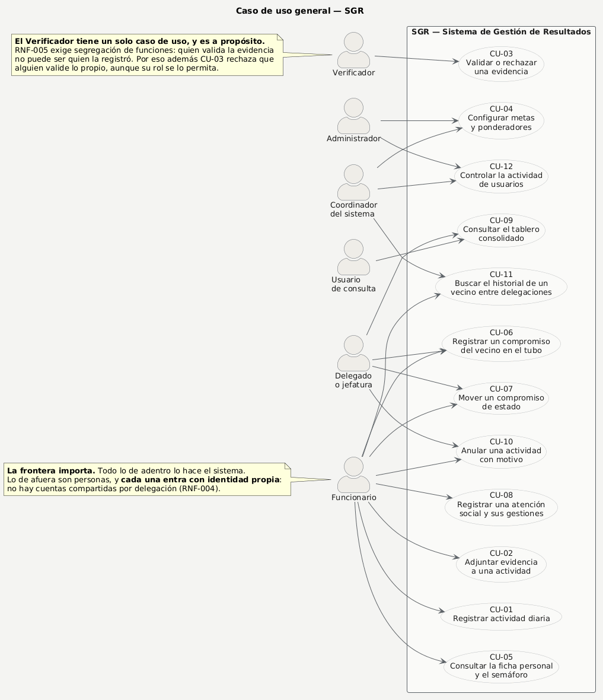
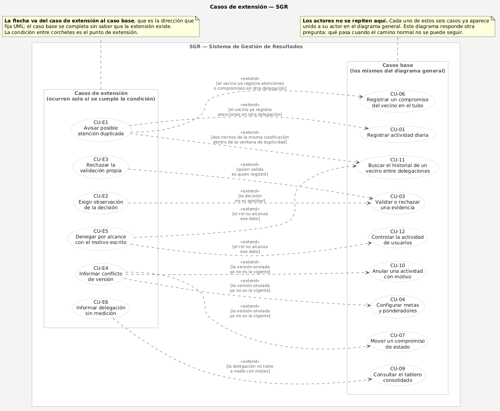

# Diagramas PlantUML de la entrega

**La fuente es el `.puml`.** Los PNG se generan desde él y no se editan a mano.

Para verlos o retocarlos: abre el enlace, que lleva el diagrama ya cargado en el editor de [plantuml.com](https://plantuml.com/). También se puede pegar el contenido del `.puml` a mano.

```powershell
cd frontend
npm run puml -- ../docs/entrega/puml          # comprueba y deja los enlaces
npm run puml -- ../docs/entrega/puml --png    # además descarga los PNG
```

## Panorama: el sistema y sus ocho épicas

Fuente: [`01-panorama.puml`](01-panorama.puml) · [Abrir en plantuml.com](https://www.plantuml.com/plantuml/uml/ZPNFJXin4CRlA-qxZE1GAIA8_0MXD2AKX5FRAEcHox2UB2Eyzc9xWqBJ1-gXXwgFa1Uhx6JfGcX8Sbdf6_yyt_XRxuLrQ5oHISXHQOCPnj47k69C_JC80aCF1HdEc9JJ5kemtXI280cMhQCCOG6siA2JEmshdpadQ3rdUZs1EamtDOBWcgpZrH_bdoTa2-bG1EXNmobc3DDy44UEdQJdVSxXdNtYoDwpoj5W1hUOtAT65qfyqb8RE1orH-rHirfYxr3eHrOfp51Qgag2PbX8DzBAVS6CO60OvNyAfln4q6XLrO4n-d6pR-Uos-XsjrI_ylsADRjHrGmb3bKg2Rx74S3bbi_m2v8sWiohJG0gEpS6_Xz7F_pi_e4FUZr_s6me8-Nw_HjLgqsl9xNQZVfCWWqim1byGWCI8QsSf4Jhmq0f9gmLsHkL5OeJpb6IXKGhe3aBKWaZp56oG847W3Raut0u6buDpzvlPJYkdpHyCnDAsJgZOV6Y2qmSppsRR80FnoUDVPZDqc0II0iGP2dBQVLRbvpcFfoMvmnBenOMC2V3CqumW4jMQnzMsxC6AIc1a6X9tfeFVwAptEYChNxssDw7rmaUjMAd3Ua0KivewUTMph04TlO1TjS7aMlZy9R3aVfuwFLhBYXX6w9GGhlxG4yzT2pHuKoRB3Z7MstGcoz1f_k0piBuHCRA1sKz_oEmb1QcxDG7UTDuYGuP35TMlH_I0-VGw_b98IlRxxyGcxl4rYwnlKlix1AxkyJJNUBPbXX7mU7nSSMD8CDpcj23ynN1nswzMUgTj_LEgNVVqED8aayuI9evVqCjFy8tWq_QFqmvLU7TWMMGGAv-ASAGMrO5mlA57rY0ZyAC5VNxhvRaXNA4Ohsasi8H2Cf9RIucKiwiltPisN_fbd54IgnxzDrUa1959kFeBm00)


## Quién necesita qué: actores y épicas

Fuente: [`02-actores.puml`](02-actores.puml) · [Abrir en plantuml.com](https://www.plantuml.com/plantuml/uml/TLJ1Rjiu4BtpAmRfeK2m3kB4TjmUYjgnT6gSr4LoycKiZbMsr8oNf1ouY_sW7FQmw2VunmhALiqAhNHwyzwR6Gw6VEy3kb1N5h08uiYhrx0WYuNPV-T337gmVzcO0Y_WiGrvWfe946h68mj5ZQm5B09zeQ8Eg5v30mjXNrVq5x2q8c-gZQMAE11iQj84Mt8MBrGmmH9yhCt-XO6f86y2mj_r_kLjso7iZXMzKlwhuGqwh625nTVIIStwLgmuU9KFya5-bIZyPzJoRBY4DLfF2QDfZRKDkN2OOqKmSGRjx_bFvXj1_peX9yx9yx7cS3hgZqO9sRJyAUmi0JwJbugw9FoZ0ARTvhCycsNZo8ZJv7vD3n0xESRwa_YhVvEyZeg0N5hwVUwy-Rgvfs-cisd-XzpAqZf0472c_1n0crZ222jrECFPH5U6ZGyEjRWpG0-JsLrBteeuRVWdTNj_tr8pibIYbYO-opwqyRpcmWYZCmSgVvotr1CvipR5psnFsQAb7dqT7Q3fi7CsuB7WNAdJLCwoXzvbVyaBAcFBZHwBOBP6eoRVMBA7otxNShNaEzBcS3LseCbJjQ7z_z8whhgEwoLdMwE92uDnRxV7tfiKhUkwwneiUL8IwtXpR1pq5bljeAiTBlbEsCIB8R2BnmvER2iVTkMZUEgDk80hO-DnM-MegxnPyeF5W6jnLTC8hiHXsijDrp9UycaFsYa5Xz-wnSPAvOzpwFNU7UQSWAiKNATWa88RfPwonKcdPjc7ap01mnICbBgzlp-LIi0m1QCKZ9MQpEvEfWGCKp2EoUT9APP0i98Gf09PDtiAa5b85XY250Zdv_4LzMBRf_Jy_29AFIpcUU_oSWZQhEelgEKjLFl_s5G26sUsnb9fH07im5Ffg3mENHEi3_U7_8KYrX1RKUeziQuhgtu0)


## M1 · Configuración organizacional y de medición

Fuente: [`03-m1-configuracion.puml`](03-m1-configuracion.puml) · [Abrir en plantuml.com](https://www.plantuml.com/plantuml/uml/bPNBRjf058RtblmEH-cYRHGIxgHLX1fIsBMAKdLLkZXu3iuqupbaBgcWwiFa0RAekkY-l5WrDXU798J21lp__iw5Vymxwz0udod8QfM4zLYctc0YMSVHI_XGWmgShQ_EVsjWawAMizo32gOW238Iib1VNGmgrMeD4F8FdTTnvAHJ551___mNAuxYo5v9FK636OmmkKeDUotEMB615uFce3cebots4WL_bpg5CIfBPKdG6Bro0zRk8sO4fqQYUiBmISu8QesoUceCVr_KRVNQjNRxWHhkVDvHi6jbpL3YKAUAu4SS0VGUp9c_SecD8BEut7lJUz_BBvSgrqx3Euv-bWjuImdQ9_6BDMxWbpCyXOyZHMC7Zi78zDA1a66EF3Pnj1vfx-J4qBMNXZBIhjiTwltz_dcbUho_FzId8fDQMhT8mm5OIhsH0iLGJy4PdE58gl1z3z12_xnw32_wW_xx_l4kDUgXneTLCaEuB6KJcl_Y9Q--vZr7B79zlsq3WXIbUNp9vj2BGRLQsubLtsHvwz58jZ05muhiK1yTJT0a4jNHqGfUtmdU2F3LOJEGe4bpilKMvdUEidMxZPs8pPo8RdwhEELmK35nyYRyEg7LAQ0ZNIm29cnWVci87n-XkLF1riO84pBpEnQS5nFpExIGS3Rn3aUgjFpMJl1sW9-p5cImt7JOpC5Gv-k2wQhcYjxUYTufakSmRDnd8uEABDoGiU4v9tZTRIS4Rtb0zyu-LwhDUqDd0H86dXIz2ZQBMSy-Xpt6KNugAfLkaJnu2w6fiTJKxMw8zMrYOvlOt2Qs7ehrbTZU9dOsn3WgEZayBDyioCWRkg1h5pn5nQMZyuWZZi9geF9byGmx6B4IN-_rOz59Evu6znPlPzCRHveTmOYTumnul4m4m4S6Ip3n96ZvIndmkiWJN7i2pS57rirl0Iqd4WK3gk9Wlit3HvQ15A1o6Bo2m6lC4n3-8ovnXciaVYFDXt54Ma1eAZJtZhJmcOgZVm00)


## M2 · Registro personal y evidencias

Fuente: [`04-m2-registro-evidencias.puml`](04-m2-registro-evidencias.puml) · [Abrir en plantuml.com](https://www.plantuml.com/plantuml/uml/bLRDRjj64BuJu3iCd4DRGJBu8nbo41YH7UdK5863z5BrCEAEf6t87NbtgK0kUkq3z0ropA67meS2FLPlqYSfbXH5MZ-s8bqM_BxvPkVRsI5V6ulQvbaAMTJHD9F6QkxGKWfIYKJZUz_0smWwSBl1O47QiC8KLb3JuDlRKIS8-e3W5c7lEnSuD40f9ApnVlsWG50AHXfB6Ru4lClNVuB2X1n7e6Muoma4cKM-_cB046HIqBdlMMbJSfluz-zdTk5xlcS-IhL0ZHbCCFauqvmhSSCfQtWnwewwewX9CNCK_4cg6KmnDTI414qnJ-s8bVq1CuA1bfWU8RoNzmHXt4G7MlEdJTxUzKLuSR67kiZd6QLssCGq9HRLB2NurVS0hlVgB7u5n5gGtZo-lhn-SrqyRcGE1-xlUxyr4-I64ZH7vJSsxiXNDHoJzxsKfXOiWvQpkGKXNHsIbOFgaivUlT9qbqjD6IbxTJLMhTRmNIS8MwsnsXx_2cPah5m_gB4I19XOkPG21PapG0F3Tq48BuQZuPjX_nJns8aFwsvUmPAqdCe44vUZqeo_HZDoccz9o482LgwrALlG-Y-kzA9Qxpd5udfTDZn0lLVrxIW8BayH2WCdz2EcKg261BC5cpPCMMTesOpL2XAUaoxCg9J3u2JbufXkrWz2pXW4rPTphDR_A9am44YLvHOdAMsrmvEqUqvxO9sSSzHm8j6D5pLMSpGMmMeoPMEmgZq9UoUf5-SrA4GrfDZSkSjIbhJLZ4xIZ9i-RmNBBVF4a5wM3GOyIUKCBUk6uV59AReknNjE6LA6PP5AC9WyguMw9pLNtmcDP3B7UhWch20ZYwOzLhX4bH2iOC5Aa4QnDICe-hSQ6cSt7pf1UB1Fnqf8h4gy-H24Er7HM0t4BxcoJRSgShH3ZcjdsOt4ETwZ7gjSuNvil1FR6wiRLYPFRNdMKrUswtltXg9i_NdAcglWtavmlrbRhbn_xFHa5LduKioYJkUgl9xm4jm1JAMYgwl7O1Wy1OPFWRrzCDw2qLDW_1JOtGUZRIdz7T3tocsUdpVJ2j9oIRTqPnsdp5WnkaSOtOgnoV6OuNkkSw3pq-QDqvvmAdv-vAz1AyrqvTZ7kHkxJ-E61xZH4MvqW1iVuSPVmUqUuFQE-D0_mEqVqUtjSdrFiIMOiBMS0K-h8GBmFKA2WjJcAo-4_tx_ern6zJAkbztjqjq502e-28lvOwHboDQV3SXimTgYijJyGZnt_E5sy89Yzqcuo4cGUsDD9EfsSNNPCYGvfJDqxvlrbxJj8jdgxHnpj78ojc45hPPnqvAKPPMGAKPbgtNkUwG4kCAT0Qz9YJnBVUz_)


## M3 · Agenda colectiva (el tubo de trabajo)

Fuente: [`05-m3-agenda-colectiva.puml`](05-m3-agenda-colectiva.puml) · [Abrir en plantuml.com](https://www.plantuml.com/plantuml/uml/bLHDZnf74BsFDF-Xj3x4Hi0ox9gFn49UrY3buCZQjKycXsAwW8vxgd5tppfib1_Zt-13xl4VYse6s34iB64khNwltwiggkgr3-X2dXd8BXeu9rROIAsXDEWxZAEVuEq5DE2g060Br84CX7ngGH44XrFymyBpct6ZbNG0GGxjv4KS1HqCYSI__-nfmFDzZHTn54V-a-ObEinWYkcdkRCvgsjhh8DduylnvRXTfVW5Alj5ynncQ3nL8KKpp4qOMmw_OKPmvJIQ0uHRVK-GN5JHA-VibxNlos4dwNJsK7dvDAFKJggOepGWpmt1Nt44CDpBi_WLa7MAtFfws1--6HRN5UVaIhuu-hjga7jAqH-KNvTnHtwJmo7vE38q2n0iE3rV151Qyj2M1Nf8wUpLAqUVS-qe8mw3mOHhjT6xHkkoLflmRXTCU0MfpPREPjfRVmReOVIkTGdFHkFHcr7lQUcowqJx-a57UifRerCTSaL-mfe3EKOF5kZFybXutOnRIUSaYwvOt9QQo87g4CWv7QpJjZxXxryT8QnWHka2DobHq0gtFjsJV7hYC_81bVMGMfRPOAzJRLaIIIq7Pmqgz1C-Fr-YIpMQy_EjI-yabtvPi49BYhKqU6yFAFPFKMotYhWDf9gS8q2ZXO10HgglT8hAEiWPvOz1kAFxmerOQU903txjrcO0VZ6QgQdGBqYT54CYCToGppFYROzPM5etuLdEKaDqsi8Ag2ZmeGYInoE8eyrSdLr_QBGwuZNNFZYKn2fzF67YpOeiHAy_j3exhxiJVcllQE-bedLmcuTTCIvcej4Ob0qBFuEKOAQP1eCTi7iCx1q3-qV0TkiOcEo0SLI6sMnMOrBaz1tTqESWd3AS3QF_56CTm356yWWZZgJqqFYutcxrgJNgzn_gw35eFri9-mYt-mYtUu3R-n_S_YutZjW6WgaDmMPWPvkX1gZLtZloKBI-rw7OSjAzn3B1vV9ercf2lTL5_vMD1B_ot96NqmgyPbXeBsiBPVA5NTqmm1OymJ8dMQ4u9GTU0vgvN0lP4Hfz__qRp79okDqTTM0jwogW4-To2mY_El452LrMSjnwK9VMhIDjnX6n0Yc05E8riSep4qV_0G00)


## M4 · Cálculos, semáforos y tableros

Fuente: [`06-m4-calculos-tableros.puml`](06-m4-calculos-tableros.puml) · [Abrir en plantuml.com](https://www.plantuml.com/plantuml/uml/dLR1Rjj64BqJu3yC71HD1KkcH4csqi28hKX0WQOmdBgNgeSHTqHliznbTfTAxQ8Vum_8eSYXz-h7YbsAD6DPibpf8kvxysRtSNP6Run5ROjCGDPl9oYIGYZJjZWNf9K9Ws_XNH_QC5xTbT0X6CfMTmkbbO4Rg8ZmydBQZdezG70_ukvtOM2v5UJ2__tdoVWm20FpWSiSDMOmn-H3gbKXsLW9fU75j3_jJtjDYhb6fZvncS82XQ4cn6Y1XR1J9UrFc16SQOvY2-4zloNenatqJ6lrQPrtS3xi3eSRg8jycb5gTvkOfiIYJ0N1ds40SBvnJl_naDACz7hvV7J-zjmlDp9tpzmt3Fvg9YWC9MYsogzjV21VdM6RV1W8MbYm2ZHFhoqmxix1bNJG_P4ENh_MzB7WcZAIzlHq9bkjoKKxwhLQC_cE64_uwek46s1aACjfzRSw03GmkOXwy68odRoTdEoZD_1wIdAhD2cuWKH9gvMOIKQGah4kJQKyk5T-IhkiO2T-jaIPaDC5J2nVSeQCp4mkLtU2CpHU_78QzNfxQSPESrnakU0P9saLyBH00JYJM6OoQgu9Ch9OIyTxIVUTz8MIZ3GovNTCOYQprTqVFFFF2vuM3gk5-ti9UvD_a0b9ovV-gkOaKV1RJBYIpWnVS6GrltLtsCpaqL5Eaha3qj5HdMvGLVNtWalgC3JNnFRQmh2i6uj09dVdGq01RFNvtgJXNaB7JkXzrNQyIKKsr-XtNLla3b4B7-ybVEA4VovR6EIaZP8ejXbnyh-D63NJC096WbBqjydltoXNbOrNFDf7DevygLVrxNgJtxA_HeKfK7DL6n97UqbsdUGlt5Y4LAWv2iYLXWHrghOLIDnzt9Smg7hPmVYg7GrcSgoaAOH53G9XmPDhdCaR874_KRpc-2eQF0WUDOD9L5DdqxpnLJJwEhRRyx6klvI9wuQmwTFugjjp6_SDhTq-BLi4l09dru9BEZrz0CQxmFukSB0B7Eu2ZpV1GGsUx097Ey0usWLs7u1XK5hJwJHzOAJvaYxfetMSShrYzBSmXZNZU0kZNpD6Jp86Zp32m5KKj7zTpyd3kHBijwzUe47BpUB6iNTmXy_W7Z_27MtXzfx1xJ-3EzhaTdkFSzTlly4D0waimLnPgp9GYwgh0hHQayQL1KQkARYc1cNNFmIfwgUuqsgveB7AtBmfHpswEwpclvCRJTLCy65hMA2BSUFKzKhNcLUVbH-FMIx8gbT04d2kkJY4Ga8SVUFuUK6Cm9269Mb67VXHcNfGW451qkrBeEyVFWKZo56lxjmSTFzjPI6JCcUo-i9ugZfXG9A1yy9vyeOaAp8H1ly1)


## M5 · Consulta, colaboración y administración

Fuente: [`07-m5-consulta-administracion.puml`](07-m5-consulta-administracion.puml) · [Abrir en plantuml.com](https://www.plantuml.com/plantuml/uml/dLPDSnf74BrlrVw7BlcGX089n6SS5MN0KCaXAPKIvH9oQ7OQDFPi3veF79pAZ_4FyCc7tCCVI_N2OYmicGGkrBpkzwPxN_VomWTq8UO6ydOji-oZ2LX3bMlMFZZCjEKq-Gf-R4CDHZky2farEBC2RpumhE4mGKw-lfdKwirBG2X-zBv9aw238U7vv-_JYT8aJVnhpKjqcCCCizSBPoEhaJNMmRD9QzAQN1w6-3jKzetc1SpHU3g45CqncZ2n77x2d63WD9f70dxMRmaQpKDqu9nzizDj3pkDJkS8bSmlHsov6uUOeomWBmp1dsa2C3ogi_WKa7MAtEvu-EtmvR0uFb1k3EIR9dyT2aHF6Vf7wNTjV41Vrl0OVPeOcWS85fnUt0LGMkee39Cc7qiwkxfoT1-revmuzFjJhbJ6rxLwfrAPyWqjhGiuqqOhLB2USh0vWY9Gb6clBPC_0_GmlgvtuDbuCduvxft2tXNsQuC1vzRbk3TQq2ii2Rl_XR0dX8DFxLa5JulevEfJNaDm-BOifTJeVTJuaifsPaHc67s63jOmroOuT0NPpQJUl3o9eoaSup-ApZhGB1qWFsMPRt8hP6MtpDPF-U9YIQmqSQ2BYxrGipJTTqOpdIlqTwHE4c-9-2yEP_ZAWjTvD67pZab-yvIzdJdocTCXEYp4qMKQpO5qwoIPjiYCh9oYqzP3mJnbOpquMiWpUhowzl-khhEhRl-SnQePvZEzKpigftCIRs7NWI4NqCFIEbWHPpgNYmlnMjPPAEQYBExpQjsJr0el_qfEvWiTBD5jtkMqxzWHQs7USeUSZMvhZVgK1nmDEeYCW5dGg-qKP9OXjq6lR94zkctK7wGsflozzi7A-fM28iEACirsoiJ1oUGRMXHldjtiZsvbNQP9iGDgjVvs5E0vI7rppTJlFm2Rns1t3xQU0jl7O6yFTfu2kq-1lGTWccnhE3y_lB0YfrTqG_T1OhQAPKJtCn5f8ls5sc-xNLsTMQD-_-Io7eFsyxL4IniVYRry69icR0F1p8PWSx3pqie0vI00ULbux5VaF9fAfGeO-JuIu7tSl8UvNaH7aa4ippZVV53HsESGh4AmIofV-fdRl0yw4tCRyDe7ob7I5Bt2lTj1V1Lzb5clmfooEwm2PkNV1cEzfApGM4SUa0CvRMM3SgILFOSnImnawAqlJESjK9531gwkD6ScAkhtONHR-w5vdYR42gG5qeeNn2hc9at-1G00)


## Requerimientos no funcionales (18)

Fuente: [`08-rnf.puml`](08-rnf.puml) · [Abrir en plantuml.com](https://www.plantuml.com/plantuml/uml/fLVDRXit4BuliEymI52q5HnPArcor1X6_2C51HBRaDEY1rr6ov7CXZlSa5mbIj67wR6770e_WbwiuExgDzvsqKeNVUJCV9pXp73qoZeqBaiK69w5mRVmHbk8-c3eGqP69fBOQGkiOPPnB3MZ8di4E3TPYa9RIBK1T4PECwT14CIef40H1auwHJ3-9plmNTJ_FWp2mBwNdAB11AOOlvyRdR6uqaeRU3uw6PsCshiYzW65_YXv3ZDKbdQt1CqmKswasTrWGd1X9AeAWNlvcI3gxEvU6AC_bhpTorxKwtsrwpN_NQAm7Utk6OeTybmH_1O609TV-Pb_yYrj19bo-N9mUNsPB-ymHnV-6mQ_-zY5mTRqiqRZdkQPyJS0IqYDN63iGQFn3D32_V0rF1-EXjV3_e7QRKe6OxbwP5X2ZEcUsktTi4BjHtOqB-W4WT8M13fjIxthYtSLUiDFAHb974lqYfdLfShmbxigbOLMMNx2jUZFjrlHFU6pCv--qb12xCxF9zneZ6z6BrgjaqPZmXUP8tOoBjsDDKzO2h_atP0iv4AA35LEChuPjLedzQntI-lQoCzRuv2ilh1Cz8JzTKX5SwbX2PRcXkQ5s9QfMu-fvvckDC_ykMDPb9o_E3apAFI4YS6PrHzifTCJFZvEqNYnu-CjLQyULRzmIaYdpUeBvXujK6apOMH7Hce3I-2C5bL4_Nf40qzqjybOM48YMIRhK4vOK95Sa9AnHGF96Oc5xowqopbO5zHB9PcQ0kq3YRfP4lcJN4kRQfPJMSHsC3ZgVbD95prDLuUixSd6tcZH8w4D5eZ1q5nQP_I4bz0jbXnE5HbjA-BShaVOANCdpemf2j1Adh3LKqCsDj9bnYyflwSjLf1rQf55US4DROmArv7CsGm9QMdr5vgDoQXUbKLvGhxLx1EIT5bXVpeZOxG-MAZ8EAnCZQZ_VrBZr9FlDxsPDebFIyzjIA5_tAZgZaxh-TWgaiAcg4JXulZk5jedyE1Pnkzk8VzPuM7hFsTZbFltcgpBkvSWe4NPOah_d0TvEJxbNtHQCv1HNcC_sKrM-4SIFcIIUCAi8K6cNn5IXIoLGhjbYEhPpylg8ex9RahOJogEOfKtoAMFgZDe7LMuKg-SehASaXJTXkdgmUY4ZYOy57FoZMprk92gWgTJDsJvy_BMDzrjMygBASPaAltJIn2l7eMSLtJYgDxh4lNMIMwqdmhMNCi9qwTK6rU-RMIToMBVBWHMvcAlgjhyAFBYnVdcWTt3tGFSEy3z0pm80p-ZR71qWDi7kBEFVUlPm_qmyBFBHlvq7qUj0tmQ1dvmsU3e0BSFS2SC_FIomTq3tFCHAY83pUOwAF03d9q9Cd91O_hWpizBcUvMfbz3Pl24J1YmTWHJxPnEGCysrm3GQBn1Y54G8oYQem912goqZX9iDXfUvbuoF3L2-Nd_0PU0kqFHIwzX9U-lWaB0xPZ1klnNiIHW59WhBRtGTgW5Io2JLEK9x2UJH0Eg63cclDYDLaslzeQMPA4TDNkzpX54WsQltOUbNpYD1iqm81RWtVTXU4KiiaI5mTy0)


## Caso de uso general — SGR

Fuente: [`09-casos-uso-general.puml`](09-casos-uso-general.puml) · [Abrir en plantuml.com](https://www.plantuml.com/plantuml/uml/ZLRDRXj93hxNKn2UWsS4Mt3BFt62GJ2oP0K18dlWm3dfGdLJScMgIRb-b7M20FiG-m8vBVQGamyBp35watcIHLLtInrBEpFoGQP8VcHznIBvY_DeVIWDvEZ47GOdXtDYicZKFWpG2HG4mGdKly8XpAom9ujGa06ddQSI3y280qVQ0UPUBBca_NKuWc__FbRxy90C2icfYjJ0BgpcN2_Ga3i0fnbc9hmN1pg6O75TjGzlnDLEZW3dDYoGOI4sGPRQbL6lEHSeLuz5I878GA5nRh6CUQfzi7GVoEfI4tjnyECu0uJnwKylm23aOYsvXN11d6i4Ocy9q7gQnUCu80U1rJxaLdkoMi1RPBSawz34enW4k_fzQdMENUMrDxIJl3_--Izu--f6AVURvWLQB66A-MzpAu6BWHYnyCFeP7GowhKit1qMya7p76Pe7BKq1Sqm63yIzbTO4lIjHhDR_rP_9CYEMyg-jVAXZdbwSPQTdJrLHh-_DAY0ivOg5S1R_s08y0CvAUcf4ZufW8kd1xySNGulpwD6R47s-yW0hMooVlnJdrkumL6EZdOZZzBdAVB5yulXnUWlaItb7dbk_XzsVzGVdVyTxFeadvKoDFFW1QoUttaeT0oXXPMgsDaR1SwrC5ejUu0EHhTNZUeTMJtJEHPYa-hTvKsZ6fAXEHOoOO7tD4CVB2QRuUMRncOWOWlDqNt2hVURx0RNrurTloWrQ-VjEb1_E6wKjox4r280vC8k6Dy0N2cruMklqtdxwgOg-YfCV0-lo7czUkJu_mqbvq9SfxFNt1DyKWfQjE-DU_3jlt13yvYGm8Ai4qO33q1BNRrOb-AFU-cEO5qDUuFRmwDimhKlsbX_UgaBB69xiBhE-_Oes_RhJRXVl0_iqMu2JHWXC6vm6e3UDi3nXD-XqGLQa7YUE_o8TiBHVOtNk1zlkvzEU52pQsE3cUdy3jUdd_03nFkZSlLb9bOQeDDjeFCs0Ibv7sEl7dd2JdATg7J1mJnUZJ2v1kny2-nrjZbKQhJenLMbPEiBgfrVRrFwkZVXLwaLsfXxldeiz5nWzJlhl2ediytiwyZivwSbSHnBeZydBcBtDl41BIionyUxYk3iUmuWbt9XfTHEgkINb6iM88w9-J1TytcsZVLimcDPqWuS81UhkV5zjYlpavZvOFN5v6bIFO37gI4hTGcVxCh-URiKOeALouJZyvDu6vkWpxVSirvozrPCLKbhYbFEeNhEpQLdE_dEKjR2CpqF5bFnLFbck_8zIG4hMmibUNInNjE0JIrbKs8dkwATrj7IYID55Z_YL9jrMOnFTuJDZYRSvs2QAj-SCXU6KhnUDYnbHzlUsOGlWiihXk-qynB7QHhXFE5rWSJDe4YjDc-_bInB1_cirEZs2WuFNrPTfINqsi9fMpXh2y_QmdbBo8xQGgRKkykRnkvOgU7bcmrUItZM5fwtXEn8gS7rTQCwQGbPrXPwIlM7uutTHeYgmVNL1bt5GqEt-p8r07W1F_-iEJUXe9Sle-xiJtHhlzuJdMBn15FnNagGMTCJEfqt21WAxSMklY9uBATwzH-kbhMqCK82qON0Zx7z7F_KwHp43Yh04fV9Ga_3UmIy3wklBnJ4jv4y7eZ1e8D2qqUG1Tdwhk4-n3UUMpqbFe1ozILU_M6MmKFwxXqa2qSAgioG0GEdtyH8Cos9kp2Cq3CJfuA3EqnRfwcsMLWzBj58N0nMNv4LG4aiJN2FCBFeg0lz1LhAgMvQhNKNSenjSRE0TXLn0P76cioqWSWihG-HoKi3hSq2l2QEPLzdlG4wY4FN0SB2ocBrwBINRgUZ06wkHeT7HwT0_z3pIC3SfWTIp_bPjT2GUm7tGHF3CesGoFTw4Yg8bx88L4H_Mnl6nRhgswl7Blmg5iW9fEdQZ5J0Wj9Dt8V4kvblGX0OIRbgELZVH00hSN8c7TbIUsmJz0jn4KgZ_WS0)



## Casos de extensión — SGR

Fuente: [`10-casos-uso-extensiones.puml`](10-casos-uso-extensiones.puml) · [Abrir en plantuml.com](https://www.plantuml.com/plantuml/uml/hLTBJnn74BxFhoYH0_OALZk0iR4iAu1tBKiuYS1OaJAMN3jTkxJJKptqOsqSMSefFo3AAQVa64Kv-PYR-IV-9L7rx2m3krOU2XmGtLDVlRvwzES-e0knCb2YjtupUhj9RmAnrvR9P-jmAEUW2ER7b-yPDi5O3vwqXm-_ftFruKzGPC1h7wZ23IWjWuy95SRe2Ix0nsnTpfKk1QKFpv6162A3qZXrM25WZIvGWfeIaqC32BMpzULxhuEz3zuob5XfjluApJ8QyXj9HuLEZCCh06F1669ayKAqU3YF1DuQ2xQCpX43Pkimev9y7uwiUAMvD57HXpytceyl_sXKswgsBc2bYODD_w8BMjaD81ykVqqEaSdM5zfl3VOshs8xF-tNiJAt-zbwjWuVV_u5XWQiKvGiL5GQT9XYr832ao-U3u-VFNdq9TmwFDtCj-3Z3p_2uUdcO7j3_WntsuDXVZkvqesOPEAbeKc0OC7fwLa0fHsLGLj-2LyPv73wz0YmrWP5FuxnbOKpBBKWeNDwZ1BQkLrjT1KvAiyiA7g5Oqo4q8euw8akKLb7GXgVl49bVJyBEXXQIQUFt_y49u-Fiyn_gxb6XnMCiVnswcnaTMYDTV3PQ6UqCzhgVE7FKDdNcgSmGUEfSwDeWj64aUNm1LO4-qwZMNr_ejyIvDkTottdxEkvpZi7k_dkxirBaVlR3nhWl7E5PR3k95mO0dnDtbPqynA-om0ERZe-70qV3U_9ZSJINTSCqB4ctvVVx5q7DtegfVXM8e_IpqtaWxs3HmUZlqKM0Y5FpQUmzqVxetl_17lkoRii-mH7i-nArrglT_Buk25Cqsc4Ie_9XqGaHN1CFfeWZElrrbeVuRiiWux9QojOMF2jjXcapk0rU88oLhKXCDXfNBVN03qCltwMN8T5aDTIAHRyX2VMLUYaYz6qAUI2lMQeQ0wH40vFXxlB07SAVaHCKtHGMmTeIkII2fOo9WEL3NfcWNpfTB0jpfrbd9sE8QNbYT5bi0KhWXavtpLYPrbuk-1ZAi_mBJemMF0CZLRpbYIzHMChlBqil5Nmy8sUQWTsxCdDsWYe54T5fRwcVciP8IzuVwPz2e7NOqC5Oo1kzAjO6san2nFo3E3ToWJBu2dublIcIligfTnS3PjvCsxoUR1_CboHq7ohu4FBmLcJOY6bgcTQeKeEHH_HQUldjkJBpkHvmGVHb-WaVMVQ1olzICWNkU0PbPej40T72yB8w6qHyoN4mLuoAV4yWGOS6t8sSSHRoPHgcJ7OMnQ_M_1JEoCdWrS6cBELzWqro8UExDrbsPsaUgAdqQ63YWBwWY-Wjgp8DMs_bLwcrM2xuEU9IGwiP2iHhE3823IJwL4kY3LO9bO-A7YVe-H193g9aDfe2gEDsc1P-QvmUgfzSBZ2TGEBJAIGnl4Y3Cj5EiYxM0j3X5dkoeE6b--oJ3WA_Vx3b4wu3myUD3lJmuS5VwEiXpEPfAaV6KnCHIWD-ZHA5yKZ79n_CYCEoAdtDTKWsbzqzGnsR-gvyl02mSsDXwQiX6y5sqv8lCJ1oXUT9dPTG_wFDBILAofMOmheLWkwVHEqsp4AblnumDhPCRf6TFkJekTH4qFJkWfHtnpCBRjytyZljF8xArIthHA8Pne5vWAXCK9kzPGuq8jhC7V_5vXyyDzX1ETEYxEr8alE6X5Be-Lj2Ws1mc1VN9FC_vMaYEwsCTXRcSL5pWKYQ69fwy2eDAKbDNMJ5rd6DX2CRGYs0ZkHGPi1z7f721CZFGDc2QrvMrpV9D5SlJXwlMPrRwAJreb6-tca362YNo6SFZsw3zGHIZFVoimF23AoFOx99Ho3NKtqHlQFVWPmrDqDvesyjAuyeo2Kzu9VHtajNBErdn4h45_d7WTRYxioXnf_PS-MlP2y1CmJEAfraCVAURpyez_hmI4gXCWDiW_jcomzDwG8vJL5fNWRMIiBA4-oPjTisjpDKTY7ePVdLtlioAVMdies0wWTJIC7l0_dyV8tgD4Zb15PsIQAyYu3bgN3p6sk8oc9wZHgrtNvSs8LAvFz1G00)



## CU-01 · Registrar actividad diaria

Fuente: [`11-cu-01.puml`](11-cu-01.puml) · [Abrir en plantuml.com](https://www.plantuml.com/plantuml/uml/ZLJ1JXin4BtxAqRfWJOYKJO1H16AI4AMHcevWD9BqyF47eA5OqUsDv1MIFs8_a1FFVN4eH97yYVzaihEfbssKDYLThL-Cs_clVNum7cqFfigI98QpsgDX6r0RrXh973t4qve8fstQ06vbtCfK82GQ2N2hozVWQCp80Yo-FAe50fJPnlGLokC6mqk2yd6ReBBN5ns83LNcHJ6mQAmAWZeofDsSdcZ0yrR1BgQAScHXwKGm54Wp0Bt784qA8Hqq7lJsGHjmZUfqE34uXJtG27R0Bky7Ll94Uw-RzUtO2P36PNtIpd7cUJd29wkV8OANiP-QfapjJoiFXMlwinBh-WvxZ3cBgIUeSKfZ95VJAp9jEWPPIoyIBVIhRHPY73dACobr1CuG-MeW0Wwmqpvr6X_Z5E2ZfMe7iPFvIU2f5K0EzQQoxpcTdSdsTafWo7loO0LSLA0ukyyzGj5W9Vap9JA87nc0Dsoy7xQF-pl1iHOGVP-PO12DqadtEowm9ivukZeOUOqNcNcxklkOJTzajaIzwWdwZ7kJjf9Tv_3dIkvPcnbGYNDD9T6evMc0kWW7HupzhTSfLezFJgfLkCilMiMjfI16LbdD2fO0Csb8CqbkifQQUnqxKWbRiYHVdmxnkAzOICfPVMJaUxCfKCBC-FaMD58em-ruhHbSVJ4EhrVJXya8_qUbHHeGONvHM_SI0jIO7CTUUhWdzJcI1-Hfj0jAU3B6o4d1fQtMd8JAC9G_f6nPccMMLf5rQj97ak__CQDnSY2cP3UsEMFjOX1A_oVT7WCjLfxvGaBJwZNsx5Hs8Fz_NW-2Mgtxs7D_s2j4iQ2NpdOM976iqsqsoFzWHJCYKjjO85hht3jlT7aWXZZBO8WHPFLyVUHiGFI8figzXi0)


## CU-02 · Adjuntar evidencia a una actividad

Fuente: [`12-cu-02.puml`](12-cu-02.puml) · [Abrir en plantuml.com](https://www.plantuml.com/plantuml/uml/bPFDRXCn4CVlVefHE1IYRjIa7ofL5NMJnb09UcYLMovJUvgQUkt87sq3giH3y0ASE77YWCInUHEU1DdPgaieAknAkzhvp_ncnZjpu0Ew42iDtLuXOh7HOsim71SRFRZx3gLy5qr01tIb91cX412YGK0Hr9MIAE7dnqyWq5kG136_0cgDqdRO6epqKXFMW8yfohfryD5dimTbX8vAMW_pXbKIq4qWuzNYcqcODmXqCzDAe4Ycv21G8imI-mg136W4VZHyNQw3iUcRD4Y5KuSLxe56jWPkyUFCAO5mzsMximKpbTBekbwg6UTAN204kWaHDJpFzHJHsw9swrJoHOS55JJzpoanvY-LcQ732ivGN4wTZKOEhROEdl4jliLx3Gz_WT9UApE5SzIU6egaSumwS6l2CLO4fLEe7zTFrNk2xcP3B9sprtNExS5ETsTdLKnnJpeimTs6b7_hQPXh0hmcRojQ5U430nYiDZxYeyFHRbAia-H-pmpGgAPRfflTDhZHaq1FZvDvlbR9WvU3mm5_akn813HJ_JTsoKk--o_ikfDRnfQ7qEBH26KDEcLRW1xu-9YnXtIjTllqrKcxdNVgRHwj4veg7vo56Jbl3MgOFqoPRzrtcYkzFv5M7io9-NCi9sPbBdCLm_56RoNyQ7DYwjGfFg_6cGgBpy8wd1X9W56gODtYAzQCeytKA1yVGr7qbqoMdj3fzBCCUx2_dnTUKh_Fs04P6IlDVW40)


## CU-03 · Validar o rechazar una evidencia

Fuente: [`13-cu-03.puml`](13-cu-03.puml) · [Abrir en plantuml.com](https://www.plantuml.com/plantuml/uml/ZLJ1Jjj04BtlLupI0sr48X83eWX59AdT8hKz195Bms6oEmahDhlkxZe4AgH-H7-Wfvvwub2fH_8d_PBAQwUO50IsPClxvhsPjvxPG-VH-coce1KrUDROYjW6z4yQMn7S_e8XAYdGWW5B_0olq4Ac4MWk1Mak4Vvy_GOSdG51a8MNHwLGc2RRW5WL63SQN0R8lR6Ru38NbXr8pLKcXN5mMLaL1BJmf9rStkXSvZq2BL8bEV9yAG_WA13IN7kEG1eKGdBKVzVT16toRr8W94ujpd0V5B8DiClVOoivmksFdUOsf39FeyfwgTIOI7w6u6dXCrJmCjJJo9nfb67DcNZLP5vwHS_V8yRSkTGfMfp16Fdvr9fCYxvHniABP3lPJjgL27U6mbn8FOK9AaSLHD04C-KJe_r7d15qhKJrC7uihmXQKGNiMcikofmxlTtMxkuwcFEU32Y4MnKe_DHZVwa8y8AScT4w25yOG6_TU9p4R-Az735MaBsV6Q1IJQkRt-owefivukZeOUKaNElAlTUzDxtaIMLBtAEUgiUqkqatsNkETkdach5Y4sf3id8YEGfZQu0EXl60iRjqjNhz-EsWNWyJzQ6TDzQ0fj9vQo0bwun61PTtNULgAwUXqjMEr49RZlJ_JJdIzxeorD0_sOhMo75xfEE5d4eBPkp8pekX6sb1-OG8uZ8CPicFs-lyQAG7gpbGEDBpK4ankQarwR_KyNhgeq0Ddj6M4pcMVlcT6ukX0Co4zCOkVwuqZg9yXuVn01gDJc67vKzeDZi1XdquE0ZdZA1E9mVZTWbk5M0uQqIdCzAVglx2GU80Ksl6Q4zpOlGeyNCcIKFXD6SLtxRmihmvPUoGjCXcYlq5)


## CU-04 · Configurar metas y ponderadores

Fuente: [`14-cu-04.puml`](14-cu-04.puml) · [Abrir en plantuml.com](https://www.plantuml.com/plantuml/uml/ZLJDRXCn4BxxAKRXK8YQAA7RgbHLrCtFGYHAf5Oz4GvJUxAryDgHxKrRK2KUWXVWn8aJ1oIEpPlm9CZEXgQhedPNMil-PhxvPdR6HywZzMMXe9kqUDdg96mB1cUjJWAtls1Wz4pcfKKB1NbqS0rpemLP5CQIWpzVlW97Pq0Gb77ng1GAqsPRC58hZ1iDhWJatjXjSAMBnmwavggKmWJMkrD1G5UUj9FBdphGl4MWgxcI77au2WOS1S8yS2yGI8D2oCQ3D-asQ1Fsf418p2qMU00AsHROvUzpApd2xVVTTW9p6SAeIYzL73F9Bn0yNVaI5JoFUbgbCwtAh5s85stcfLVqv18nvZvAFKUB1PmZ_vXRKsenCCfOU9ObMPAztB1m5oZCfTGvp50vsa04pR1KFZFQlyE28BKIrSFugVn4qDtP05DhpMKLSxU_rztRguF1xr635N5t0uh_zDHVAmAy96SAgeFmcG7qwucFij5mj1yGOmNP-v41DjHqq_2ocmtUqX57HmypP_6fC_TVzOVzx55cIzoZpjN_kDCipVQVmbrbSiFOgWYDL1HII-TZLpG07QJ3upKuCCOAgGCqrO8KEEay5HZj1fC9OtV26itcwUkJPZEEtd7tNWV6-MYiQn1pMDUg4VjrgklTEjNtstKLygoJr7n7oLIFzSpO0cqOw9cIt9kW5XPatIfmT1tLNSSxKtr2UKpULfDsBlto6pSM8mEMGdfZbp-gZC_6Ew5qwV0OMgtUIivWChdRiF25ThiNRU403W_ZPIAermlWQ0rsaWZ62qNqUbFzNk4_mK1w8L7WL5zZl3XSaBQGEMbF7nWx8YtAGh6_)


## CU-05 · Consultar la ficha personal y el semáforo

Fuente: [`15-cu-05.puml`](15-cu-05.puml) · [Abrir en plantuml.com](https://www.plantuml.com/plantuml/uml/dPFFRjD04CRl-nIZS0X4TPIKE2eSK9qq2qYGGwFSUfdkJj9LrxlH_caIK2KUWXVWn0DmGEBOl0bFWjP9XHCLYh0Friut_iqtu_6f3-X2B3Lqyqp4h9Ep9WodMIU7k-ymjCP77T21HfWfSOMm8EUjGGrh80sUoisNcNKMVdxw30Az1KaGgqT0hL7QDcl2I6yrOGtu22Y2TKVWew_27fGHEYffFQnhKKb0gq36gyqtap3l46Yrq4gWIA6K850YB1Bx1e5CyidV3jyKHs1iEfC6gN3kiCINe94rmMr-N3eb4Ew-vkqUB5GgetT-QSVOzXfe5I9gU5hvoQAtsIwjNSfdRHPKqFG_qsBCNokpG8SbNAAudZiRZHnQRHqyuJtUuyUr37-5qYwLcSCCjQUQ8cc6KGTkJHXZIL0uXVfXVQ8-47IVryJ2ERlSrSm7_Mw_VoYcznvDs8AxDQdwl9EmrWIu96zBEXJX8mCO73O-ugEpqKbIh9FazYi3rDnqYtIpsnetUXBewM4ohwv3yk35u6p07oKx4W7DNF-9NV22d_mBUzV9BMFR8JHuD49PWqxP1g07FXqpzhjSezMQl3vljQf_w_rnMh5pcYiVdDrRh1iboGY5ld7VQUNqVYADQa4lp5_MyyBixsVbPZZjvCaiduuXorvjp-oKZ8obPhy0)


## CU-06 · Registrar un compromiso del vecino en el tubo

Fuente: [`16-cu-06.puml`](16-cu-06.puml) · [Abrir en plantuml.com](https://www.plantuml.com/plantuml/uml/dLHBRXD14DttAKfc4R1YoyQ95QB8YZypO2baaSXiC8joTyLfqjDjzST9G94u11TWnOeL2oIMyKqu2UgsZHsJA8WPQKRJh-hLgzySEe_MXq91lLdXeL9hiYte3Ygr9jp-W1CQI-SjMWWQk2acrXJI6H2aO4fSQWEaWHJuC3BmwzDdu9XW2EdbKIaKfigs85DpZ1iDBW1oR-mskE3IiGEfkGfI60VNQwU2WAuyQITdttMaEKAWgucI77ayYWOS1S8aSaynob48UR_xghqDV-G9YMEB1Uw3GhO5TlPpP2L7kFswMzs1YOnXr48lBJZE93z7y7Jb0ofuclHKWZELXLcr4C-gp4klw3yBnfYxa7g25WiO8RyOMnEqw1fbB3p9T_AT_FcQXJj7OIwb7iCPAaThYA0p3ChdHljZB0ZQLgAw7p-L7mZgZJMmRQsvNCJSxJJhpUOc6FqUDPWJrzUWrE5JVwq8y9ASAMWJX8yCeBEPU9PdlMml8iOAidSZ0wofgRVZpMxMU8CZZexkPyxJjSdSUT7fTV97cIrnZtgi7k9kv-ryxr-u5vdSC3OlGYaFcakZqKfJ0dIG3uwNK8yKZL6OeJRmdixG1ul9ffSTCRQIL2gNJr-UbCjf1LytuYIsnwG50ZUAk9TJB2tpJ_gNTIgboHtg1-PsgEyTt2IXEwWrDvYo-b2tfzAXXObnSgHegD6JNgngI7ihSE6UrJVS-_MXVeDA2hIWulAZDsukmSxrBIFt_t9jhESmN-2HzBClt5YC5811I6_ixDioVByHUv0FZg5IQSspwML7gmyMdr2jjb8ys8U3W_IF4jHgtS4Q6nYBgIt0MZE1wHycMgsXVhkgvpKkqqAOLybeSh7LgmQuc8k95YADGghaEyOEIOjGAFOR)


## CU-07 · Mover un compromiso de estado

Fuente: [`17-cu-07.puml`](17-cu-07.puml) · [Abrir en plantuml.com](https://www.plantuml.com/plantuml/uml/ZLJDJXin4BxxAKRfWJOYKL82eGX5v6UtZGGSG3arFGps9BXuxSW_0LeXzI7w0Ztrr5CFbNeaRz8dgUmia4PKi2kjvVbcllayE-C3vz7wK2Xejciyr1fjjW7zKQtHXjjVS6JcP25euAQOMLD8Pq0GaFCe3FpvyXKuBaqXBHwLGc7gR0CojSIuqU028FV6Re8BBfaTICrLaC8uk5wnHl8hJzh9nKyTQGuHw6gc94SUJT61eq2OHUuv0cbG2Fcm_wwx2Th4FIaG4gSM2zm3XMm3xEBtcPKSuVRxThq5CndJg58lbHmJoSyHF5tvW0fU9Zsru4ojTAiNubMTUUaLFRD0ZBaBgMTeiO0pv1TJQu8MVQECXHTvAs_bhrSyt3aASodr52Qe7AqWWYOObC-DziTO47IjHFKuVYe_4JItLi2kjUQopBdTssdkxAo3CUv9XoLnSmLAV_JKNoi2l2Hd2be7uJC3wAqVFCkpGROR4MC5sNyp0woeQNRZosvMU8CZZeuUPyxJiyxSUzCRzF8dcIrnZtgg_iVTpRlvxdEuovFSCBOiGYKFcakZqKfJ0NIGZuxle04fcg8mOstW8qtG1ul9Pv0TClOWgLAjdhuzgLRJo1rjnSxhJaaB16uKSI_dMBaxVz9_LwTAwjInVgHFn_g-KLFA_gZHNelCMcCzr1DZ2xHna2TAShyCd9DDCrg6PgsrqE7MM9_GL3flqPOJTYRzuXit5XC31Y6ziOiVM78CjsBHyj4nr6gTfPn1TlYmOV4BzNed-S8UxE-dIqHGfnF1h5M2ZNO2qqKYEfsnVg_mNZ2GdaiKEDRNc2uC5wNDvPIqfm-C7P0MeL3iBm00)


## CU-08 · Registrar una atención social y sus gestiones

Fuente: [`18-cu-08.puml`](18-cu-08.puml) · [Abrir en plantuml.com](https://www.plantuml.com/plantuml/uml/dPHBJXj148RtVOfVpeB4OYmC1Za8MTZ6ao0bB43UiIcw2zEYtMtrWqSYf1mY5yWggwooY9GblabE4iq3PMA1Y38ZpMZwh_dghvhgsG-HV4npWsu_aodRw8irZAVPHX_tFt3CCnsY9uza2HJPIhtyRX6Sr6HmYv02PXoYTfO3Vdtw34d1GJ5IUOja32dN4MkOc4gJpY8aa8pEhvU0OZb0MscILYxKs6fLCVWciWr5tWBpZi0t2wCbLLOKGv8YB0hs5O4j324_7ByThiEwufaDbAQPfpdjmf1OWr_-FFDQ4kw_RdTwMEWYZQdzSiqur_A24Fac9Z9uMVh9Kd1P7TQPgrST4NKq_ByT4o9SQhiWJtESaRoSUPUi6ZlZF5xalRoNRpOYmWKfTwtj3ETa0ZSKnUUKJCoTZKSqPmoz9lEuVg8_CBfR3N7elRkkSswFThexEwjYyTwp0HMusv3AJtmIRms3hZcuEQ-A-2Y0qMhXatnoCEaNYlEA_T-PWOQRxh0unLs3cm9B2lmuEI-FLVBezUXWb3zBzYmZsPbvYZtCXtd_NzXr9NT2L4revSbAxInvxLgWW7nw9CIVTArs--JDSRjTxg_tcuqnSrYm3ywMayLNMXNZHg7rK6dfzA4ZhN98J-qJ8tfg7v_Hqj5ukj5VGHrkDL7LbZdJSVb5Ea-dLZ4eAHsTNtwZcd6uLHITJu-GPOEAAOehEfr1AMCNUtlbZq3nO234FbkLvaRy1W00)


## CU-09 · Consultar el tablero consolidado

Fuente: [`19-cu-09.puml`](19-cu-09.puml) · [Abrir en plantuml.com](https://www.plantuml.com/plantuml/uml/ZLDBJXj14DttAKhEWiJ25awCXH52-3EJ816GWbXbiYYwowP3JRVLdm29a7A8N22h722BI5d2JNAIQDg3c5X4CBCOLR_NhpxpQiy7T26M3BrXHyREnb2imUIaip64crymiSP73kY060AUCZaBqXflMIjK5lvy_GOIlGL54DCd83CgsnLhaF4IazQ0Zu0oMBSEFlfqx44RoL4hw-6gSQe8w3AGyVhsfwba3X3eSi5QegoEAe94XR2ej3yXa056oFSdRqRhO6mL4uFIE7TOuZOmYZLmjxzFdPO8DpysktrOw2eDr_LIhJ7JyWmXq6M8oF0yrTE9tdPgMhTKBxeYwC3qz1a9uS-rMQ334avHdi-TZKPDB5i7p_9-tizVDXZ-39Mzq6OECsHF3KJH32E7t9fmY2N1o6daX_5Z_PcWzwe1Zfop5tNEpV6WDnYiWjMzHmbBuLu3IZ_rE5mn0LwGjoMjWl1508nN6y_oR9fjLOXrYjo_cG4QrVH6rIkk6xhHaqHF3oldwLbL7W_7qt7-gB8Z6T3C-N_QetoKRpr5k-xaMeZb45fJOfgZieMny95c6AB35g27QNPmnpdn4PssXQaiNjigSIP7XqBSrzPgjuzVlsktq_gzxISNtdvd6JdjKcr2txeRHchcRcYjvDp2FEJRmZICkynyiZ5SkPmD2hDlPjQLw42bjj9Y5iPh0oKfdSBwUfQ6CCqEeDFPNSfDZWxl0r5HeDjTXh0DEpjf_TNkRc7UCpOpLDiTD1ag3891fTEOeAI0_eCGUsHKB5dy1G00)


## CU-10 · Anular una actividad con motivo

Fuente: [`20-cu-10.puml`](20-cu-10.puml) · [Abrir en plantuml.com](https://www.plantuml.com/plantuml/uml/ZLJDJXin4BxxAKRfWJOYKHO2eWX5v6UtZKGvW7BgzZ1PJuABruxy4mWLKX-YBz1JJptrKAb7yYPzaihEKjA82dQbjUplcsy-puvzR1qQvqi9Ewr6uHj9Ysr1VzH8Md3t4xhAIpJW5G8MJim5Hmw5Lb1g9-OQVd_-0WLQ3Pp0ny6XbCXrasr1AbTOu5iV1BJP1kjjNBOWL26zuDh2OcsL4z2r8sN5yeSACYS8T3sJei0YB0L2WHnX5hJd2AH08cJ3_jlkDYWTvYI12vmQBF4G9B8jCCjVOoCAXBjlUyqsp4H88ok_L6bCH761uEZQUPJmClffUAiR5QrPybTDveIJzEmICMOlXPgXmHB6M5nEZVQAzxNK1bvaxQoTxQmnx0LoVINK52OeBQqXd2RefSkqSgTO4dIDGFauVYvk29BTDR1hZBwgSkxrzfFz_Kqmn3r9M0adQr3yf-Tk8GdmYgmkQHE4JmoWjxdnD4i7wK50jE5a_iqCiEOcwOQNtQxfUai5MdfSEOlFfdBlTM_GovvKDbGuL5FvF-rkriqEdgDTxUIMiLKHQfbNXT0AZT0rG0lPwFGU6f2aANATAmqVQOBE6uoSGNh2s8EbMhr-_kQiNe-7xjrUwBs-LjPBXx00P_06nqA6zglTbo5kuxvSjTYokNgiONFrqB4nTt-Kj3PYqtQkXcgYJOacDFX4YiBfN762EPbuNAlGjBqHEjpDrHbDXNK6JNNOni8jlnRQO5H0puNJPlaTAutXRgXUDZg5HgEpiZD8JnucB7oXsUn4BXp2qL6yJpXrEW5CsnMOj28OxnJUwUJglSI_Xe7KN237N2qmtXqsM9kBAIb77nWx9iLzATaV)


## CU-11 · Buscar el historial de un vecino entre delegaciones

Fuente: [`21-cu-11.puml`](21-cu-11.puml) · [Abrir en plantuml.com](https://www.plantuml.com/plantuml/uml/fLJDQXin4BxlKmpk8Qs93Pl48Gt1n7QyRQ1D8C6dRWvZQMABQ4T6FyvF2VGX-W8zzTHJ3uKUapVfanJ9Dd7TX1Iw2xj8twTlVZGp-ywZzQ7Ii94tH6ZaURO6lK4Zp-7k1tI34sY1D8oLyyOgr2090iEKX683nDuIID8qGg4CauDVdpw3G6SICVqyQetIDBCrwEiP9Wo32u326xiEBhYqxK2nq459u-1wQLSIq9KdTkh-EqUPTmXqDT5Ae8XRaI1G8aoYzXI163H2STXxsrc7v6QCGIeSMQnm5pHcQs3lVmwj4WXtNrlDBPYeQ4RF_QMvnhaIOmHFLpwWXfV9dqPmfZ6dDIlvgfbvvJNzLzgop5qedg352eOeBaRM19Ozeus55yLMiLLiB37S6AMvL3o2SzIEbX19vnYqBmpx8wm8Ej7uu_YfkY78DvV0ZhNcScwprTtEjxTNmNZkMS9CE5-2qZsV-cjDW9VaJ4Mh87pC0BghWVUB_a5_9oB6Ih9_MWPOyYRln3UxNT8DZWGwUbovIC-gSlTrzw1RFAjiINZaaNvAkrDqYfr_qPv7SfjbioJKYi2n7j0gKmDqK0oE5b3F62iLepIsP4aQd7AUAaoytl5nbZsuLQlNJz-SrEkf6T-tOats3BkWFS8rU8itE5HQIPIrHIfIA8kKrL8fb_na8PVyP2NF_1da-OfUFo-vCrKEBKoCKqDD9QCdddTmIEqiv-4C-dyTRvLyG4oZTDu2Qe4igEGuIaX3PRoQ6Y0dhF9ceT9QKJdSBFc4Hifv6-DABJvK_lwBC1PZMW63LDxO-syBJmutu_qKWoDeDDgpm7h7nm-BB7wXsMmdBkp2tbwQOfBQxGZs5s2U9p1DCjbkb_mXphanYV5in6c4IhaAGMXqwdmntA9NxAsPKwR47XdZQfQpU8jdqKxhIJkamHeT1s7AsWq2EGA9tfnbsJwn39NEVWC0)


## CU-12 · Controlar la actividad de usuarios

Fuente: [`22-cu-12.puml`](22-cu-12.puml) · [Abrir en plantuml.com](https://www.plantuml.com/plantuml/uml/bLJDRXCn4BxxAKRXK8YwaJPDgb9LKJS_2vKeaLhrH3XCx6bguRKZ__GFLU8XU86UE77YWCInUHEU1DdPqX0L5NQbjJpV-9jlPcUyxpnQ7oe5xNR6GvQtsGOCJhAy3NVVOM2qjqQX1OM0tCjpAL2080Wke9N6mSzFdu6ZCqjZN3mgXSAqs0QCr1BZHeCBaS7OJN319RC3gRaAKXW7LojMGK2NdhIJYsywqhn1eCkvaXnvD4K7ZW9X7hdF4KX7VUN1u7Mn2Th4FIaG4cSMAzm5XMm3xEB7r4gESFUbs-h0NCOmgjPBDSUfv6S8dYvzG0NFavuiE9FLRgrAl6WnBxsY_waIO-w3r7EqMC4K-OUPDK6BWL76mhEoKtRAzeg7EqDXBgIUmIagHok8e5CCofT6-xTO4HHMedeSFvRN1FdM2bXOQoxgcDt-ThwzlGx6SqywB8dp5IZzrcD_fGZmWfofQ1s4ZmoWlvxug1mDHpiHCLQG_JCom8gQl8WlkrdX3OuuEdgSkKpFEdF_PN_OBvzajiGzwfdw6tTH5kNElt3NcTmmjYn2en2LrD9vYyBO1g23OdXu3mwCiKBg24sq80LEEayL9h_1UCpOWx16itdywgZPJDDts4bDkBXLFAWqIXwdYgnnZVjAf4pkAzP8ZJlHZxTjZFsxRvUnJ_Bssl5HTwA7f6c65kR60YgEcjD4nq4d1PNnyjm0EMwbDpNBgBl6Sh0rqKSqImMnzG1EfL_SScCnwS0Wf3TsyRMkmid1LYndCJo4BEijbGt6uuSDYrzejNh95tPXRo_TCO9wlGYEkZMOjnEOxXdHwqtqEr9WZOhNHyhc6e4SWK1ltZEsJrg4Ih5V)


