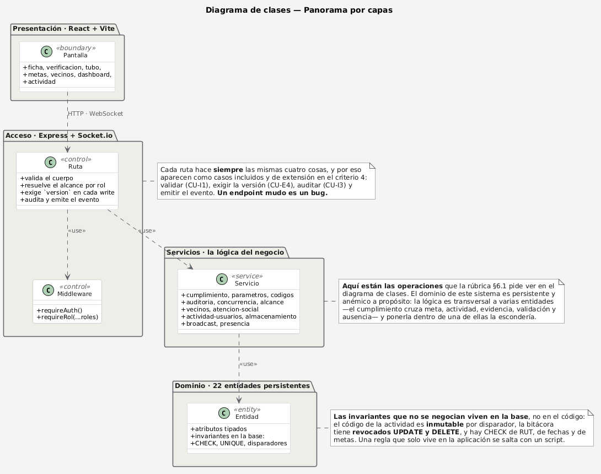
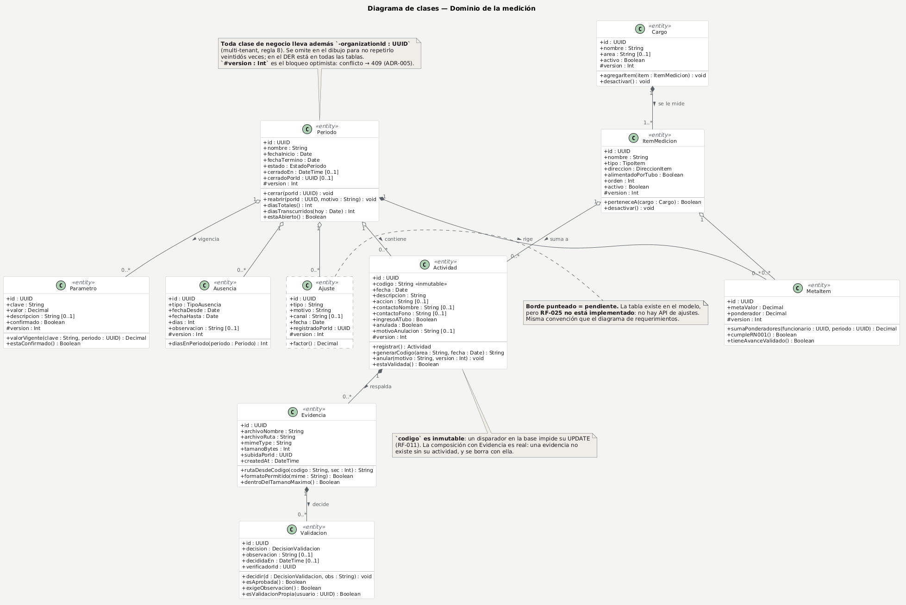
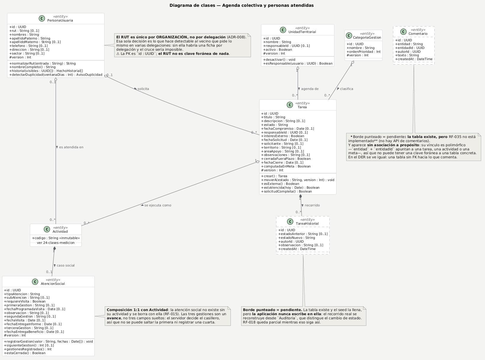
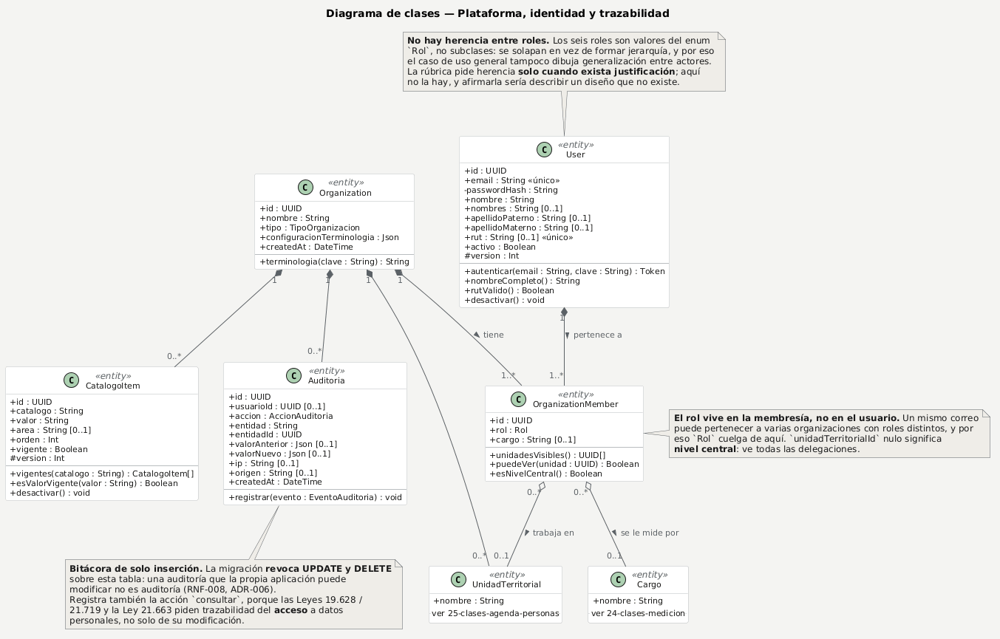
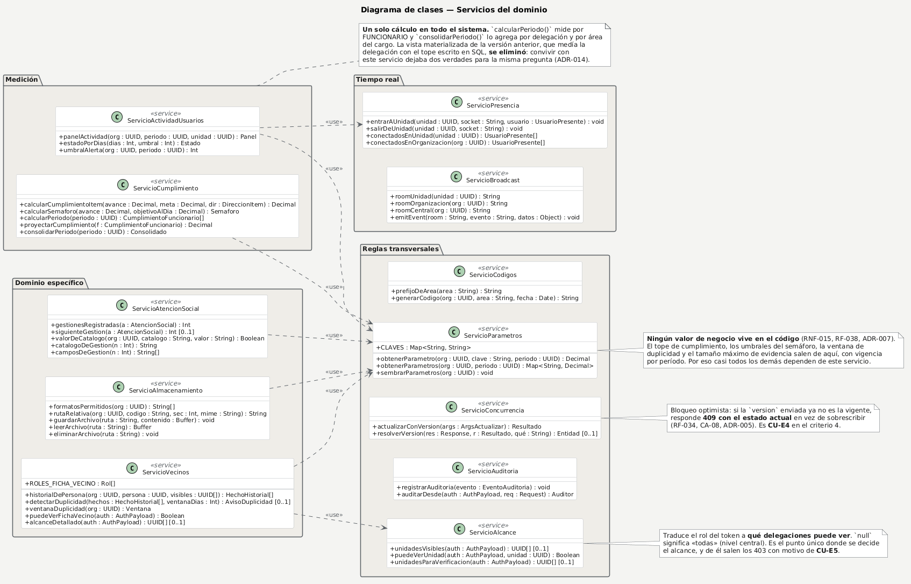

# Diagramas PlantUML de la entrega

**La fuente es el `.puml`.** Los PNG se generan desde él y no se editan a mano.

Para verlos o retocarlos: abre el enlace, que lleva el diagrama ya cargado en el editor de [plantuml.com](https://plantuml.com/). También se puede pegar el contenido del `.puml` a mano.

```powershell
cd frontend
npm run puml -- ../docs/entrega/puml          # comprueba y deja los enlaces
npm run puml -- ../docs/entrega/puml --png    # además descarga los PNG
```

## Panorama: el sistema y sus ocho épicas

Fuente: [`01-panorama.puml`](01-panorama.puml) · [Abrir en plantuml.com](https://www.plantuml.com/plantuml/uml/ZPNFJXin4CRlA-qxZE1GAIA8_0MXD2AKX5FRAEcHox2UB2Eyzc9xWqBJ1-gXXwgFa1Uhx6JfGcX8Sbdf6_yyt_XRxuLrQ5oHISXHQOCPnj47k69C_JC80aCF1HdEc9JJ5kemtXI280cMhQCCOG6siA2JEmshdpadQ3rdUZs1EamtDOBWcgpZrH_bdoTa2-bG1EXNmobc3DDy44UEdQJdVSxXdNtYoDwpoj5W1hUOtAT65qfyqb8RE1orH-rHirfYxr3eHrOfp51Qgag2PbX8DzBAVS6CO60OvNyAfln4q6XLrO4n-d6pR-Uos-XsjrI_ylsADRjHrGmb3bKg2Rx74S3bbi_m2v8sWiohJG0gEpS6_Xz7F_pi_e4FUZr_s6me8-Nw_HjLgqsl9xNQZVfCWWqim1byGWCI8QsSf4Jhmq0f9gmLsHkL5OeJpb6IXKGhe3aBKWaZp56oG847W3Raut0u6buDpzvlPJYkdpHyCnDAsJgZOV6Y2qmSppsRR80FnoUDVPZDqc0II0iGP2dBQVLRbvpcFfoMvmnBenOMC2V3CqumW4jMQnzMsxC6AIc1a6X9tfeFVwAptEYChNxssDw7rmaUjMAd3Ua0KivewUTMph04TlO1TjS7aMlZy9R3aVfuwFLhBYXX6w9GGhlxG4yzT2pHuKoRB3Z7MstGcoz1f_k0piBuHCRA1sKz_oEmb1QcxDG7UTDuYGuP35TMlH_I0-VGw_b98IlRxxyGcxl4rYwnlKlix1AxkyJJNUBPbXX7mU7nSSMD8CDpcj23ynN1nswzMUgTj_LEgNVVqED8aayuI9evVqCjFy8tWq_QFqmvLU7TWMMGGAv-ASAGMrO5mlA57rY0ZyAC5VNxhvRaXNA4Ohsasi8H2Cf9RIucKiwiltPisN_fbd54IgnxzDrUa1959kFeBm00)


## Quién necesita qué: actores y épicas

Fuente: [`02-actores.puml`](02-actores.puml) · [Abrir en plantuml.com](https://www.plantuml.com/plantuml/uml/TLJ1Rjiu4BtpAmRfeK2m3kB4TjmUYjgnT6gSr4LoycKiZbMsr8oNf1ouY_sW7FQmw2VunmhALiqAhNHwyzwR6Gw6VEy3kb1N5h08uiYhrx0WYuNPV-T337gmVzcO0Y_WiGrvWfe946h68mj5ZQm5B09zeQ8Eg5v30mjXNrVq5x2q8c-gZQMAE11iQj84Mt8MBrGmmH9yhCt-XO6f86y2mj_r_kLjso7iZXMzKlwhuGqwh625nTVIIStwLgmuU9KFya5-bIZyPzJoRBY4DLfF2QDfZRKDkN2OOqKmSGRjx_bFvXj1_peX9yx9yx7cS3hgZqO9sRJyAUmi0JwJbugw9FoZ0ARTvhCycsNZo8ZJv7vD3n0xESRwa_YhVvEyZeg0N5hwVUwy-Rgvfs-cisd-XzpAqZf0472c_1n0crZ222jrECFPH5U6ZGyEjRWpG0-JsLrBteeuRVWdTNj_tr8pibIYbYO-opwqyRpcmWYZCmSgVvotr1CvipR5psnFsQAb7dqT7Q3fi7CsuB7WNAdJLCwoXzvbVyaBAcFBZHwBOBP6eoRVMBA7otxNShNaEzBcS3LseCbJjQ7z_z8whhgEwoLdMwE92uDnRxV7tfiKhUkwwneiUL8IwtXpR1pq5bljeAiTBlbEsCIB8R2BnmvER2iVTkMZUEgDk80hO-DnM-MegxnPyeF5W6jnLTC8hiHXsijDrp9UycaFsYa5Xz-wnSPAvOzpwFNU7UQSWAiKNATWa88RfPwonKcdPjc7ap01mnICbBgzlp-LIi0m1QCKZ9MQpEvEfWGCKp2EoUT9APP0i98Gf09PDtiAa5b85XY250Zdv_4LzMBRf_Jy_29AFIpcUU_oSWZQhEelgEKjLFl_s5G26sUsnb9fH07im5Ffg3mENHEi3_U7_8KYrX1RKUeziQuhgtu0)


## M1 · Configuración organizacional y de medición

Fuente: [`03-m1-configuracion.puml`](03-m1-configuracion.puml) · [Abrir en plantuml.com](https://www.plantuml.com/plantuml/uml/bPNBRjf058RtblmEH-cYRHGIxgHLX1fIsBMAKdLLkZXu3iuqupbaBgcWwiFa0RAekkY-l5WrDXU798J21lp__iw5Vymxwz0udod8QfM4zLYctc0YMSVHI_XGWmgShQ_EVsjWawAMizo32gOW238Iib1VNGmgrMeD4F8FdTTnvAHJ551___mNAuxYo5v9FK636OmmkKeDUotEMB615uFce3cebots4WL_bpg5CIfBPKdG6Bro0zRk8sO4fqQYUiBmISu8QesoUceCVr_KRVNQjNRxWHhkVDvHi6jbpL3YKAUAu4SS0VGUp9c_SecD8BEut7lJUz_BBvSgrqx3Euv-bWjuImdQ9_6BDMxWbpCyXOyZHMC7Zi78zDA1a66EF3Pnj1vfx-J4qBMNXZBIhjiTwltz_dcbUho_FzId8fDQMhT8mm5OIhsH0iLGJy4PdE58gl1z3z12_xnw32_wW_xx_l4kDUgXneTLCaEuB6KJcl_Y9Q--vZr7B79zlsq3WXIbUNp9vj2BGRLQsubLtsHvwz58jZ05muhiK1yTJT0a4jNHqGfUtmdU2F3LOJEGe4bpilKMvdUEidMxZPs8pPo8RdwhEELmK35nyYRyEg7LAQ0ZNIm29cnWVci87n-XkLF1riO84pBpEnQS5nFpExIGS3Rn3aUgjFpMJl1sW9-p5cImt7JOpC5Gv-k2wQhcYjxUYTufakSmRDnd8uEABDoGiU4v9tZTRIS4Rtb0zyu-LwhDUqDd0H86dXIz2ZQBMSy-Xpt6KNugAfLkaJnu2w6fiTJKxMw8zMrYOvlOt2Qs7ehrbTZU9dOsn3WgEZayBDyioCWRkg1h5pn5nQMZyuWZZi9geF9byGmx6B4IN-_rOz59Evu6znPlPzCRHveTmOYTumnul4m4m4S6Ip3n96ZvIndmkiWJN7i2pS57rirl0Iqd4WK3gk9Wlit3HvQ15A1o6Bo2m6lC4n3-8ovnXciaVYFDXt54Ma1eAZJtZhJmcOgZVm00)


## M2 · Registro personal y evidencias

Fuente: [`04-m2-registro-evidencias.puml`](04-m2-registro-evidencias.puml) · [Abrir en plantuml.com](https://www.plantuml.com/plantuml/uml/bLRDRjj64BuJu3iCd4DRGJBu8nbo41YH7UdK5863z5BrCEAEf6t87NbtgK0kUkq3z0ropA67meS2FLPlqYSfbXH5MZ-s8bqM_BxvPkVRsI5V6ulQvbaAMTJHD9F6QkxGKWfIYKJZUz_0smWwSBl1O47QiC8KLb3JuDlRKIS8-e3W5c7lEnSuD40f9ApnVlsWG50AHXfB6Ru4lClNVuB2X1n7e6Muoma4cKM-_cB046HIqBdlMMbJSfluz-zdTk5xlcS-IhL0ZHbCCFauqvmhSSCfQtWnwewwewX9CNCK_4cg6KmnDTI414qnJ-s8bVq1CuA1bfWU8RoNzmHXt4G7MlEdJTxUzKLuSR67kiZd6QLssCGq9HRLB2NurVS0hlVgB7u5n5gGtZo-lhn-SrqyRcGE1-xlUxyr4-I64ZH7vJSsxiXNDHoJzxsKfXOiWvQpkGKXNHsIbOFgaivUlT9qbqjD6IbxTJLMhTRmNIS8MwsnsXx_2cPah5m_gB4I19XOkPG21PapG0F3Tq48BuQZuPjX_nJns8aFwsvUmPAqdCe44vUZqeo_HZDoccz9o482LgwrALlG-Y-kzA9Qxpd5udfTDZn0lLVrxIW8BayH2WCdz2EcKg261BC5cpPCMMTesOpL2XAUaoxCg9J3u2JbufXkrWz2pXW4rPTphDR_A9am44YLvHOdAMsrmvEqUqvxO9sSSzHm8j6D5pLMSpGMmMeoPMEmgZq9UoUf5-SrA4GrfDZSkSjIbhJLZ4xIZ9i-RmNBBVF4a5wM3GOyIUKCBUk6uV59AReknNjE6LA6PP5AC9WyguMw9pLNtmcDP3B7UhWch20ZYwOzLhX4bH2iOC5Aa4QnDICe-hSQ6cSt7pf1UB1Fnqf8h4gy-H24Er7HM0t4BxcoJRSgShH3ZcjdsOt4ETwZ7gjSuNvil1FR6wiRLYPFRNdMKrUswtltXg9i_NdAcglWtavmlrbRhbn_xFHa5LduKioYJkUgl9xm4jm1JAMYgwl7O1Wy1OPFWRrzCDw2qLDW_1JOtGUZRIdz7T3tocsUdpVJ2j9oIRTqPnsdp5WnkaSOtOgnoV6OuNkkSw3pq-QDqvvmAdv-vAz1AyrqvTZ7kHkxJ-E61xZH4MvqW1iVuSPVmUqUuFQE-D0_mEqVqUtjSdrFiIMOiBMS0K-h8GBmFKA2WjJcAo-4_tx_ern6zJAkbztjqjq502e-28lvOwHboDQV3SXimTgYijJyGZnt_E5sy89Yzqcuo4cGUsDD9EfsSNNPCYGvfJDqxvlrbxJj8jdgxHnpj78ojc45hPPnqvAKPPMGAKPbgtNkUwG4kCAT0Qz9YJnBVUz_)


## M3 · Agenda colectiva (el tubo de trabajo)

Fuente: [`05-m3-agenda-colectiva.puml`](05-m3-agenda-colectiva.puml) · [Abrir en plantuml.com](https://www.plantuml.com/plantuml/uml/bLHDZnf74BsFDF-Xj3x4Hi0ox9gFn49UrY3buCZQjKycXsAwW8vxgd5tppfib1_Zt-13xl4VYse6s34iB64khNwltwiggkgr3-X2dXd8BXeu9rROIAsXDEWxZAEVuEq5DE2g060Br84CX7ngGH44XrFymyBpct6ZbNG0GGxjv4KS1HqCYSI__-nfmFDzZHTn54V-a-ObEinWYkcdkRCvgsjhh8DduylnvRXTfVW5Alj5ynncQ3nL8KKpp4qOMmw_OKPmvJIQ0uHRVK-GN5JHA-VibxNlos4dwNJsK7dvDAFKJggOepGWpmt1Nt44CDpBi_WLa7MAtFfws1--6HRN5UVaIhuu-hjga7jAqH-KNvTnHtwJmo7vE38q2n0iE3rV151Qyj2M1Nf8wUpLAqUVS-qe8mw3mOHhjT6xHkkoLflmRXTCU0MfpPREPjfRVmReOVIkTGdFHkFHcr7lQUcowqJx-a57UifRerCTSaL-mfe3EKOF5kZFybXutOnRIUSaYwvOt9QQo87g4CWv7QpJjZxXxryT8QnWHka2DobHq0gtFjsJV7hYC_81bVMGMfRPOAzJRLaIIIq7Pmqgz1C-Fr-YIpMQy_EjI-yabtvPi49BYhKqU6yFAFPFKMotYhWDf9gS8q2ZXO10HgglT8hAEiWPvOz1kAFxmerOQU903txjrcO0VZ6QgQdGBqYT54CYCToGppFYROzPM5etuLdEKaDqsi8Ag2ZmeGYInoE8eyrSdLr_QBGwuZNNFZYKn2fzF67YpOeiHAy_j3exhxiJVcllQE-bedLmcuTTCIvcej4Ob0qBFuEKOAQP1eCTi7iCx1q3-qV0TkiOcEo0SLI6sMnMOrBaz1tTqESWd3AS3QF_56CTm356yWWZZgJqqFYutcxrgJNgzn_gw35eFri9-mYt-mYtUu3R-n_S_YutZjW6WgaDmMPWPvkX1gZLtZloKBI-rw7OSjAzn3B1vV9ercf2lTL5_vMD1B_ot96NqmgyPbXeBsiBPVA5NTqmm1OymJ8dMQ4u9GTU0vgvN0lP4Hfz__qRp79okDqTTM0jwogW4-To2mY_El452LrMSjnwK9VMhIDjnX6n0Yc05E8riSep4qV_0G00)


## M4 · Cálculos, semáforos y tableros

Fuente: [`06-m4-calculos-tableros.puml`](06-m4-calculos-tableros.puml) · [Abrir en plantuml.com](https://www.plantuml.com/plantuml/uml/dLR1Rjj64BqJu3yC71HD1KkcH4csqi28hKX0WQOmdBgNgeSHTqHliznbTfTAxQ8Vum_8eSYXz-h7YbsAD6DPibpf8kvxysRtSNP6Run5ROjCGDPl9oYIGYZJjZWNf9K9Ws_XNH_QC5xTbT0X6CfMTmkbbO4Rg8ZmydBQZdezG70_ukvtOM2v5UJ2__tdoVWm20FpWSiSDMOmn-H3gbKXsLW9fU75j3_jJtjDYhb6fZvncS82XQ4cn6Y1XR1J9UrFc16SQOvY2-4zloNenatqJ6lrQPrtS3xi3eSRg8jycb5gTvkOfiIYJ0N1ds40SBvnJl_naDACz7hvV7J-zjmlDp9tpzmt3Fvg9YWC9MYsogzjV21VdM6RV1W8MbYm2ZHFhoqmxix1bNJG_P4ENh_MzB7WcZAIzlHq9bkjoKKxwhLQC_cE64_uwek46s1aACjfzRSw03GmkOXwy68odRoTdEoZD_1wIdAhD2cuWKH9gvMOIKQGah4kJQKyk5T-IhkiO2T-jaIPaDC5J2nVSeQCp4mkLtU2CpHU_78QzNfxQSPESrnakU0P9saLyBH00JYJM6OoQgu9Ch9OIyTxIVUTz8MIZ3GovNTCOYQprTqVFFFF2vuM3gk5-ti9UvD_a0b9ovV-gkOaKV1RJBYIpWnVS6GrltLtsCpaqL5Eaha3qj5HdMvGLVNtWalgC3JNnFRQmh2i6uj09dVdGq01RFNvtgJXNaB7JkXzrNQyIKKsr-XtNLla3b4B7-ybVEA4VovR6EIaZP8ejXbnyh-D63NJC096WbBqjydltoXNbOrNFDf7DevygLVrxNgJtxA_HeKfK7DL6n97UqbsdUGlt5Y4LAWv2iYLXWHrghOLIDnzt9Smg7hPmVYg7GrcSgoaAOH53G9XmPDhdCaR874_KRpc-2eQF0WUDOD9L5DdqxpnLJJwEhRRyx6klvI9wuQmwTFugjjp6_SDhTq-BLi4l09dru9BEZrz0CQxmFukSB0B7Eu2ZpV1GGsUx097Ey0usWLs7u1XK5hJwJHzOAJvaYxfetMSShrYzBSmXZNZU0kZNpD6Jp86Zp32m5KKj7zTpyd3kHBijwzUe47BpUB6iNTmXy_W7Z_27MtXzfx1xJ-3EzhaTdkFSzTlly4D0waimLnPgp9GYwgh0hHQayQL1KQkARYc1cNNFmIfwgUuqsgveB7AtBmfHpswEwpclvCRJTLCy65hMA2BSUFKzKhNcLUVbH-FMIx8gbT04d2kkJY4Ga8SVUFuUK6Cm9269Mb67VXHcNfGW451qkrBeEyVFWKZo56lxjmSTFzjPI6JCcUo-i9ugZfXG9A1yy9vyeOaAp8H1ly1)


## M5 · Consulta, colaboración y administración

Fuente: [`07-m5-consulta-administracion.puml`](07-m5-consulta-administracion.puml) · [Abrir en plantuml.com](https://www.plantuml.com/plantuml/uml/dLPDSnf74BrlrVw7BlcGX089n6SS5MN0KCaXAPKIvH9oQ7OQDFPi3veF79pAZ_4FyCc7tCCVI_N2OYmicGGkrBpkzwPxN_VomWTq8UO6ydOji-oZ2LX3bMlMFZZCjEKq-Gf-R4CDHZky2farEBC2RpumhE4mGKw-lfdKwirBG2X-zBv9aw238U7vv-_JYT8aJVnhpKjqcCCCizSBPoEhaJNMmRD9QzAQN1w6-3jKzetc1SpHU3g45CqncZ2n77x2d63WD9f70dxMRmaQpKDqu9nzizDj3pkDJkS8bSmlHsov6uUOeomWBmp1dsa2C3ogi_WKa7MAtEvu-EtmvR0uFb1k3EIR9dyT2aHF6Vf7wNTjV41Vrl0OVPeOcWS85fnUt0LGMkee39Cc7qiwkxfoT1-revmuzFjJhbJ6rxLwfrAPyWqjhGiuqqOhLB2USh0vWY9Gb6clBPC_0_GmlgvtuDbuCduvxft2tXNsQuC1vzRbk3TQq2ii2Rl_XR0dX8DFxLa5JulevEfJNaDm-BOifTJeVTJuaifsPaHc67s63jOmroOuT0NPpQJUl3o9eoaSup-ApZhGB1qWFsMPRt8hP6MtpDPF-U9YIQmqSQ2BYxrGipJTTqOpdIlqTwHE4c-9-2yEP_ZAWjTvD67pZab-yvIzdJdocTCXEYp4qMKQpO5qwoIPjiYCh9oYqzP3mJnbOpquMiWpUhowzl-khhEhRl-SnQePvZEzKpigftCIRs7NWI4NqCFIEbWHPpgNYmlnMjPPAEQYBExpQjsJr0el_qfEvWiTBD5jtkMqxzWHQs7USeUSZMvhZVgK1nmDEeYCW5dGg-qKP9OXjq6lR94zkctK7wGsflozzi7A-fM28iEACirsoiJ1oUGRMXHldjtiZsvbNQP9iGDgjVvs5E0vI7rppTJlFm2Rns1t3xQU0jl7O6yFTfu2kq-1lGTWccnhE3y_lB0YfrTqG_T1OhQAPKJtCn5f8ls5sc-xNLsTMQD-_-Io7eFsyxL4IniVYRry69icR0F1p8PWSx3pqie0vI00ULbux5VaF9fAfGeO-JuIu7tSl8UvNaH7aa4ippZVV53HsESGh4AmIofV-fdRl0yw4tCRyDe7ob7I5Bt2lTj1V1Lzb5clmfooEwm2PkNV1cEzfApGM4SUa0CvRMM3SgILFOSnImnawAqlJESjK9531gwkD6ScAkhtONHR-w5vdYR42gG5qeeNn2hc9at-1G00)


## Requerimientos no funcionales (18)

Fuente: [`08-rnf.puml`](08-rnf.puml) · [Abrir en plantuml.com](https://www.plantuml.com/plantuml/uml/fLVDRXit4BuliEymI52q5HnPArcor1X6_2C51HBRaDEY1rr6ov7CXZlSa5mbIj67wR6770e_WbwiuExgDzvsqKeNVUJCV9pXp73qoZeqBaiK69w5mRVmHbk8-c3eGqP69fBOQGkiOPPnB3MZ8di4E3TPYa9RIBK1T4PECwT14CIef40H1auwHJ3-9plmNTJ_FWp2mBwNdAB11AOOlvyRdR6uqaeRU3uw6PsCshiYzW65_YXv3ZDKbdQt1CqmKswasTrWGd1X9AeAWNlvcI3gxEvU6AC_bhpTorxKwtsrwpN_NQAm7Utk6OeTybmH_1O609TV-Pb_yYrj19bo-N9mUNsPB-ymHnV-6mQ_-zY5mTRqiqRZdkQPyJS0IqYDN63iGQFn3D32_V0rF1-EXjV3_e7QRKe6OxbwP5X2ZEcUsktTi4BjHtOqB-W4WT8M13fjIxthYtSLUiDFAHb974lqYfdLfShmbxigbOLMMNx2jUZFjrlHFU6pCv--qb12xCxF9zneZ6z6BrgjaqPZmXUP8tOoBjsDDKzO2h_atP0iv4AA35LEChuPjLedzQntI-lQoCzRuv2ilh1Cz8JzTKX5SwbX2PRcXkQ5s9QfMu-fvvckDC_ykMDPb9o_E3apAFI4YS6PrHzifTCJFZvEqNYnu-CjLQyULRzmIaYdpUeBvXujK6apOMH7Hce3I-2C5bL4_Nf40qzqjybOM48YMIRhK4vOK95Sa9AnHGF96Oc5xowqopbO5zHB9PcQ0kq3YRfP4lcJN4kRQfPJMSHsC3ZgVbD95prDLuUixSd6tcZH8w4D5eZ1q5nQP_I4bz0jbXnE5HbjA-BShaVOANCdpemf2j1Adh3LKqCsDj9bnYyflwSjLf1rQf55US4DROmArv7CsGm9QMdr5vgDoQXUbKLvGhxLx1EIT5bXVpeZOxG-MAZ8EAnCZQZ_VrBZr9FlDxsPDebFIyzjIA5_tAZgZaxh-TWgaiAcg4JXulZk5jedyE1Pnkzk8VzPuM7hFsTZbFltcgpBkvSWe4NPOah_d0TvEJxbNtHQCv1HNcC_sKrM-4SIFcIIUCAi8K6cNn5IXIoLGhjbYEhPpylg8ex9RahOJogEOfKtoAMFgZDe7LMuKg-SehASaXJTXkdgmUY4ZYOy57FoZMprk92gWgTJDsJvy_BMDzrjMygBASPaAltJIn2l7eMSLtJYgDxh4lNMIMwqdmhMNCi9qwTK6rU-RMIToMBVBWHMvcAlgjhyAFBYnVdcWTt3tGFSEy3z0pm80p-ZR71qWDi7kBEFVUlPm_qmyBFBHlvq7qUj0tmQ1dvmsU3e0BSFS2SC_FIomTq3tFCHAY83pUOwAF03d9q9Cd91O_hWpizBcUvMfbz3Pl24J1YmTWHJxPnEGCysrm3GQBn1Y54G8oYQem912goqZX9iDXfUvbuoF3L2-Nd_0PU0kqFHIwzX9U-lWaB0xPZ1klnNiIHW59WhBRtGTgW5Io2JLEK9x2UJH0Eg63cclDYDLaslzeQMPA4TDNkzpX54WsQltOUbNpYD1iqm81RWtVTXU4KiiaI5mTy0)


## Caso de uso general — SGR

Fuente: [`09-casos-uso-general.puml`](09-casos-uso-general.puml) · [Abrir en plantuml.com](https://www.plantuml.com/plantuml/uml/ZLRDRXj93hxNKn2UWsS4Mt3BFt62GJ2oP0K18dlWm3dfGdLJScMgIRb-b7M20FiG-m8vBVQGamyBp35watcIHLLtInrBEpFoGQP8VcHznIBvY_DeVIWDvEZ47GOdXtDYicZKFWpG2HG4mGdKly8XpAom9ujGa06ddQSI3y280qVQ0UPUBBca_NKuWc__FbRxy90C2icfYjJ0BgpcN2_Ga3i0fnbc9hmN1pg6O75TjGzlnDLEZW3dDYoGOI4sGPRQbL6lEHSeLuz5I878GA5nRh6CUQfzi7GVoEfI4tjnyECu0uJnwKylm23aOYsvXN11d6i4Ocy9q7gQnUCu80U1rJxaLdkoMi1RPBSawz34enW4k_fzQdMENUMrDxIJl3_--Izu--f6AVURvWLQB66A-MzpAu6BWHYnyCFeP7GowhKit1qMya7p76Pe7BKq1Sqm63yIzbTO4lIjHhDR_rP_9CYEMyg-jVAXZdbwSPQTdJrLHh-_DAY0ivOg5S1R_s08y0CvAUcf4ZufW8kd1xySNGulpwD6R47s-yW0hMooVlnJdrkumL6EZdOZZzBdAVB5yulXnUWlaItb7dbk_XzsVzGVdVyTxFeadvKoDFFW1QoUttaeT0oXXPMgsDaR1SwrC5ejUu0EHhTNZUeTMJtJEHPYa-hTvKsZ6fAXEHOoOO7tD4CVB2QRuUMRncOWOWlDqNt2hVURx0RNrurTloWrQ-VjEb1_E6wKjox4r280vC8k6Dy0N2cruMklqtdxwgOg-YfCV0-lo7czUkJu_mqbvq9SfxFNt1DyKWfQjE-DU_3jlt13yvYGm8Ai4qO33q1BNRrOb-AFU-cEO5qDUuFRmwDimhKlsbX_UgaBB69xiBhE-_Oes_RhJRXVl0_iqMu2JHWXC6vm6e3UDi3nXD-XqGLQa7YUE_o8TiBHVOtNk1zlkvzEU52pQsE3cUdy3jUdd_03nFkZSlLb9bOQeDDjeFCs0Ibv7sEl7dd2JdATg7J1mJnUZJ2v1kny2-nrjZbKQhJenLMbPEiBgfrVRrFwkZVXLwaLsfXxldeiz5nWzJlhl2ediytiwyZivwSbSHnBeZydBcBtDl41BIionyUxYk3iUmuWbt9XfTHEgkINb6iM88w9-J1TytcsZVLimcDPqWuS81UhkV5zjYlpavZvOFN5v6bIFO37gI4hTGcVxCh-URiKOeALouJZyvDu6vkWpxVSirvozrPCLKbhYbFEeNhEpQLdE_dEKjR2CpqF5bFnLFbck_8zIG4hMmibUNInNjE0JIrbKs8dkwATrj7IYID55Z_YL9jrMOnFTuJDZYRSvs2QAj-SCXU6KhnUDYnbHzlUsOGlWiihXk-qynB7QHhXFE5rWSJDe4YjDc-_bInB1_cirEZs2WuFNrPTfINqsi9fMpXh2y_QmdbBo8xQGgRKkykRnkvOgU7bcmrUItZM5fwtXEn8gS7rTQCwQGbPrXPwIlM7uutTHeYgmVNL1bt5GqEt-p8r07W1F_-iEJUXe9Sle-xiJtHhlzuJdMBn15FnNagGMTCJEfqt21WAxSMklY9uBATwzH-kbhMqCK82qON0Zx7z7F_KwHp43Yh04fV9Ga_3UmIy3wklBnJ4jv4y7eZ1e8D2qqUG1Tdwhk4-n3UUMpqbFe1ozILU_M6MmKFwxXqa2qSAgioG0GEdtyH8Cos9kp2Cq3CJfuA3EqnRfwcsMLWzBj58N0nMNv4LG4aiJN2FCBFeg0lz1LhAgMvQhNKNSenjSRE0TXLn0P76cioqWSWihG-HoKi3hSq2l2QEPLzdlG4wY4FN0SB2ocBrwBINRgUZ06wkHeT7HwT0_z3pIC3SfWTIp_bPjT2GUm7tGHF3CesGoFTw4Yg8bx88L4H_Mnl6nRhgswl7Blmg5iW9fEdQZ5J0Wj9Dt8V4kvblGX0OIRbgELZVH00hSN8c7TbIUsmJz0jn4KgZ_WS0)


## Casos de extensión — SGR

Fuente: [`10-casos-uso-extensiones.puml`](10-casos-uso-extensiones.puml) · [Abrir en plantuml.com](https://www.plantuml.com/plantuml/uml/hLTBJnn74BxFhoYH0_OALZk0iR4iAu1tBKiuYS1OaJAMN3jTkxJJKptqOsqSMSefFo3AAQVa64Kv-PYR-IV-9L7rx2m3krOU2XmGtLDVlRvwzES-e0knCb2YjtupUhj9RmAnrvR9P-jmAEUW2ER7b-yPDi5O3vwqXm-_ftFruKzGPC1h7wZ23IWjWuy95SRe2Ix0nsnTpfKk1QKFpv6162A3qZXrM25WZIvGWfeIaqC32BMpzULxhuEz3zuob5XfjluApJ8QyXj9HuLEZCCh06F1669ayKAqU3YF1DuQ2xQCpX43Pkimev9y7uwiUAMvD57HXpytceyl_sXKswgsBc2bYODD_w8BMjaD81ykVqqEaSdM5zfl3VOshs8xF-tNiJAt-zbwjWuVV_u5XWQiKvGiL5GQT9XYr832ao-U3u-VFNdq9TmwFDtCj-3Z3p_2uUdcO7j3_WntsuDXVZkvqesOPEAbeKc0OC7fwLa0fHsLGLj-2LyPv73wz0YmrWP5FuxnbOKpBBKWeNDwZ1BQkLrjT1KvAiyiA7g5Oqo4q8euw8akKLb7GXgVl49bVJyBEXXQIQUFt_y49u-Fiyn_gxb6XnMCiVnswcnaTMYDTV3PQ6UqCzhgVE7FKDdNcgSmGUEfSwDeWj64aUNm1LO4-qwZMNr_ejyIvDkTottdxEkvpZi7k_dkxirBaVlR3nhWl7E5PR3k95mO0dnDtbPqynA-om0ERZe-70qV3U_9ZSJINTSCqB4ctvVVx5q7DtegfVXM8e_IpqtaWxs3HmUZlqKM0Y5FpQUmzqVxetl_17lkoRii-mH7i-nArrglT_Buk25Cqsc4Ie_9XqGaHN1CFfeWZElrrbeVuRiiWux9QojOMF2jjXcapk0rU88oLhKXCDXfNBVN03qCltwMN8T5aDTIAHRyX2VMLUYaYz6qAUI2lMQeQ0wH40vFXxlB07SAVaHCKtHGMmTeIkII2fOo9WEL3NfcWNpfTB0jpfrbd9sE8QNbYT5bi0KhWXavtpLYPrbuk-1ZAi_mBJemMF0CZLRpbYIzHMChlBqil5Nmy8sUQWTsxCdDsWYe54T5fRwcVciP8IzuVwPz2e7NOqC5Oo1kzAjO6san2nFo3E3ToWJBu2dublIcIligfTnS3PjvCsxoUR1_CboHq7ohu4FBmLcJOY6bgcTQeKeEHH_HQUldjkJBpkHvmGVHb-WaVMVQ1olzICWNkU0PbPej40T72yB8w6qHyoN4mLuoAV4yWGOS6t8sSSHRoPHgcJ7OMnQ_M_1JEoCdWrS6cBELzWqro8UExDrbsPsaUgAdqQ63YWBwWY-Wjgp8DMs_bLwcrM2xuEU9IGwiP2iHhE3823IJwL4kY3LO9bO-A7YVe-H193g9aDfe2gEDsc1P-QvmUgfzSBZ2TGEBJAIGnl4Y3Cj5EiYxM0j3X5dkoeE6b--oJ3WA_Vx3b4wu3myUD3lJmuS5VwEiXpEPfAaV6KnCHIWD-ZHA5yKZ79n_CYCEoAdtDTKWsbzqzGnsR-gvyl02mSsDXwQiX6y5sqv8lCJ1oXUT9dPTG_wFDBILAofMOmheLWkwVHEqsp4AblnumDhPCRf6TFkJekTH4qFJkWfHtnpCBRjytyZljF8xArIthHA8Pne5vWAXCK9kzPGuq8jhC7V_5vXyyDzX1ETEYxEr8alE6X5Be-Lj2Ws1mc1VN9FC_vMaYEwsCTXRcSL5pWKYQ69fwy2eDAKbDNMJ5rd6DX2CRGYs0ZkHGPi1z7f721CZFGDc2QrvMrpV9D5SlJXwlMPrRwAJreb6-tca362YNo6SFZsw3zGHIZFVoimF23AoFOx99Ho3NKtqHlQFVWPmrDqDvesyjAuyeo2Kzu9VHtajNBErdn4h45_d7WTRYxioXnf_PS-MlP2y1CmJEAfraCVAURpyez_hmI4gXCWDiW_jcomzDwG8vJL5fNWRMIiBA4-oPjTisjpDKTY7ePVdLtlioAVMdies0wWTJIC7l0_dyV8tgD4Zb15PsIQAyYu3bgN3p6sk8oc9wZHgrtNvSs8LAvFz1G00)


## CU-01 · Registrar actividad diaria

Fuente: [`11-cu-01.puml`](11-cu-01.puml) · [Abrir en plantuml.com](https://www.plantuml.com/plantuml/uml/ZLJ1JXin4BtxAqRfWJOYKJO1H16AI4AMHcevWD9BqyF47eA5OqUsDv1MIFs8_a1FFVN4eH97yYVzaihEfbssKDYLThL-Cs_clVNum7cqFfigI98QpsgDX6r0RrXh973t4qve8fstQ06vbtCfK82GQ2N2hozVWQCp80Yo-FAe50fJPnlGLokC6mqk2yd6ReBBN5ns83LNcHJ6mQAmAWZeofDsSdcZ0yrR1BgQAScHXwKGm54Wp0Bt784qA8Hqq7lJsGHjmZUfqE34uXJtG27R0Bky7Ll94Uw-RzUtO2P36PNtIpd7cUJd29wkV8OANiP-QfapjJoiFXMlwinBh-WvxZ3cBgIUeSKfZ95VJAp9jEWPPIoyIBVIhRHPY73dACobr1CuG-MeW0Wwmqpvr6X_Z5E2ZfMe7iPFvIU2f5K0EzQQoxpcTdSdsTafWo7loO0LSLA0ukyyzGj5W9Vap9JA87nc0Dsoy7xQF-pl1iHOGVP-PO12DqadtEowm9ivukZeOUOqNcNcxklkOJTzajaIzwWdwZ7kJjf9Tv_3dIkvPcnbGYNDD9T6evMc0kWW7HupzhTSfLezFJgfLkCilMiMjfI16LbdD2fO0Csb8CqbkifQQUnqxKWbRiYHVdmxnkAzOICfPVMJaUxCfKCBC-FaMD58em-ruhHbSVJ4EhrVJXya8_qUbHHeGONvHM_SI0jIO7CTUUhWdzJcI1-Hfj0jAU3B6o4d1fQtMd8JAC9G_f6nPccMMLf5rQj97ak__CQDnSY2cP3UsEMFjOX1A_oVT7WCjLfxvGaBJwZNsx5Hs8Fz_NW-2Mgtxs7D_s2j4iQ2NpdOM976iqsqsoFzWHJCYKjjO85hht3jlT7aWXZZBO8WHPFLyVUHiGFI8figzXi0)


## CU-02 · Adjuntar evidencia a una actividad

Fuente: [`12-cu-02.puml`](12-cu-02.puml) · [Abrir en plantuml.com](https://www.plantuml.com/plantuml/uml/bPFDRXCn4CVlVefHE1IYRjIa7ofL5NMJnb09UcYLMovJUvgQUkt87sq3giH3y0ASE77YWCInUHEU1DdPgaieAknAkzhvp_ncnZjpu0Ew42iDtLuXOh7HOsim71SRFRZx3gLy5qr01tIb91cX412YGK0Hr9MIAE7dnqyWq5kG136_0cgDqdRO6epqKXFMW8yfohfryD5dimTbX8vAMW_pXbKIq4qWuzNYcqcODmXqCzDAe4Ycv21G8imI-mg136W4VZHyNQw3iUcRD4Y5KuSLxe56jWPkyUFCAO5mzsMximKpbTBekbwg6UTAN204kWaHDJpFzHJHsw9swrJoHOS55JJzpoanvY-LcQ732ivGN4wTZKOEhROEdl4jliLx3Gz_WT9UApE5SzIU6egaSumwS6l2CLO4fLEe7zTFrNk2xcP3B9sprtNExS5ETsTdLKnnJpeimTs6b7_hQPXh0hmcRojQ5U430nYiDZxYeyFHRbAia-H-pmpGgAPRfflTDhZHaq1FZvDvlbR9WvU3mm5_akn813HJ_JTsoKk--o_ikfDRnfQ7qEBH26KDEcLRW1xu-9YnXtIjTllqrKcxdNVgRHwj4veg7vo56Jbl3MgOFqoPRzrtcYkzFv5M7io9-NCi9sPbBdCLm_56RoNyQ7DYwjGfFg_6cGgBpy8wd1X9W56gODtYAzQCeytKA1yVGr7qbqoMdj3fzBCCUx2_dnTUKh_Fs04P6IlDVW40)


## CU-03 · Validar o rechazar una evidencia

Fuente: [`13-cu-03.puml`](13-cu-03.puml) · [Abrir en plantuml.com](https://www.plantuml.com/plantuml/uml/ZLJ1Jjj04BtlLupI0sr48X83eWX59AdT8hKz195Bms6oEmahDhlkxZe4AgH-H7-Wfvvwub2fH_8d_PBAQwUO50IsPClxvhsPjvxPG-VH-coce1KrUDROYjW6z4yQMn7S_e8XAYdGWW5B_0olq4Ac4MWk1Mak4Vvy_GOSdG51a8MNHwLGc2RRW5WL63SQN0R8lR6Ru38NbXr8pLKcXN5mMLaL1BJmf9rStkXSvZq2BL8bEV9yAG_WA13IN7kEG1eKGdBKVzVT16toRr8W94ujpd0V5B8DiClVOoivmksFdUOsf39FeyfwgTIOI7w6u6dXCrJmCjJJo9nfb67DcNZLP5vwHS_V8yRSkTGfMfp16Fdvr9fCYxvHniABP3lPJjgL27U6mbn8FOK9AaSLHD04C-KJe_r7d15qhKJrC7uihmXQKGNiMcikofmxlTtMxkuwcFEU32Y4MnKe_DHZVwa8y8AScT4w25yOG6_TU9p4R-Az735MaBsV6Q1IJQkRt-owefivukZeOUKaNElAlTUzDxtaIMLBtAEUgiUqkqatsNkETkdach5Y4sf3id8YEGfZQu0EXl60iRjqjNhz-EsWNWyJzQ6TDzQ0fj9vQo0bwun61PTtNULgAwUXqjMEr49RZlJ_JJdIzxeorD0_sOhMo75xfEE5d4eBPkp8pekX6sb1-OG8uZ8CPicFs-lyQAG7gpbGEDBpK4ankQarwR_KyNhgeq0Ddj6M4pcMVlcT6ukX0Co4zCOkVwuqZg9yXuVn01gDJc67vKzeDZi1XdquE0ZdZA1E9mVZTWbk5M0uQqIdCzAVglx2GU80Ksl6Q4zpOlGeyNCcIKFXD6SLtxRmihmvPUoGjCXcYlq5)


## CU-04 · Configurar metas y ponderadores

Fuente: [`14-cu-04.puml`](14-cu-04.puml) · [Abrir en plantuml.com](https://www.plantuml.com/plantuml/uml/ZLJDRXCn4BxxAKRXK8YQAA7RgbHLrCtFGYHAf5Oz4GvJUxAryDgHxKrRK2KUWXVWn8aJ1oIEpPlm9CZEXgQhedPNMil-PhxvPdR6HywZzMMXe9kqUDdg96mB1cUjJWAtls1Wz4pcfKKB1NbqS0rpemLP5CQIWpzVlW97Pq0Gb77ng1GAqsPRC58hZ1iDhWJatjXjSAMBnmwavggKmWJMkrD1G5UUj9FBdphGl4MWgxcI77au2WOS1S8yS2yGI8D2oCQ3D-asQ1Fsf418p2qMU00AsHROvUzpApd2xVVTTW9p6SAeIYzL73F9Bn0yNVaI5JoFUbgbCwtAh5s85stcfLVqv18nvZvAFKUB1PmZ_vXRKsenCCfOU9ObMPAztB1m5oZCfTGvp50vsa04pR1KFZFQlyE28BKIrSFugVn4qDtP05DhpMKLSxU_rztRguF1xr635N5t0uh_zDHVAmAy96SAgeFmcG7qwucFij5mj1yGOmNP-v41DjHqq_2ocmtUqX57HmypP_6fC_TVzOVzx55cIzoZpjN_kDCipVQVmbrbSiFOgWYDL1HII-TZLpG07QJ3upKuCCOAgGCqrO8KEEay5HZj1fC9OtV26itcwUkJPZEEtd7tNWV6-MYiQn1pMDUg4VjrgklTEjNtstKLygoJr7n7oLIFzSpO0cqOw9cIt9kW5XPatIfmT1tLNSSxKtr2UKpULfDsBlto6pSM8mEMGdfZbp-gZC_6Ew5qwV0OMgtUIivWChdRiF25ThiNRU403W_ZPIAermlWQ0rsaWZ62qNqUbFzNk4_mK1w8L7WL5zZl3XSaBQGEMbF7nWx8YtAGh6_)


## CU-05 · Consultar la ficha personal y el semáforo

Fuente: [`15-cu-05.puml`](15-cu-05.puml) · [Abrir en plantuml.com](https://www.plantuml.com/plantuml/uml/dPFFRjD04CRl-nIZS0X4TPIKE2eSK9qq2qYGGwFSUfdkJj9LrxlH_caIK2KUWXVWn0DmGEBOl0bFWjP9XHCLYh0Friut_iqtu_6f3-X2B3Lqyqp4h9Ep9WodMIU7k-ymjCP77T21HfWfSOMm8EUjGGrh80sUoisNcNKMVdxw30Az1KaGgqT0hL7QDcl2I6yrOGtu22Y2TKVWew_27fGHEYffFQnhKKb0gq36gyqtap3l46Yrq4gWIA6K850YB1Bx1e5CyidV3jyKHs1iEfC6gN3kiCINe94rmMr-N3eb4Ew-vkqUB5GgetT-QSVOzXfe5I9gU5hvoQAtsIwjNSfdRHPKqFG_qsBCNokpG8SbNAAudZiRZHnQRHqyuJtUuyUr37-5qYwLcSCCjQUQ8cc6KGTkJHXZIL0uXVfXVQ8-47IVryJ2ERlSrSm7_Mw_VoYcznvDs8AxDQdwl9EmrWIu96zBEXJX8mCO73O-ugEpqKbIh9FazYi3rDnqYtIpsnetUXBewM4ohwv3yk35u6p07oKx4W7DNF-9NV22d_mBUzV9BMFR8JHuD49PWqxP1g07FXqpzhjSezMQl3vljQf_w_rnMh5pcYiVdDrRh1iboGY5ld7VQUNqVYADQa4lp5_MyyBixsVbPZZjvCaiduuXorvjp-oKZ8obPhy0)


## CU-06 · Registrar un compromiso del vecino en el tubo

Fuente: [`16-cu-06.puml`](16-cu-06.puml) · [Abrir en plantuml.com](https://www.plantuml.com/plantuml/uml/dLHBRXD14DttAKfc4R1YoyQ95QB8YZypO2baaSXiC8joTyLfqjDjzST9G94u11TWnOeL2oIMyKqu2UgsZHsJA8WPQKRJh-hLgzySEe_MXq91lLdXeL9hiYte3Ygr9jp-W1CQI-SjMWWQk2acrXJI6H2aO4fSQWEaWHJuC3BmwzDdu9XW2EdbKIaKfigs85DpZ1iDBW1oR-mskE3IiGEfkGfI60VNQwU2WAuyQITdttMaEKAWgucI77ayYWOS1S8aSaynob48UR_xghqDV-G9YMEB1Uw3GhO5TlPpP2L7kFswMzs1YOnXr48lBJZE93z7y7Jb0ofuclHKWZELXLcr4C-gp4klw3yBnfYxa7g25WiO8RyOMnEqw1fbB3p9T_AT_FcQXJj7OIwb7iCPAaThYA0p3ChdHljZB0ZQLgAw7p-L7mZgZJMmRQsvNCJSxJJhpUOc6FqUDPWJrzUWrE5JVwq8y9ASAMWJX8yCeBEPU9PdlMml8iOAidSZ0wofgRVZpMxMU8CZZexkPyxJjSdSUT7fTV97cIrnZtgi7k9kv-ryxr-u5vdSC3OlGYaFcakZqKfJ0dIG3uwNK8yKZL6OeJRmdixG1ul9ffSTCRQIL2gNJr-UbCjf1LytuYIsnwG50ZUAk9TJB2tpJ_gNTIgboHtg1-PsgEyTt2IXEwWrDvYo-b2tfzAXXObnSgHegD6JNgngI7ihSE6UrJVS-_MXVeDA2hIWulAZDsukmSxrBIFt_t9jhESmN-2HzBClt5YC5811I6_ixDioVByHUv0FZg5IQSspwML7gmyMdr2jjb8ys8U3W_IF4jHgtS4Q6nYBgIt0MZE1wHycMgsXVhkgvpKkqqAOLybeSh7LgmQuc8k95YADGghaEyOEIOjGAFOR)


## CU-07 · Mover un compromiso de estado

Fuente: [`17-cu-07.puml`](17-cu-07.puml) · [Abrir en plantuml.com](https://www.plantuml.com/plantuml/uml/ZLJDJXin4BxxAKRfWJOYKL82eGX5v6UtZGGSG3arFGps9BXuxSW_0LeXzI7w0Ztrr5CFbNeaRz8dgUmia4PKi2kjvVbcllayE-C3vz7wK2Xejciyr1fjjW7zKQtHXjjVS6JcP25euAQOMLD8Pq0GaFCe3FpvyXKuBaqXBHwLGc7gR0CojSIuqU028FV6Re8BBfaTICrLaC8uk5wnHl8hJzh9nKyTQGuHw6gc94SUJT61eq2OHUuv0cbG2Fcm_wwx2Th4FIaG4gSM2zm3XMm3xEBtcPKSuVRxThq5CndJg58lbHmJoSyHF5tvW0fU9Zsru4ojTAiNubMTUUaLFRD0ZBaBgMTeiO0pv1TJQu8MVQECXHTvAs_bhrSyt3aASodr52Qe7AqWWYOObC-DziTO47IjHFKuVYe_4JItLi2kjUQopBdTssdkxAo3CUv9XoLnSmLAV_JKNoi2l2Hd2be7uJC3wAqVFCkpGROR4MC5sNyp0woeQNRZosvMU8CZZeuUPyxJiyxSUzCRzF8dcIrnZtgg_iVTpRlvxdEuovFSCBOiGYKFcakZqKfJ0NIGZuxle04fcg8mOstW8qtG1ul9Pv0TClOWgLAjdhuzgLRJo1rjnSxhJaaB16uKSI_dMBaxVz9_LwTAwjInVgHFn_g-KLFA_gZHNelCMcCzr1DZ2xHna2TAShyCd9DDCrg6PgsrqE7MM9_GL3flqPOJTYRzuXit5XC31Y6ziOiVM78CjsBHyj4nr6gTfPn1TlYmOV4BzNed-S8UxE-dIqHGfnF1h5M2ZNO2qqKYEfsnVg_mNZ2GdaiKEDRNc2uC5wNDvPIqfm-C7P0MeL3iBm00)


## CU-08 · Registrar una atención social y sus gestiones

Fuente: [`18-cu-08.puml`](18-cu-08.puml) · [Abrir en plantuml.com](https://www.plantuml.com/plantuml/uml/dPHBJXj148RtVOfVpeB4OYmC1Za8MTZ6ao0bB43UiIcw2zEYtMtrWqSYf1mY5yWggwooY9GblabE4iq3PMA1Y38ZpMZwh_dghvhgsG-HV4npWsu_aodRw8irZAVPHX_tFt3CCnsY9uza2HJPIhtyRX6Sr6HmYv02PXoYTfO3Vdtw34d1GJ5IUOja32dN4MkOc4gJpY8aa8pEhvU0OZb0MscILYxKs6fLCVWciWr5tWBpZi0t2wCbLLOKGv8YB0hs5O4j324_7ByThiEwufaDbAQPfpdjmf1OWr_-FFDQ4kw_RdTwMEWYZQdzSiqur_A24Fac9Z9uMVh9Kd1P7TQPgrST4NKq_ByT4o9SQhiWJtESaRoSUPUi6ZlZF5xalRoNRpOYmWKfTwtj3ETa0ZSKnUUKJCoTZKSqPmoz9lEuVg8_CBfR3N7elRkkSswFThexEwjYyTwp0HMusv3AJtmIRms3hZcuEQ-A-2Y0qMhXatnoCEaNYlEA_T-PWOQRxh0unLs3cm9B2lmuEI-FLVBezUXWb3zBzYmZsPbvYZtCXtd_NzXr9NT2L4revSbAxInvxLgWW7nw9CIVTArs--JDSRjTxg_tcuqnSrYm3ywMayLNMXNZHg7rK6dfzA4ZhN98J-qJ8tfg7v_Hqj5ukj5VGHrkDL7LbZdJSVb5Ea-dLZ4eAHsTNtwZcd6uLHITJu-GPOEAAOehEfr1AMCNUtlbZq3nO234FbkLvaRy1W00)


## CU-09 · Consultar el tablero consolidado

Fuente: [`19-cu-09.puml`](19-cu-09.puml) · [Abrir en plantuml.com](https://www.plantuml.com/plantuml/uml/ZLDBJXj14DttAKhEWiJ25awCXH52-3EJ816GWbXbiYYwowP3JRVLdm29a7A8N22h722BI5d2JNAIQDg3c5X4CBCOLR_NhpxpQiy7T26M3BrXHyREnb2imUIaip64crymiSP73kY060AUCZaBqXflMIjK5lvy_GOIlGL54DCd83CgsnLhaF4IazQ0Zu0oMBSEFlfqx44RoL4hw-6gSQe8w3AGyVhsfwba3X3eSi5QegoEAe94XR2ej3yXa056oFSdRqRhO6mL4uFIE7TOuZOmYZLmjxzFdPO8DpysktrOw2eDr_LIhJ7JyWmXq6M8oF0yrTE9tdPgMhTKBxeYwC3qz1a9uS-rMQ334avHdi-TZKPDB5i7p_9-tizVDXZ-39Mzq6OECsHF3KJH32E7t9fmY2N1o6daX_5Z_PcWzwe1Zfop5tNEpV6WDnYiWjMzHmbBuLu3IZ_rE5mn0LwGjoMjWl1508nN6y_oR9fjLOXrYjo_cG4QrVH6rIkk6xhHaqHF3oldwLbL7W_7qt7-gB8Z6T3C-N_QetoKRpr5k-xaMeZb45fJOfgZieMny95c6AB35g27QNPmnpdn4PssXQaiNjigSIP7XqBSrzPgjuzVlsktq_gzxISNtdvd6JdjKcr2txeRHchcRcYjvDp2FEJRmZICkynyiZ5SkPmD2hDlPjQLw42bjj9Y5iPh0oKfdSBwUfQ6CCqEeDFPNSfDZWxl0r5HeDjTXh0DEpjf_TNkRc7UCpOpLDiTD1ag3891fTEOeAI0_eCGUsHKB5dy1G00)


## CU-10 · Anular una actividad con motivo

Fuente: [`20-cu-10.puml`](20-cu-10.puml) · [Abrir en plantuml.com](https://www.plantuml.com/plantuml/uml/ZLJDJXin4BxxAKRfWJOYKHO2eWX5v6UtZKGvW7BgzZ1PJuABruxy4mWLKX-YBz1JJptrKAb7yYPzaihEKjA82dQbjUplcsy-puvzR1qQvqi9Ewr6uHj9Ysr1VzH8Md3t4xhAIpJW5G8MJim5Hmw5Lb1g9-OQVd_-0WLQ3Pp0ny6XbCXrasr1AbTOu5iV1BJP1kjjNBOWL26zuDh2OcsL4z2r8sN5yeSACYS8T3sJei0YB0L2WHnX5hJd2AH08cJ3_jlkDYWTvYI12vmQBF4G9B8jCCjVOoCAXBjlUyqsp4H88ok_L6bCH761uEZQUPJmClffUAiR5QrPybTDveIJzEmICMOlXPgXmHB6M5nEZVQAzxNK1bvaxQoTxQmnx0LoVINK52OeBQqXd2RefSkqSgTO4dIDGFauVYvk29BTDR1hZBwgSkxrzfFz_Kqmn3r9M0adQr3yf-Tk8GdmYgmkQHE4JmoWjxdnD4i7wK50jE5a_iqCiEOcwOQNtQxfUai5MdfSEOlFfdBlTM_GovvKDbGuL5FvF-rkriqEdgDTxUIMiLKHQfbNXT0AZT0rG0lPwFGU6f2aANATAmqVQOBE6uoSGNh2s8EbMhr-_kQiNe-7xjrUwBs-LjPBXx00P_06nqA6zglTbo5kuxvSjTYokNgiONFrqB4nTt-Kj3PYqtQkXcgYJOacDFX4YiBfN762EPbuNAlGjBqHEjpDrHbDXNK6JNNOni8jlnRQO5H0puNJPlaTAutXRgXUDZg5HgEpiZD8JnucB7oXsUn4BXp2qL6yJpXrEW5CsnMOj28OxnJUwUJglSI_Xe7KN237N2qmtXqsM9kBAIb77nWx9iLzATaV)


## CU-11 · Buscar el historial de un vecino entre delegaciones

Fuente: [`21-cu-11.puml`](21-cu-11.puml) · [Abrir en plantuml.com](https://www.plantuml.com/plantuml/uml/fLJDQXin4BxlKmpk8Qs93Pl48Gt1n7QyRQ1D8C6dRWvZQMABQ4T6FyvF2VGX-W8zzTHJ3uKUapVfanJ9Dd7TX1Iw2xj8twTlVZGp-ywZzQ7Ii94tH6ZaURO6lK4Zp-7k1tI34sY1D8oLyyOgr2090iEKX683nDuIID8qGg4CauDVdpw3G6SICVqyQetIDBCrwEiP9Wo32u326xiEBhYqxK2nq459u-1wQLSIq9KdTkh-EqUPTmXqDT5Ae8XRaI1G8aoYzXI163H2STXxsrc7v6QCGIeSMQnm5pHcQs3lVmwj4WXtNrlDBPYeQ4RF_QMvnhaIOmHFLpwWXfV9dqPmfZ6dDIlvgfbvvJNzLzgop5qedg352eOeBaRM19Ozeus55yLMiLLiB37S6AMvL3o2SzIEbX19vnYqBmpx8wm8Ej7uu_YfkY78DvV0ZhNcScwprTtEjxTNmNZkMS9CE5-2qZsV-cjDW9VaJ4Mh87pC0BghWVUB_a5_9oB6Ih9_MWPOyYRln3UxNT8DZWGwUbovIC-gSlTrzw1RFAjiINZaaNvAkrDqYfr_qPv7SfjbioJKYi2n7j0gKmDqK0oE5b3F62iLepIsP4aQd7AUAaoytl5nbZsuLQlNJz-SrEkf6T-tOats3BkWFS8rU8itE5HQIPIrHIfIA8kKrL8fb_na8PVyP2NF_1da-OfUFo-vCrKEBKoCKqDD9QCdddTmIEqiv-4C-dyTRvLyG4oZTDu2Qe4igEGuIaX3PRoQ6Y0dhF9ceT9QKJdSBFc4Hifv6-DABJvK_lwBC1PZMW63LDxO-syBJmutu_qKWoDeDDgpm7h7nm-BB7wXsMmdBkp2tbwQOfBQxGZs5s2U9p1DCjbkb_mXphanYV5in6c4IhaAGMXqwdmntA9NxAsPKwR47XdZQfQpU8jdqKxhIJkamHeT1s7AsWq2EGA9tfnbsJwn39NEVWC0)


## CU-12 · Controlar la actividad de usuarios

Fuente: [`22-cu-12.puml`](22-cu-12.puml) · [Abrir en plantuml.com](https://www.plantuml.com/plantuml/uml/bLJDRXCn4BxxAKRXK8YwaJPDgb9LKJS_2vKeaLhrH3XCx6bguRKZ__GFLU8XU86UE77YWCInUHEU1DdPqX0L5NQbjJpV-9jlPcUyxpnQ7oe5xNR6GvQtsGOCJhAy3NVVOM2qjqQX1OM0tCjpAL2080Wke9N6mSzFdu6ZCqjZN3mgXSAqs0QCr1BZHeCBaS7OJN319RC3gRaAKXW7LojMGK2NdhIJYsywqhn1eCkvaXnvD4K7ZW9X7hdF4KX7VUN1u7Mn2Th4FIaG4cSMAzm5XMm3xEB7r4gESFUbs-h0NCOmgjPBDSUfv6S8dYvzG0NFavuiE9FLRgrAl6WnBxsY_waIO-w3r7EqMC4K-OUPDK6BWL76mhEoKtRAzeg7EqDXBgIUmIagHok8e5CCofT6-xTO4HHMedeSFvRN1FdM2bXOQoxgcDt-ThwzlGx6SqywB8dp5IZzrcD_fGZmWfofQ1s4ZmoWlvxug1mDHpiHCLQG_JCom8gQl8WlkrdX3OuuEdgSkKpFEdF_PN_OBvzajiGzwfdw6tTH5kNElt3NcTmmjYn2en2LrD9vYyBO1g23OdXu3mwCiKBg24sq80LEEayL9h_1UCpOWx16itdywgZPJDDts4bDkBXLFAWqIXwdYgnnZVjAf4pkAzP8ZJlHZxTjZFsxRvUnJ_Bssl5HTwA7f6c65kR60YgEcjD4nq4d1PNnyjm0EMwbDpNBgBl6Sh0rqKSqImMnzG1EfL_SScCnwS0Wf3TsyRMkmid1LYndCJo4BEijbGt6uuSDYrzejNh95tPXRo_TCO9wlGYEkZMOjnEOxXdHwqtqEr9WZOhNHyhc6e4SWK1ltZEsJrg4Ih5V)


## Diagrama de clases — Panorama por capas

Fuente: [`23-clases-panorama.puml`](23-clases-panorama.puml) · [Abrir en plantuml.com](https://www.plantuml.com/plantuml/uml/bLRDRXit4BxlKtne3ucLjL2dhj4QWX7PaX6ZIUhQLdhDY3kMsN39DScLhHG1-Wxj2-HKv92J3m5wZDwaJz8ELxBMFsbHws1fPtRupSUPR-P9YEHZNHeeGu73UaNMUIefUu21febyHS4BA_xwzNSiFL0v3qKLXMxs0CUCGe_hdmcLroLx9-Rpci6NbT6AC9Z_zc8m18SuVmT51K6vG60Bum9Sz2v0rHIzonwWM1mTLcVdcAKJp-lvUx11uKfjjODrKEGd14Cmywk9LjJDeew6FvV0uPq4iYoyrhOYJoN6f5vFlAjjiUUCy_XoVtD_S_znooESKU4kj9tWb4pWbgNWKwfDt7Sslg2IqVUQpFtsO_s6iT4EAmX3FqQlntNa0-LiylcgvTBttbqiO7spkxMnjNNRAA7_qw4vUwDbgaYzfWdZbmpOlKt0S7yu67uh5kSBzZV30wqZD_hooTxUpkh-kFlfxtRStUzs1xlxzyO5hkbffm4SH_RiugpYk_ctmLWN-VzW-TSSioLfNnnw3cmZAJs_ilZq4KTCAk8HNkh8Nu02HWVfs8QCGxAHZ27qUcE1G7wsivFimADJhSuenvIzFjMAb7OsHwp7Bc_i9KSAObVQkf2Ze70sTkIBXPrKr5DTK941Rs-Wx2l5mGcyuMNbEGGymh5JhpbsjKie-uTjc4Tr58ZAsUYTMI6Saj45IGkgcdtbcgUUGyrcolASZ2AhEFMNTwPnu4izORoQiW_QsLVI-4a5BhoElC1U5peIPk1InnI9fsoZIwaiOJtNHM7uWZpV1yxpUQqzz-juzd3jngCZPnvskrtl38UrE-GSivzgfLqGVbPAWe8DB4-SMb1qVFIoHT7oBVHw8Ntb5H9LbvNHfPO4SgJwOn6v7CeLUk92AsVdDSbpgshlsIhvjI1nmVdokYcAsTdru9HeoyqxNwz3JLudHrEIOaiDWCPlx1qLYaBCKQMILPhkC35OwEgdZtZy66oZ1EQ0IYukHBQHGw9YyCFp5XN3nX6zdhmIMnLDJSkwWAWhAfQ9Qpibhqd2fI5065FWxSO8x3qTxdsVO_JYuCVHC4UXWr1OECzX2VcwZxhTdQPQj_7qvEHGeF_4uwQsisGGZrRXRAFNgmFlxAoirrUvibq_4liolvKvIshYzUGimfqA7HdGwJoZW7PkCWEjG-157P75L4_PjfBkT79naMS6QdubvI54h7x913E4wui61tGwsfPrfB7XJYVrsegaF8NMSVvEEIzt73LRHgVZUUgKN096XuF-oH0p38RFXYT3mJ336SqQvkN0ez59BlzFMPrHm0o5L6CIe2v6bk1vOYWb69nnAQr5LfHcVgE7WH78H9dt5hL5K5vNiPknBP8WtoRo-EXb8h9_Niy_DFk2n0nm5ViaY1mwdNIi8VZvdsCldVhfZwtk1YfTi8XdGsQ6wqrYjGDqCLnj3mNB2OnKsYNXPg5ZbW5av-zBhHnajN7L_2hewBRR8i41qPCDecraG4Yt7rRDaq4MZwIOAr60ylKRIdpcgvlDmLDTB3IWaTg6nWIbRffMjXZPXYnx8vc924egjKrviX6wZ01JpluppkOVwFDyzmyFCc1FjDXBDvoHaae9cilAIsb9i587sSQQ1IrjRjSB6GUH5wh8in9HTwLiPC596oXJQocsMO9r6Tc6bCoYr4NwlNROb6flalLuk3TQFzXOoo4JGtl98mqDUKzimysr7CseM3X_lPROaQcX_MfiTD7fZEIiedBQHfHruUIkQejnFUbsEYrAdh0jwj9aVmC0)



## Diagrama de clases — Dominio de la medición

Fuente: [`24-clases-medicion.puml`](24-clases-medicion.puml) · [Abrir en plantuml.com](https://www.plantuml.com/plantuml/uml/bLZDRXj74hxFKnJiWocQP4J3TXBQAuGoAKJ0oX4asPV50YfEbwXAUhh6tJsCbOM1dF80Yts1dF80kUKOlKcU9AYP8Jb3aT9Qkd2w-gU-htwxlmaHVImo2wd5GA6VaU6KnILFOC8uzvWX6AgbyDVF_mCZ6JiM7RK8rVpRtzqWUGBJ47sHni8Zt43aN084jEHqxWpJ7yYPBtBF8SClGdfD6GwghrTWCO3av57Ffj1BdbJx1_15n00t4CWlLBC07ufAmbbkAICNqK5dGHwUVTclKQmcxwbQ_vG0JhAPfm1175W9S79yVlBTEHYoC9cUZHIAl_rZvZb5e0NQspyGA22aSasUNCeuI297IxjecMod9Kd23-noz9YL5Coz5Cwy4IiU7XyzFtf-zAmn8roZaH_PpU4ARQ26nD0L5ZOUYOjlCICOUqQxNNxEFn4Cdobm15zKcFxyxULW23bNwYquy8mj6pIGIYRm5Fhmk0TEgazEnKae4QgcWyP12ZcCO_GyAo8Tf-BAy_ORKyRUouyrn1U7BuSlNsuALSq79rGuXfjdmtyIWCCxL9P_AX5loDUZXryVJWvrj77WSAp_2S0An8F2fIO0vv4yIRp9wIw4JmrDdKJQhkZqQ3gPVhMfQBt5DaK_9Kc5-vGyYn5u_PfSv7XpS52Uy9GDZE3Tk-E9VbH-3YCuZvxTN8UkABt6OwVn02EOOAJLw0NvZ5rpc494emFJyaTzfafIyXwDJ5qz-u8pWd_j3mR3VpV4f-AFb_gifOyNv0EBBZrsCG7ezrThV2TlhDc34Io4ZOezuSnpMzw3J28lP8MmkS0mXWk9Q2bqzbPdLSCUNKWBxzb8w5pBJOsYCKsXZsTCFagv-b344hg60TIq5Fq39aWjBjeMMA0QT0GJIZb3M-f48VMSfnKfrTGcc-Aks6ULAPQAxEIntFyzpyb5whIFxq5UkysQtuOQYldDwgpjiD-Wdt--rw4dt8OCqzfy3wB2kQSv-kD8MOSZPIgEb9tK5QfbU0hblkWxg-6L_ir5dmr3gnYCu89pqNqgT_AKreQRB7ylXMYvB4bb95mKipRIfnhpQvoVGKPEFfAZbCQTjBJ7gBBBNdl_UuaueOYgv_qaP1Jn_Ls7pSKPqWXlZ-zGDnGPdgvMKEXS5KvfGi-oYkHxFJCjjBoVlTtV7tOsG4OcH-C5kfJUOrd4TdZkMAaeYzpz0Ik6v-kC0gzViykAY3DB1mUhNDb8ajk2jpBdFV4SCOtojkrXMsOSYPDjSdPpJq76TtqANM7HO7kmof9Z5UtGQOVbFCqvH5yxq8f15St9aKV_fgIhqmhm7ZGvsckpeahupaRUxa7h_6OqQrAg3OlR3JjTi2cRiliDYpwzviKcwGt9MH6nDPvnHXSt-KOEm0oT7Dv42klG3SMC3JRBNMb5JnZ9Z6EZIAwfBI9EA1Yg6Tpmknu4IjTiD0gu-0oZrkAC8nlfg9Qj0jZA02vwcP2zABK-mO-SxGYFYkE7qwAXb6jBJUgVwwLbLfjfmxtBqShrXWtkQXqMvFcAKyqKJJ8hqgh5lcEsdju3cOMjlG25SUvbjkb2Ald8S_fkhV8TULZlV-ebP-mKeMXahksvfWZ_XqSsoibomIh1bAwnsQ5zYo6sKWzZmmdl9tv7XEiMKrTtTfrr4gv7bXtH6jdtHOZKn5LtswyiEneO3DTaTcDj15Sx0vJnWWxjDf_PJBdBjDJkC7U3lD9SMkMmPL7vb2JB5lhHy15q-truj3yOT1-j2-C8FCy93beJPJrnNL16e0bR2z4zivSMtYKlYTqbNNUR8rXeRwVETP0aLJksGZ0i9xTwd1440akGwMtl86d9DWvP8hztKXEr5dOezLYFRh2vJiuZy1Hoj4ONh8StvZVIq0ZAS5Uja_8ADPCO9GEvQbMYRlUoofsNG05MnRhR7K7Xm73GIvXsAkJqjZl3GFfQe1k70jwTJiONqmIWStRKtnyEzmPwKKubooLKbtQrRGC61V24LZVNnu7biDDh4Nra3Ox0JhV6fPAzyiK2Pk8zbhkHjJX8o9doQbYZypo_ZYMuoXCKMNajXBnmaRJx_mVav0nhPp_eTbLHXOhBSqbtXamCMUabe2sLGBUhm9wzqEiyXNZxQ-Efn8Yov0IkyGR6fyTwnyVoz31804xqEKOLNYX6fK9VMyY2QRnwUFfGaETCjP9m1rMKN36jhuxTxeKOh1vBTBsZkUXbr5fQ8A2XxFRN09TzyNDq_1D6xQUN8NxPxQgfii96xaTow68FFCqjmbTx0pWda8nNJ1YU5TyBgFqLfAUS8dkhMYo8NMHp-tk01QKKNjLB9jEpcYLo4CLWA5-NIffBJhhTotQIkUnsrIV8mipAXu8498-SSOXOfeKhosaK-EkN_yBp_Q-XCvwSzVVtN-mrcVg6d2aoc_mD)



## Diagrama de clases — Agenda colectiva y personas atendidas

Fuente: [`25-clases-agenda-personas.puml`](25-clases-agenda-personas.puml) · [Abrir en plantuml.com](https://www.plantuml.com/plantuml/uml/bLZ1SXit4htFLtJP1rEqn4XUs-jblAfG4fMeaZWgsKxLhYjLQW9DiZSOO09W6DEfLFaVujEUDgSz-UHRZii_yPTiDMP8pf1Kb5WN3xhH_RhxeT7WPo6YZsLkG1aC50vmGbRZGK4-E8iXkmTdZ1EFEOAcMWa-ldq7bI8ePqX5dY5qo40iHsuFvh3S3XZ9QjOOUjaz68ReInLBZp27o8KBVHYX-fwi_gJm77By9AWfvTYhldhmJK4U5JjBeG--Z1XWdjs3G7x6Ybs07qe2Wm4uBmpbP2DQwCp8muE_7jGHhPJtUbdaQEYcY0QR4UsA8yl2zsmBz9Wdx1FlIgjFdN4Uxfu_F7zu_g2X4QQetOzi9p164wWXqJJ6qiHpP-Cpp0a6dj7ibZ_dDmH73x9xy1M2N_msygmG_lVVnxqZA5XB0c36WKTiMAC6vN87z-40xkw3TTKdAsTTI04Br5x3asGW36BqF2eZNIXdayF3Xih0U_TZ7UEZayT7Znzl2WNdhGfL84URlk6d3E1aAvVfdqYSr-JhrPE_dPoTo6h3uT50_ZA0LH2t2fT809v7ykJYlA3j47vk8BKkqcwWm_FXsV399j3Qn2wWFsTP5VTBA_LwGTvpT59_UFgKREGuFpvElkwpXZwyV7bn9X_MvIDFq8VdqRETo9AdK3WRS6JeOgaAhmvxlQFlH8p2OmTzE77E4DeCuEwCV61deGyNDcO01mUYgIaaPVITFUZ3pB6MPGfNQm-TCfJesTL-zXfsLo6TOgI9nF8vXIXk_cn4aaDxwTdvnEKboWtOAtylq1F-lfF8iJIkvKHJK9uBLHcirXjfen1HjtUCIKtnrEM5Tpa7aPrXfCQUMoh1LdWMXgyZUTkkI6NxkJEiE9PwstIeH6WZxK8Rb_nnkwIIdq7XvZk5RYJDiMwmknGKUOyQpqloU6dmpIxafqm-5N43jd9vKKRKEBHVKyG_maBbgIPWggiivMv6Vj3PACa-j0oqALib6JjxRR1YubkoYZLsfcvU0zvG2iioIAqDnRQLDks-uB1zREk-zQbXIpsDOKfw1oUhS0P22dR-PWu-AsdM9YAMqVcBfgr64NUMq1D6qeDO1_o2Sre7SbbTS2_JoRxb8Faoxd9G7UBGHbcGCQpT9IxvlYtxUaFMehIXiTijq-n9tHHi81LtvlC6mbddSpJy1lrL6Jjaex1zjNslXRkAi-Q5wxI5qoKNEkacDYaVahXNtudY5wIcRiMNLrKW54b5z6Tb8PpJg3kpDC3W6MDO4timu-3MIklQ3QAmsTddJjrwTyYqjTHl0G_bQ6kzrTP-A9ayVSk1Dyxm_S9pJdxLwNViJltXqhiqRMbS6Tde5BSmED2ajFfMFpTPJyAXZPucU677pkSxcbKah_v0BBMP4x8qbfbooz0DFFCquH0z-jf1PuQcmTDzIDP3RQxYpBAX1PwKJ3RISkzUPRo1RL99vBQk_6WCIxLbCpcjMldkVdRgqkmiTyYVxsKsrbVrcbNrMgjFRNUkIAzZkpVyVhCQo8IIVBL03iu7vqygOCffdZJQnjEdRFCoogryV9m1z7gG7WSFbu-3d3GdtlLwucTx8hjpT0VSmG7SEUprkdVgUQE_VFreWkDiQ-QvOO-uvB7CxiTPjIQAtGt5zQtI1q_AUS_QjNOqJAypqeT0GFyYLKQiHlxZBDlexh9fDxJbY077j-zf-gJromZ8Yikrj1dSqPtDRjK7XS51gBwEiomDs2CNeyl1ZJToaG5qksc-XgAqaMGM-3iKubbEHg_RbRUHr1c1NdE817CW0u58o_F86BAudu4yw1nqkmO1fQ6YuiK72xQq2Y4DXIEIGCWOx7RxOc9T0qye5ZD8QrOUitC2JK4JN0zANL7cUZyzIZM7o7PIajXGc8_O2LkgQxsN0LoT7nmUFH5TZL2WJtd8ETr10KXomnC438ltlOoiJY-GhJIj3-ujAP9eJ3j5-yji29I_F9At8eMu-3M3ndDQksuNEjR15ESmkBoedf1Bf_Ac1lW7O86U546t6zW2fgfMgKKel2iM7m979nX22RF5Uwja9AS0XJESBpxuCIk9uEFRTzTrxxY6-t2zwYFNW18LYi7IIXoUS3_z5rUCS_AT0UGKyUFRT_ifUQaQra5HaYQ8PCcdRShWZ63i_E9NIxWoA-bHpYfF4IMseP01pePNShvc13mfqVGRoXBm-PSmHSK8nYLtTOAswkPvCerIjlOXIwKR6hXw-K9oilZDid9GE0_VN7q-U7Rnpy7fnUANP-arBwkQ34sg_4fn1cTN1uU7Jr8fXW7bC4jdKXnI1IWiOKrH2L_Js34o16XWHefj9Qr-If0gv1no9yTW9kZ2ob_rCum4BES3fZZoY_TLuiQifYZWCcZ2gqwXygKY-T56j3alN9gG1Ex7V_z73kxbbuBoUdMjN7yAtIvL2KcitAoM9h2eiTkzESNjVfDIBBER2rmXE-eVIQ7NxQm-8PZsYKRTcmH0rL82ozmJoWRbvaABaVC-iQRAIoSTxKTxFVWA0qIPZLSND0HdeRG93ixGAkfsKrsJca812A4a4-N7iTJ1_8nrAhgI0gLk4jWOyauQMfFYWMgM1pGHlKHJpsXW6LOpI4N_4dsReP-HrMLkily3)



## Diagrama de clases — Plataforma, identidad y trazabilidad

Fuente: [`26-clases-plataforma.puml`](26-clases-plataforma.puml) · [Abrir en plantuml.com](https://www.plantuml.com/plantuml/uml/bLVDRXj74hxFKnJiW-MHE2jg7QtDDOHG4eaeK1H3bdG90gZOKngrtTCrwUwXbmu2v27o0Za5EVYmo2t7vPliamJLCoA752qxqeNJNTtrVL_zJCsNFg0BTMb06VJaUvN1W3ViIaoUmB76mc69a5Ex3___-HTOsko0pia6dMCECmWEt-D46tdCaYSmyc0G55O8FzG4ddtGP0d8G5cRe7k1BDgm8mje55f5KB43nmPcSdIYm_nNnGwp9EXWw6E0Ndq6e2JnRxMjq6494rHl2yUrpO_Oi8F7usVZP-EzZeM_nPpVQLl03HfFdPsSRh0sOSmsd659C7GQpURzr_ezGNylUGAd26x-vyHfXV2_t_QpFbGw9w4urLwt245noR0DFNYy0vQRHwtOiezy1MhMyIG2-648Ja_gG2UARNIusp4PEiVlMevV7Extz_VNDmNd9mqQ8lrrt_1Z0d1uJylu9pliSdBjwk6Bm-D3MUqux0_bFm5OaFZavXqIWDU1776OLNIVmayTf9O3RGOw6e-EHy_NWRPNR0BwKv8qlBzr1Lhz7eDc2ozVIiA5sS51TBEjSnZ0vUN9iJnOBYUEO02lWzEsaAMWAuO1NEYAx-vHcgriAROtkgXTNBWWLshBXWkDC82lVMlZ20Fbmm03ECP05xga1A3NYtTtpcmfWzEbwwTB40iUbvxSm_YfH6qM9-7bo_cVLYi-E12N5Nh_Zbt-5VhR5OeRM3TBVddLTxjPrlzUjh0YOtJEhp2Gi_oGoJSVDt5rM5zUXRkDAkYfd3raDeIYvkCfEIz17C293GiPiGwYYKAtjIh03jmNzOBVabrIFEAoCXHuw-aAVrU7AnGASNs9O3id7u6XYpjJrldcHFk6oicdmYMTSm3dR6Ace2isITLmhAtq7F9Nqe0C-UXTxlakobdLbDCLkQt6hjrRmqx-J4_9794D3iqAimM58mnekE2JGEN3u5LhkQBR5AK2kole23SbW1JnCf3RKrsG3VGvuMvD_TOz1CAeIw3HXloLeBfgZcsjGlmxuHtMkGxiD3uiJErhT9fFxjQwXQ5KmsSOVomkZ33Rzs1Nl7Rjf7jzn3-qWPoEFAJJT5p4xREQOkcixUbgSoH4cKqx3pOlHuNsmKdHJSa6SJUAFnQixYju6RFpWfnhB4nNoSVZuNWuVjueUhydPHbCoS7U5xrszi62R8wzYfndYnwoh9l6Kan___9dTvUNbEiOg-RMbLV8e_uZI7izUDJFilJHfgeVG3Cw7IInPt_EWOfS84kA0E7W8_vsu_5x8ZvetQs71msNoRW1Nsl3hNb_0meXxN22Rn38hb7uw2r7RTFp18QWb2bBHig398c3WDF5RG2-sI1P0f2c8nEdpwcUaZWr22N55zVy0yQXZAnCgsr5PcaAbnPAxKiPrvmZJW1YwrpAxm1XYawZ1-wyxyc3OYlUo4EkVT0siD-1cU1D0CWpN9-pkGPLaodYo8i_rFCF6LpNwrATvDTWQyFWTM7rZLOOsLZfpg2Qzfoc0vWI1CvHvdAPAGqLBPOi8Pl7MQaLQi8XS2bATNjAcXxUZUI2nxDXqDQJKth-XnKvJX5ANSW4C__3Gfewch92k7nrFBmOmGoEHwUZYr6Q9W2UfMR81uI04uC3g2q2Dkxc7vgF1eDGEQuq0bP6g_RUA742K78UsReO6jyzl7L-DkxjxZxVWU7nUMztT_zfbW2Sjpq60fOJFVyzXbYQgDnwhTZwsWHqrpiIXSQ_XrEQaOV-Ysn_xpdy8m7OwsV_whzelb5EQIRF-_l_Z3EzNVde48qXJL4fyfocW91ZO2z9qZGPGpwcLLHI5AqNd1f9r-CIk9AWI1U8yJXZkCKPt98ZgxHKId3KP5KC1tlmf7sRPzAzOp-d67uWMvS9D7dMuAWdJR-A5UJPO8LMadvAxmLV_CXoy8OSEab6R1DMqbMIre127vdKdg4WImwDY5snOiZrf7w3Tykn44Jt1ZEg8BWaIjtFfVYXjA2Nfb4fLQFD6UW_MhBdJUt3Kh8q_NTJA0a88uCYaC346otW3OAdc28vUUNqH3kehPGWpV_BCUbiUpLrvV-IR5wN9laB)



## Diagrama de clases — Servicios del dominio

Fuente: [`27-clases-servicios.puml`](27-clases-servicios.puml) · [Abrir en plantuml.com](https://www.plantuml.com/plantuml/uml/hLZDRXp74RxFKnJY0vUhvPgqASKc1C5BxZ8c88aCQV8Y66QnktROKa_NiBjdRIema8V82-WK684EWM_EpVicUPAWUlPdXXnAIX3fm9tk-kkgwghgxviGqSUgiA0i1WfRWVpCACCXsu2nmTnZWQ1fiGt__klVG66PbbQamsm3HZVL_3tCp8mSM0nmV38v7HqS7R-Sd84c2y64I0KEuJa7S5nSUGeGs87b09xGKW1DsGPSeNf3JdyUlFgyra3Xy_umXZq81Yg7m2LvL6R-gmF7G27Etm4v80jg_gisEGzMwzd6OaSlZYAcYWKhss66JcXAlAaeKe2IFNWA9Rk0LyOQZLeqEy3SLoNw0PnOTF7ynVDi8nclwJMA134ji4MO6ejmKv5O4GWi4PYYz1Hmc4KJBJtasBELKU8npOLnXhCil36kH8z5yatkkNBwW2rx-Enmzt3ty8i6HRX6pJyQbyCKRQ36ZgOfLZOUieiliI0OUOEsU__Cl2NO-K9SXU3dlrrven1-__kJuGwKHXDOX9a9Pk4UK5mmF88j-2nvFdqQnIuT19IOEcneaXE7KOpUN5MHZXIxf70xsu03hhD7KqbEarC60s1PkOXECoWC1Y9hMLnvwqI4KlGS1c0nsm1jF2bbsALOQfgIYWpqKpGYivaDW60PqAbhXciC4U4Q5NdBsGOOIxcviilOyH361ERjJMN8Q-7Kv4bTuo0bmJgV0W6Mng8RPfQc4IA3D_brhCsAXbt35IFl-ST5B1_lFzbvykJkfiJZemHrm7OQMoMgDvWJ_2K3sB-RDPF3oNZobUomr-JRuW4QAdT6yZ_x-MxqkkKUfdztvUv_lJ_UF-oK2x1AWuzkBiy8S1R94yVRakuxfscfuqZ_ZQ4VT42szEWVNf0sgVhy0J30oOkaelRACYKFggAqfZ3a8iFJfuiozknP8WLufD2gog9lqXr5AdeuGwS8zc1CoXHe1r1GnEQtDbu-boakN9lh_RRuCofmofuxnFBLQufcnYCxDWtv8ch9rPPrGjwmvbvP_uKzE3y_6Wjzyn27bHEhq1j-zNqjeFHyIogs3zkRFinu_pZi0akb-P0HInejTl-StGl9I4Kpa_tpK8cMq1MN4XtP5MMFVRvGCO2soW5KBfM-jGKdmbkBeH1HymdxiS7GqrB3zk38nG5KnPL7Mty9qoHHrbprtiYIZ_W1rPirTpfbCorFAPVA6JswC2CVfAFM6VfTHuQkYsQN7mwUZoucPx07Bx1yUXQzSVa0wh_F4iNMLat8Lv4S-PMqbjtAuaoIRYdW_ZbQORuhAtp42KtR5e9gunu54bTsInBE6HlzG9PKsaJs1hkyuYat8NhqAweUpT8LtuD9-h7QQ6W1U8IoZ7vCGLCFgtWDUp2gulK9tbf6FG1FDx07ftHJKKXviH3KRUG1ErLvdxfZbvseOeNMl4L_mEw2V33iUkXpoSAHpyDejR-Pj8RAhhDGMfsTaL_ooPYMY6GWeW7u9ii0RghvBwiGfunsCLsCLzl3uSxt3tZPgbIFEcolhnM52nalB8KETsqk8ldg-xKIkRiLQReWVvuaTBhvtftTPxQ4hgrQqkQ2l9aQXIgvxfDCw0oKJAFTbSRJrBpcCOqyOGyzOSkBzQ-QD9TR8R4KOQqxqM8Rm5J64RbL6Aabf5qenlLS2HHAKlFtKwEuhXFZZZfnGSguxYES7Z-VdFrmU7JmxUY7Yyd1qSjZIGssYyA_B17N9gGhOSTqGZwmkrVSP6trFLi4VkLXESctfAxvswMWPMVH55DZ6LUbDIf5_Le8GmV70EI2eiFngXgdUpOpWTVyhOHQCgobjwl8HRtVphv3ewwnTje3UTFAEQnlmfWYMekQ__TS6qLA7VICbK7R5Q-SWaoV54uNTKnZw8dZswph_YALrEILz6VwKytyC7tRTMZPZ-a08rg-axHgiTX8t4JUol-MavOSuvKLRXt1varHM9GSFa3swi62LA0YXmzFR5Fs1KOE9-GB4us-rrCQ2gIALX5FoM8qitQwgtIB6sSFf9R3GM4AUhWALEWr-f5NrsR6FL7GaABOHN8czSVzQZebt-v0bgYRTNF5i1XTP21p-33ngdSsIyftXegIqpE-BYMd7QLatpDgXI5szbRcOb6vxrNffXk4xjZdwCpRkZXtHM5DUa0kUhGVeAB2nDIyUqBVSEcgjIyNjCGVzk3uwZMf-E4vuiHJUB0_9vlygEku0mYitb1igAtgULK8wb-rxBh4hoCSq1e_fayIskPKxAICQWuJzr08xgXUfdcJzGDHwU9E2TJvNXeEdtMDgNlmz6aLwDcpxE6H_l_5kehUVSvbG_naLLqCom6emx1s6V_q0xKhs4VvilGuhe49diB9YmoWtpztWc0ngFaxUVMnm5fHfku6WDVlm-NTH-7c9HI22vLfP3qyVod0t-Zqw1XkuVB-ystpCi4kkQSS5nYDfNm1wTscbVaxJz9Q1GXJw7CU2XOrCuBH51X9khfvYpf1Q097oRWgxEXaa_qW8N05wVbx55W8MaeK9rGmSab0GNaJqrdF_lny0Fr-4918wk3yrtv_JuXdPcQy_CX0WCKrzfdGloi4BKYY04DQ84JqeXCA4mg4qbCk01RqHkFJhUsTtSrXHaudUE9k7Ex7BCNbfN7v_3UtQ9IQm57EebtmrZRssUz3x_JbuTRspkC1d1vkRN_vrG2Iukq_RWupWCdYs8BCDQvT3MFLRr2g0SX0nVoT8063siDft16G5a2lHwRRv4WiSFvFXcB-xYTJY5U0PgO6y42UeawMK33YrAnWPlAqcK4ATqb-_fur3-64FL1OGtqS5Y1hCN-tnWMJWcOSFkxIvgj9a1_BDnKnS1bD8McLu6MBS3chNpwNG6vc9CDkiSQJQzWpbn8so6014ck2Vdzt--jbIjLlVwZVOFs-16T6RnDSpe9vAs-kZDoINWhExW0EHblRgnWztXp2942_Vt2-DTcj-IMutgIqXjsF7tHHN3A0xppgIYN4qxDDCOtyXXmWzFlfvRQy4p8MGffX9Olx_I5SkihQommWcDobjn3y_ey4lVx-B-WvCnEhwkvQcqmM1ATbcF_cZ6BGoJT14asPb3HaOJ7l3k1MF3B_nIwIGqAyk_rbScB10an1SgnuuN6_tppqD-HqLTZiFm00)



## DER · Mapa relacional completo (22 tablas, 52 claves foráneas)

Fuente: [`28-der-general.puml`](28-der-general.puml) · [Abrir en plantuml.com](https://www.plantuml.com/plantuml/uml/pLhDSXit4hxFKtGb1uaiYf7adtAujYgo9TLkMPPZsSvLqvnfKN0m00rWc32ngtpQ9_0B-05ysCfXgt9SlecUPAk16HB3FobPMLdRLUOC6er6u-lVmNVMeN5b8I4dipKWHGPbiW47XwTm-U4Z53X4C2Gn4rgXX4mNGqbET-4OBUpkWiE-H0jZiAM5UxkGIHoHXNDj9fyKeUqc6t1KadBKWpvcFvBAlnaQOGlyncONL60tFC4Oc4yX1iQlHHPocf_XHvtGohFTVrjEFiC85RnyVlpSJm-hzq1g2naMG_wlajW2MJVvf82K7tQ6bn0uC5YWJJPukPmSIacmkVjj1-vimnZkxBIwSAmjA5tqUORLONeXRA5PHZbbmXmoYPPiDt72IV9Q_C-_uTaA9SBcL86TPRfh9OdzKQWX6YoyAWP6bof_egKsyFNHtQExHxiHXRt0NFyar03EKLgAHd8wnrAw8wtS2HO4-qQWN3x-Kln2i1EpbKAH6my9j74NEXhODqR_L0bpx_7zdVltvmUPuPK4OSNjQ8YLQE7N1E3nmgRz7nxH9YTJlNtyxUE3n_msMd1dd_yc0FlE6T4l7Lqv62JPIG1UEZAaUTUBMtWVIQgqe-M27XuT7Xm-c1UqOh5CqFV9XM002PD92h-f6Ben5EGkT6wJP0CkFtwu_FW1lfVey5oR0e50vAISo36lHl_oVmdBuyRmbJO3LEANOB1V0LfelF5wQqExBV9s6thmvE_xfvjtxhVWuSFld-xj9U-JAQVIaWaS_A-hPW9iRNaAAb18wC4F-wUUPkV1DXEzVW43gVieFMqRJEbYejrvcaYIU0Td1HNzMh1b0_3m8LgT2NHYX7jxrnQxmKlaJTAZfvNKh8fLenfAnPWuSsICS9hjVJLjXcQWLmrxcLWVUtkmEITPfnQYnJgQulDvHPM9oMyA8X5W33WWbIDaMbB6Qe4RXrtOETbuxrIXfngwqPFGOCWEjRBObxISA09GXeu6B9Cz6v1blbwosUiRb2rQrg4X34e8FsyQZDU6Mtksr_z1eqmq96ErmhFIbhYIsxmEpYw43GBEb35xTyDQ2TnN3cFfj5afzjISdcXrBWQbgUmf9v081UKYFF-rJdv8HkXS1sZL3pTiNnaPWxa-6oxHbg5pCgGoWM25WcivhP3BjM9i-71EpjGRcJxUy5Og3VqvPpkRt0cvOglfMSoW4Z_yl57H_x16XQF2dWMOLaxElxfX4riJko9X2d9eptXzByZiySk6w2jEk-qridhql5I-OZ3YUe29yL5nximnQGRgKne8wypKbSeEq8WJIZQdCOnGYXo_X9U9tGSlR6idFlKZ_kqj8jYKhW5VvEmaP0jUfEZvja7oHsBhDI2ZrwBkcc6L2TT6j_NQpdGk1hgXy2dmWhvdZpUixkb1hYQnPL_ak3JSp3kMsaIuOU7bZbzyMUSorT1gaX4PSIuopA-n4tIaWjXdNkOwPvwzlyM3w003f-6hzj-Krf7j09Os0AF3cUJaazGSwyRG5sxoATC6uSjbEzErWshgfzls25TQUNokGMz1uF2xRgFyZLixtHpj1UN_TrlmXNc8JwjoloMr5J8QV6IlCw7mwXOZIRraXts1DiqSJHUa76-w4c_sV0k7igRUy0wbwYFDMY5tjrlnoBhaUwYbA2Q_6NOtSm0iyn2sAfkfdcuuiGxHIb-pFlYJMvew8z_ytbvesFfsS55A9xOSALGEDWqD9CA3rfzqIia6_82-PpqmmlUtZUw59ZJw7dJTMEOSpT2GU5Sm8g4SmOWoOi_eS8XcyXbLiW4akRXskkfSzyitkWklT8wXjJslx9Fdh-3azV5n1vwVmC7XyU6hGtYo__B9_i5XDscsyzwzszhIlovlX7rzm7_sby-OTcNMKaKTahLqLNlZQfgewbzBF2rgrrFDAiOhjk5BixKqeKvQIn9LC5S97pBfjLHnShkMCChArj8rig3rIy_IY_LqqrYxdgoES5T0AGI5zLInRrulMktIQhAcexYpkznHA1heJEZRQE0aeM--paHxZ1L7YZ82XBrwXcwQQ0_8njqvxaRDqLO6sAl8SeAXDZEY1Vpsm198WdFn1kV9Oc3sfkd0F5M4oXudxpHFq81Z3tBAHBv0D4EObyW_kaM9Ae2nD9de4spE5TZh9bJYRoxaDGkpvZrK3ugIHWionnZbeycCyBjFfWVMz8gzkl--jq3HLBNEIcE8uqvCgTV11_FPyfMNOzRlQdzMdtCHT5-JhEMPawLYI9D_OU0w3G7ps-9FXhxKORgfqvj7fDLIPC8VwZnDS_iKwfwSWwdNGJAD0ii0RCI00iy6JPDdffKJf9OIHj3BoMPbXRm5kYcMy9ooEH8z7uTwmAc068HincicdCILDbYHBTECBOkALwNLbO3DwGt2HKbILZgi9onZguqO2ENvnWFB39pT2agFuGNITt4ywG7s3K66LZFVYCbojs2fzWpXo2MnhK1VEwSBJXhRpvQcTjrss_lvAkkgF_IJzJbRTMSWNPLPfGmCI1VIgxG3umIYImiaWGriwE3bYsCe5Ng_MYhiGkgTGigmPMN_dD7GPuGUoErs-93PRdTunjkIe5JX_W9asXZIC2o9tNJj_mrW0Z3o_RYfPLPROc6DblxkX7L2EMsxS2Zv7Op4oEikNMRDQJS1UFJeqIEloLTybwAwEpBhaVZGKf8SaOhLUD9xniA76oB-teQKnFS-C7oyrnQ6HW_P2Lv--CXQ8Ql16vk2LEHfDPm0O4x5v9E_Ms9BU7toZnUl3_rzZ9AJuiiF7tihf8VDgiAmSFdFZtDQwNYraDT2gmFfpBBI11eH8ioUV6O3ur9HXlvCECiXcSbddUiMZ26DmPd2PeHUvX1rTkhb9NhuMZxuLaFPnmYJtnKxnrcjiDFRQRSP7cbaHAdddIvf1QMzYF2CLKgsKby7q4u-Gy0LpkoQjStsXo0rkmt-9XsCCJ25yVmBfO5-5jQHBzLiEUC5cwT7MzixzpgmVt2wjRrpfxM8fbdbnhTrlD7DfrsC8N-nI8e-SVXbqqsZ8DgTbOKf7y8qjMiCMAtyid61QDlj7k2mL8vnwJNX_LsdgHJ_PHwzwmLBWydl2jAADHiyAA46JD17I_6LePouzFDy-VR8KxX0TkgLZGP3wiRopkhX51pVXCeq8yGRHOz_pTfbuQgLrLA3K9PC0CWOSkhpwxwXaHW90oWJWBxst-9y0bkj0Pkd9qTRsziFgjFPlj_gGbe7fcxpwrqA31PcpHKfiCCnaZysg5Y-joNbM6ywrut3zXTgW3LDcEjs6nw5_NlGi2bhux0Gf9psTxqGS2X5XfL7JAiWcWPCxTxprXPXe1guSw_LJTZ_Xp2G9D-Hoij29ly5)


## DER · Configuración de la medición (7 tablas)

Fuente: [`29-der-medicion.puml`](29-der-medicion.puml) · [Abrir en plantuml.com](https://www.plantuml.com/plantuml/uml/rLbHRnl74Nw_Np58451YAPgaRSLcP2AKH2529DQMg3Pz8aUtGsgLkztpxXvZEJQGnpuN_GDvAef2JtueqBwP_oI_f9ZTetWKAJb5qzQX7iJRcPsR-URRsTtXbzQXSNcQW22pbPAGiTGggi1-xmH--k7F8CXXaX08WWGXrcei9xd1MCxUgM8mp9gzK_Me0dkOPjh25JZ9_vr1aSTIQClAvnX_Iqeyo8oqAJwmyGMbM0zFR9kjEJnF40H55Q2NkPnYGYgMwEV72LgozLJ0-xyyhSCHMZ1adP4nUqqMzhxgxNqDrbkomRse0gcSp3rkDLhRZQUDPhFLQ3GQmrGBIlHmsXgIpIYMOnaZcnhgiOmb9lN8IPUGH-Fzts7ltl1Xu_FWlTsC8lkjL1aQJ7tG4wDp9VPqeWryUl3euD51gwHXBr3exwIQm1WJIoM9e37cYJlGolKn9UWQYSbw-QbyJT0icqsa8dUL4MZZBdH9q3L6VrSuytXtkxczVLl81Z-e4DxOA8auFnQ-Zm1sLuBs7vPe8yWKexjFT_TtURJqmcQN_oA0hdD6dkUEFYWCdZGZW5D7XZH7lHh2svAdIZjQxsZleBVVUtBRqSB4EaVVHXUIkIbDd53uJcdchY0bTw65ZI9IJheh-2GZ8xNGzXD02_C7xqKLgbKfgbLemzvNtPEDXzkRiBFp_EjE9mBOsl8QsanGoTVec9zIBAiU1DKgA9sU6u8s_AvxukNDLcFJIyOKN-1GAbxXq8Rzxg1N6dTaKgcM16GT2XxfzS-EDofuBiauNQbLOZ86XQvimZEu6Ou0D1II8Qd2qE3mkBVnS7D9c6cpuh-L2cvYc9AnKhE9m_u0da7JZyQ6q94Oebks3SzWx-pafDSV37daTD0zVXvUMOKy4sldp57TsJbxqUd0nYriQmMCcrxbSF-RjJe1dw3Z2q-dSmlCphCbrAEt9Ium3ScPEHjk7dzHFkWvpUucJ9pWjCoN9mLTfiWaRyD-R-_mk7kqqMpL7eKy2hAnaLaSKZIVrthyE4pqUuH90tK6X_q_7FO76qrEK-DZoUu2b5g8__v45ogbxCLe9aNcmjV_-YhURWJmqH2MnhUBR67iv7G5yEQlQJc549PWbevIEvoVIZpSVkWNHjkdyDz8HgjHeCvdd9lw6ADoKg2er2gPDZ4fXvSKQkIDoCyIqb1Sh9umDSKhROOfNMfJgLLIKZTFVdfP7BATo9Jj5yNKvUTth3NUmXQ9RtnKLBbpjHNPMCk8b1pQ8PF0is7n23ixQ7KiqSafTZg_C4C-M4NPXRkburnnlj78UqnmBCCrLRSL0Csq4iJxPrdyEDJa_ySQBzVG8lhQhK3lN-zb0-lcpRVK4YuTJ-65g8J9Rc_m-rwl3mtezlUXMUOCvZPS8JnbRfx-rnJvMIHOgYY9ZBshbLfbYk5YGfRFNphDI5bqsaW-Zr5APX8qoqSzGLRGwadl0gt3yh1WC3nn_0wZposPAHO5Qj3xPl3Hb8RxA5DE-6Lk7HNf3j_d5v0l-59K5sWlI7oK130qaTRTUKw-JPJ5bXImJVMyk8UyQOXHOR9oOl07GwiL3ky-QimrOgqSnawlqx4KEr-HrbytoZJx5H4ejsG2VVmtsDaX1GzRMzmZoH9qEDOc_HcxJCbasPLWUcdaFtd5ig4tRxQszFUBw-Md-_pftg6rk7RSgrSSSk_L2IUpUrLAs_MzUeiQVR_QV6qNIj5Dq6_qxV3Q812cCfH9GEYKb5USQuEH4rgZit2ixQz1EP_2rkaLdhK1nnHxbQZ0a3NUpD5gWoL825Bk6dIYCBZEdw0sbfVUL63b1_MMrCgkMmgFRbNhnd53iJmdsBYrJEwR42eNRApKC9uL-PRBkNPEfw37fTmmmQkZnT8SWSeJ3LPEb6_8mVk_XUq_quOxNbnoYjxRd1Q-__R-dzLg1B1nSh3LUFYa1jtzawr6u_FDElpsKlls8YLmrZzySTPhWqFbD1nVdRuuWbYd6fvhwoQ6JbySHS1jIuSA4csXVtPKQ0XfdLHEMo3b386TNTS0xUmQNkRUcvnl-G85Toy1HglbXstDhvCZg5QLvcaJD7m_U8tit-nQ2HbJjVe5zou1w1KpSSHRiep9FbZ0LdTsL8UUvLcfj2c7c6RQE4mbSN3a0uW0c9YfTjgGNNOuT6T3yr9faCePBVAO85S8Gex9UChK8rB2jynMihWWdy_Ym3Tl5mTnZpg6JfsszMeLJiZcb4o9lUwtZmieIoJZc65sxIZbgq3Y6I2qptr6PdQjXQx3Q77o6m5PZkMalzLeDDi-Pu8ZYA1ibj78rOq947HE2coUeW5wXR53lb4HD6lS66PSqKiZWDZahn76Ci4oV4ggoUmVgcWvPpbnt-zLPiYYIR3DBeNSKS9aU7usW0SUhIr6QmI24aRdCbTErw6Np7lNisk8SzwHAG63QgAXKQytLr9WvEJ2SGQA1UZXzorBo7BbY35x1XafmMGWXlvetbodLz8wyhkX1bujhSUSVh9kzcC48DCieU9-sMR11Lv1z_aXmrgyhGv7seOM4LaVIX3myljDim6VmGFuwOz_QZNWiqsmc0Wp-z7toqSB_evge78LOq1Yzax8YLu9q-dC5ukYlePIiTn87B6BJfAYefSrrlmsuYe_yhLgLAtMu8ePm4l5j_mZ04EOWEEVAsA_3Bs9EfpoRnsN27AIOrBCuVO_APZIQuv1gYc3mrbciYQ0nj4OGrNYrjYvJvvba5EiUMXl7ZrtNkRIojbV3QRQrYE05pa915JQDrnziOcryLq2NfgPjeu1C82ULhna9akhyajI8a-Jw5y0)


## DER · Registro, evidencia y personas atendidas (5 tablas)

Fuente: [`30-der-registro.puml`](30-der-registro.puml) · [Abrir en plantuml.com](https://www.plantuml.com/plantuml/uml/pLdDSXkv4RxFKtJjfaeIGt95_oWserKjHOsyBDkqJ54f9waDsHoqA6Gnm1Z0S2F_LEMK1qZo4Zduj8TKvHYzoJv9gZ53SaYHsfyuMw4kC-Xl6etkhniDw0ldqVeyLI38DYnDfVFMH3jm4W_Wkp__7GHvL8f0a8Av63AopcXKTL08D9E2T28Hhi7bC4Cb1IRovblTZ7OWTen9K916U9qJ20HIaENQun-f3PXuEPC21NptbxzMTF5RHHLWPiq41RBEqvoqfpPCCFcQjFWiizAb-9bBhYZ5Pl7MZBpqYi8w_lrF69IcrrVCBTVX03rf8GKws7q87YSAtLuKkQ-bpj1Y6cQQMfDhqJNAMFZqzC7fWzDx5OIxGc6-aNeAbwWSLII2BZ5N_jHetyUKe6CbgitoS_c6e5LLgwGcVvqH6EklJ4NGiTPyKnhpyFYWTN2mBcI5tmiePjolY1A5pi7R2E3urgB3ZoN62hBbwF7ZuvDZ7grCsEhmNmJGyTxAIUxfUuM59Qq8uDoJ9SEhlhs4znLBjV6qsT3uD3w97wqRMghOPEZxw4eAWaJQH57nJ6dcho4bVsM4YoBINlfh-6HEcL7kShGItIU0RaaaDgS6jPeKjHgqeVjbPx1x_s0F3W_FdXuTHG2DHa0OEqKjtw2NHe-aM8MU5b03DlVGXjzq1a7OkhSNljKcdLXoLSd-VY72Z9IImemoz6IrkOqnIqow7UD9qQLPaTqhHK9QIX9fT5Nsy64XT9HuOrTiBYsRaNN5Hxt-43w7LXXDBA4dCK9Uvqbd60zxp-FT-tlmENGl1eEuFnpnoFcmy_niztwXAS_4nc_cpZqyl7XvT0IxQowkipVtWhntyceZODrx1RhxPTnzUdGKWZ68dyIlpc3d3x_VRpp-wkslwe_UD_ZnwLU_s8dUBrcog6fKyAFo_b4fKcFcIIFCTa2kUTwH9skbDrnxjcClSysHHIlDTb9AJ-bsQPa9y_JO3lHe2RURaXWXfrN-FTXdkTHfplMPvXPJSeKb3yA089TOcPK47SQlXWNfa_MHn6YFYJUZ8fsgd3qegRw0R4o56aWzjUJC24S-dp1WsEl_jjSVxhQOmFj5HkfSeS1DGWEfyN9cHW6pEQN-BnAdYCNTkRFaONsDHdT_LxBfRb28yburmHQxU95VozUFd5wBnDqESVb42XnbnjwXnYPN7EbRN5k4UOwmkSUA_E6yigSofL7e13OKLuyfQZEQNFkmBVJwmvz8af87MmjanHihuPXtQaQN1Qyw08U7w4mYqSiP7Xrzv0WjGhyTCYChBsM2uguG2KfacMXn_-Bvxax6BI4tcZlrdNdtkLFViSp5DyLpOcov6OwSKJAHdiVPlvMlGwQRYICxm_KYn9DotpaYVIid_mVng_hgxeoRUsCbojmb5o4TXNYg-Uws6FyPiwyENAqA-ilCZEP6tCuFmobwXxm6bbxdaYoDPj99lwLOPrQcP74q9UUtp1Fgr2YpPcenHO5BVUN-j9K8ZgQv5Zz0-MsDnJXfRscA8walZKsf2l1aanza-5p7X3HToaIQwiRwS-v3crcvmiNSaItO5vxWy90qtB_Nu6Difj0Zk-47L9kAokfqXUgLaOynHRbBBWuDuQLGVEznK9oIOC_h7wMMDr4tcdyQb8UX_rvpqJsIg_QFPTRFHQLVMc4Id98MFyudeH4iL1QFFrNXQhJUlMiqpDlboUpJ4_vrDgEg_VcTm4gZSITkPV-xU-fbyPpZeWKpDfZN3csf94rm52rYi15eajnQ0jAC35co4LPUwo0SHGLhtfaDA9Ud28nPU7GZZ9QNASN4PKmtWesLKwbPQLGLtFOr6-aoL0BNbx82Slc4lH9L1ZV5emsEYgrtatFMe2Lkaudlgi5h0t9hbw0p30wN4nFZlKd1N5RNpJokZOkUUip-klcNbec1pDX5mIdkl0WMnvrQ3NO7futzLgiEdPD1Ot__mLup0eWrd1ddfvRENpu3PM2A5hMNRn1o3K8wlYeHniBuE3vzCOZXuemhxlZNlF3dr_mHgGWW79eyAx2KMIFoX9Xdh6Gy7FIUF8a7O-1TSeQAkvecN6YuwFTUNiJWZ38HW4mpTfIbZBoqohH1c_bWhPPWEf5ebQdLwk4Ua1pFnayAGNCb1VgJd58p2Wxgyvu897YpqvAV9yPQ3A4BvwLQBHWuBWzOO_WbZDVFK-C8OBTmry5U4ywC1N86nil3IWZ0-4KVJk9dyJ26GNm-7FIwmt6xcCz2hYFWAdBpmOXm95pXy3nt-EfGq8Juza-XhVFQqLfacLNecX5f4MwiIcfOERtop8mbLmjYh1mdnd0DuzNsTGoEbxt1v6Qj5W7q3Iz9K69iGQDsnTLbECgbyOMi91rEC3VVGguhbxcLzhGKLMvZwt0TF45AXHE_8CjHz1RVu4IgS9qhYBNV_8FTnybhTD34B6TceZUmE-YVDlRt7-q5DesxdVDkvoGU0xxERpwKHjvyG5QTsPmcUCkBbGHRP69mOwlT2XOgN8QBcPSPotuOLplBm862oqruXa0kGKMMNI08F5-rbQqJEPZ9MIWQYL5vobNmcaDD6YwbGjSEjYhKKYa4IyYvLHHhSkYAFiinN26aV4yDwkQ39YnfshfVXswd4P9xRQdUPBpEUVKDgnnS3AlLuyNWIQVV-rsdsxlvMpzGa4S5APeMSUCgKgG3-pnSpHVHyLOcHSrXxrnXGf0P9oUA-BAUDnnhL96s2X8L3ZOmaqnocEGkGTkEWAr5EqVnwWpCA65KLj18cNAODCp2xUd2EdPk4xg6wS9ikvHyiRDcVvZTScro59WXqxcPZ4oCTjxcIVdF1u2npNs8BXU4YQ8sP3a9OiyaHfk4B5SJ1Qb9INlcUx5vaQsw_mlI8azLz1y0)


## DER · Territorio, agenda colectiva y catálogos (6 tablas)

Fuente: [`31-der-agenda.puml`](31-der-agenda.puml) · [Abrir en plantuml.com](https://www.plantuml.com/plantuml/uml/lLZDRXj74hxFKnIIWwK1nOYM8pYCGeIsA4J8Ml1AyY8vaSNfuh3jdkv9TmyZAZQm3x6dFQtF2vrqM21xCzyaJxAedXboA55I5gkiT1bsLTVFLp_TrTywZzONcG91TWTJqWAZ9t0uE8NV_let4EHHAG91e12CJL7BIqpaubg39skbDrQYQZ6rt0o9KPHuEKFO8WM-69ljw0dCGHa72Vh5HsLI_ZHw8jF2ubYHQyDHGTfJ5yQOl2CjliYjT1b-uP8fPTWkVxKZBxsYODodVy5vhT-qRkkUDtLjxOF7iKAt7KNkdTGvMio2gjIQGekNHXaBdnyzEtfszBJ1uQOepCzIfp11vQX14JJ1GlaZe_q9PWHzHc4p_KnU4dIQOfNKvESvWR5-QXg4lhNcvygOBr_iT_RtRn9Pu8CCfSRT1YbHw1py4W6ykELq-6EAiO9ijVhYgnU7BtYreR3Jv_y8eE-zbUF2quF4qf9E173coP9Xhs-xyA5XgJQUDXiwE1eS3fxVDBGIiSdG3z5K2e94saHH-KrPxkUGaPyQuQA8j9T-3fyLMWeKv8QDb2Rt6Q23cXHiYY6EfOXZwCBBx_gdMtlxst1myFhxNYy2sDa977MDU6dqK8frrgEIrO0bbnljEFdlOef1csni2Rhmb_vfe7VsTxS31Jd93NJX_FZan-EJywtEDdm3dK2RaNNIQEZ2ySbvjHfiEpWuFloXruEj6oPkHnzMK2JeAMK0t30bnnm1XjNoem9nduySPJtChJIMGr3wymWUUhI4PN3BpqVsgCoOPYhTpRk4zN_A50CvMMSq3WjNu3tIOl3I5yequ7ww6-0s8CWbLkP92Upvu8SIQt8UHNF3irrEjITIfvOS2lCax9vGCiLXOhBScamwtd3OFny44L9pxRiXNNYoUcFMrWASKJAHlX2h_GQgHTIUDXc-1BffPUTfHUK83p4tyurKCtPaPyXEaskwdP2rA70uASZYC5TuUSlktQRZacp8ugNJ34NXMGJfOKOUDstVdCen99RGanYYhqIU7xyQREtnjfTlJay79-T3NZaxxxzwlRLNbakHYurx7ggDrkQ4RLMHtxvtwysmtowquLIwKkYgubPhzV7pDH-9RO5kIkAHox7KU2SP2s_itOLLWZ3atED6j5u7ZG8Pwe9cvXPvBSFMykk_Zl03GQpTlDdCaMz0G-afStKZ3qkFZF9Ix0g1ke_FKAq1LpNuiZGty8U-loo8ganaIcNv_yu3xu-geJT_teX-xNwhzFR-ecambswjnynaf3rQQQg0hNx_7whbtdA8WOqip-9RPL1IRcrrKiEg5kd2cp-q32epMWrxrj0j7DdgOiTVS7106lQUxl3maolqE34smrxl8LWR8fisbABNLXv3HNMyk_fyBzNKgvM6tQ31KYgTj-PtoLytzFtxdHtpo-h6-_aX__KtSpKkXFVoLLUiXtcQXy83YijESpzNisegngWC-NkpxcONo3LlMJphzg8bUTsFRZrfzg860ZTvUDoI4vamsvhI9KUfJn3ana8lMeRo9bzzzu5ULAtTWLaN1Br5c1Qa50BfbUQx-BE2PdIJhOaR0vDOEMQcACnbO-EzoS1CAWCvmU9HUGAE6CQgAy0Sj871oPjNW91Rao-kdVGcZhkWGajJHSRUYkg1809mHgy_2GHarXuSsl160-aY8yjNKZDMCaMxk490o6HgqKR0xn1ZT0GyJGAcbbAqK6YibG8gU8TwZBeTHG2__VqV4CUdHpkxdUUGXt6nG6_hWpyyKy0IjQzXQkOmnJbuIwuTn_1Z133QS5aSGLBmNEECCcnJ9ZqApgoWwgikE88CRO90AWAOaKwaC2s6pH7WJ3gcmAT_vdPnVI4p0nYOo7xwTni6_5hZPekhm2qeKMYn5K6rNKWdiq9Xy32EHnilUAEAUMoinMufnuMv4kCOjaRbY3dQPh6viJyLfUsx7Q0BcHBlpea7SNQlHgXw9nAaAAs25f4MOQglSiZATEgNARJAo61g6EqXBxGdP3Zc8GiuV1Ol-Sr9IEUbzXpoe0T6-BPmdjo8ez7_gLXSbKaGtdlOLES9vX37fC0H2QOfHHhZkCKEXEXWhcHIlMhfGYSOmJBtIGENL9S_WihCE6yhPbAhv608PrpGOyNfEGVI4K3XU8H3LQ4TL7FEjc7WU7iTnog8mYoJvFajw5RbroZJgWQNnrs8QrwG871akHND22R6BZvgGWPfe62skD89pu7aGdILp1RNTY8JqmLaz1dVKLdZenQKkL3smn4O6F4yuyAbSWIEqiMlx6bjmwWD9rAd7BHGYPPKkFwYgfqC0Jtw7gQOI8HPED4Yg9xeMe1kSGMSRmh3x9YMyxz2SCPvIPfknAmDPvpqu-8j1uvl71F5WmdC6NAw29ny9O0PNJA-PNbOhX2eod_lIyQDd5zy19dbYWB08lGiRKBDzryVy-O6zdSdTtrA1Vb_kkVb4nmgqYmNENcvz4APFTlkWfUvuIOP0Q3d3h6urYrmnNYd_Cb3QojqL6v7KBtNaAiUMrU3iMC_EIYBNtLr7nS4cbAJI0CpEQlI79B5jP2fOVQpHaC8hHb6zIty6zWTjSf2MNOGtGrHdKXkm2RqmmZ2cHGwD0UbUkh1O5nzJt6XW1RNLYR6rL4l75gprZg-9IsAJ4N_0G00)


## DER · Plataforma, identidad y bitácora (4 tablas)

Fuente: [`32-der-plataforma.puml`](32-der-plataforma.puml) · [Abrir en plantuml.com](https://www.plantuml.com/plantuml/uml/hLVDSXl74RxlKtJPgGAv1K049T4Imh0Cag3DYA9e47GvbNA8nauJ77jsUZCp2mNwgSex92_WOmuvf7H8bO_1c-H9KZsBduL8oKegm6LtkhT_llwwP-PB7z25CZUWoBKAWm5lsEMODE2uFu1___cle2YWCGIAm22iLRgGboReLY2BDZH1Ax91ArHDS6nW1cCTvZzbxB2TDE2a91ke2sFCVYIh7XHE-nmV-EoMScnNR-qaw60eUlxNF-5YvQfcl6uNjXv1mB51lvqa_aTj2tIOHnSJnwLLHspOmUSdZquUdUpMDFmjAdwfxGHkq7YgIHJTO6d22TjmZZb1psaqzyilzIk2JjsiqPR2h21W5swv9kWvnoyNmJm-tElixRql58E_g51vtAc9CeFUm-i4uF1Eql4d4dQAt6BryEdXyQ6irXnsUl9F07eXE3qk0_sYi8gaam1S1dB4alNT5DxM8hKSwFv0-oVzu_wJzmDTcBWlqBV9hLO4cNQPeUgPyYBC8ATmoyedYN0bpE0pTXEq-XK6pTP_1kXXOoN6aqAQQfMcq8MZhtk3hOTxsx2_V_7iu201QBMYXkLyx0Ywy6rl49KwUplRKH9qmT25_ldLywr6NbgTwK9pezcWl73aiL6fPMnlzAHqc6csru5ShYqRdcY4BlpsyiLvfUK80wbh3D25uzwmFpnztjzwk0s_WQEhmQ1_FhoMbSjXx_d5riFjvEqwqzAJgpACJv-S6UMeJJsn9ul42lJ-9JjrVOl-jgQm-_ZnzlsOxEx4JtaXyNMhIn4MP8nMV5rW86VvephvXtLS6UhBkrL8c0Kz5VtXwVdlJi-7Mns1hXDbKt9UiuKkd9uFLwl_BU8BtFRthxuvEAZ0Mx-wCiINew_xHy-gTnZql-f_Tm6DF_n-f_Nq-zTVD9-yRSdZi-z_rQZNhyxBwvpoyRASkQPyxDZ3_ZvwpZG6FSM3Wqyky8PXhJPLJohLD9BcGrA6qiha5Tew7LWcueTrCtGJ_h0ZsHcMxO8grxRHRFYo83VLdbsZsPYGausYqMoKlaGNUsbAJj_e35NKoDZwqeIgjHOEDyYmytwTjju3eRdCTplgd1v_Tx_IVMblT1sMgfB4KgtU_g_5OLW0SKV1QmihO37BAdfNs0gn1IpCGeb6luelP7IkRNoSej4gFcMOZpMwQ_81bQ2TaNFehWjockE28nmxNLzPbi0jnjjoRrvNOJaV5vAFnSumHSFk6cqG1suz4PSIMr9iwzMoBcgk7ZskYC1EJyZUDwJ_vox_43DM1vrrUX-dqZg2pQaT6KQ-pZ5QZF652FRtoSB3JalEPpWXgpwX-sikOdjK9gl7ok3kqsWm9wM5DvzaSdFlVFEcrUBNw_dK1Pouia0uIAejwAv2GIwGfOmWQYqpVCDtB2cVEJqcE4WMGT_LKUGfBsZ-3x5rRsZhVlpyM7wz-zLMSNnKQn77KYU9vvanXy0vyCqgC04n7SgP5DRZkWkEV4bcIa06phlFXJUEO1I16i4CHXi-HsdQJ01cO0nD4R0wUB67md6XsSTZEHaPfaqvaoioDC5CpzzPc8aW1jk62tP0dXDOUKfJon0qMKhJJQVNMeswG5xipN-sEiFgQ0qJmsEKwu7iT3ahCjo46PGMSkrpXeoT8uQY94Nh2Zj0cABJjIENy8m4e8ojX4uUbFP1sy2-dKJWHlUEt17OqZ1uFR5n6m2hfvAaW8WcJRim9GYiK88N1qiyn5yR-j9CrII9hbTs53V1oku62WFBLI3836edP5KyhowgxFJaDaYH8uXLe77hZvLpPHY1PrkXnXw-Edjns3lhNwPfD5-mgq4mVsUxKTjW0hLRpU9oHSwpHS7NOCHtjIQcgb4jkeEh8Q0K968WO7Dm3Ai3Q1lw9YfvWac9JY5aQEVl949XZupVeXJacu990Z0fDTic77yBP277sVnddvK6OQjtF6Zjx7IsXNEHNF5u0nDqQ8D-XH9flAJz6YgApDyfALUd0oOESAsY3XP6PnK2JG7bZoK9z9KrkoHGXaRSEiDtoh1kjbLZnrh4-YxPgWWkNvozWDFpo_xWw7J-b_DscaBVmWNxC75q-SqPA8xCatk9OXSfwMZA6LeONLt8_X0BUzm_wm_x8qaBP1mL0PxFv7l37XmLZbMPKHkkhCInlfHAOb9BwTMDj1SfvgmY_PnaJLNmgwyJWAt1-KbhP-T94ohezxPNtR4w28nWsSTo1PoIL63-awL87MaiCdfCaf-qXzbqe6XCu7diQAgdsW4Q6BCJPVbkUToGn61qrBiywXttHvM6c_yTA-OMhgGnmW_2eTXLCex85smzZWrL0s8qw5yE1wT7mn7el22bu_SAdPHfZ3-88GIBIbCRHkkzT2Gf56nqFd_dRdJ6GjASXPcZZ7EoGGBqeuZBW2RQ1oS4oCTw_ZSRoPPLY8zM9vNHYdG6FPpHZ3nqdhRtTf_0WmHWjzF-elEqwhipcidxtjv3e3_5CqLm-0h7sYnQrK2QOfQHvpG5ZDD3IBJeL4C-Dhvd8u22BrSbhuAgMggpkrsd-9TaLPcRv3y0)


