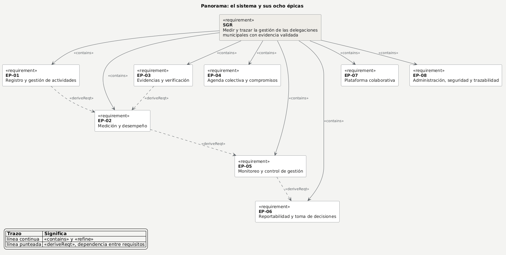
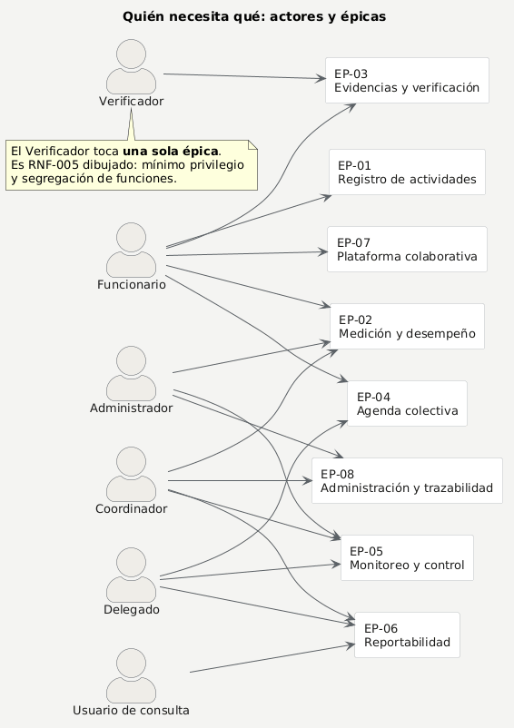
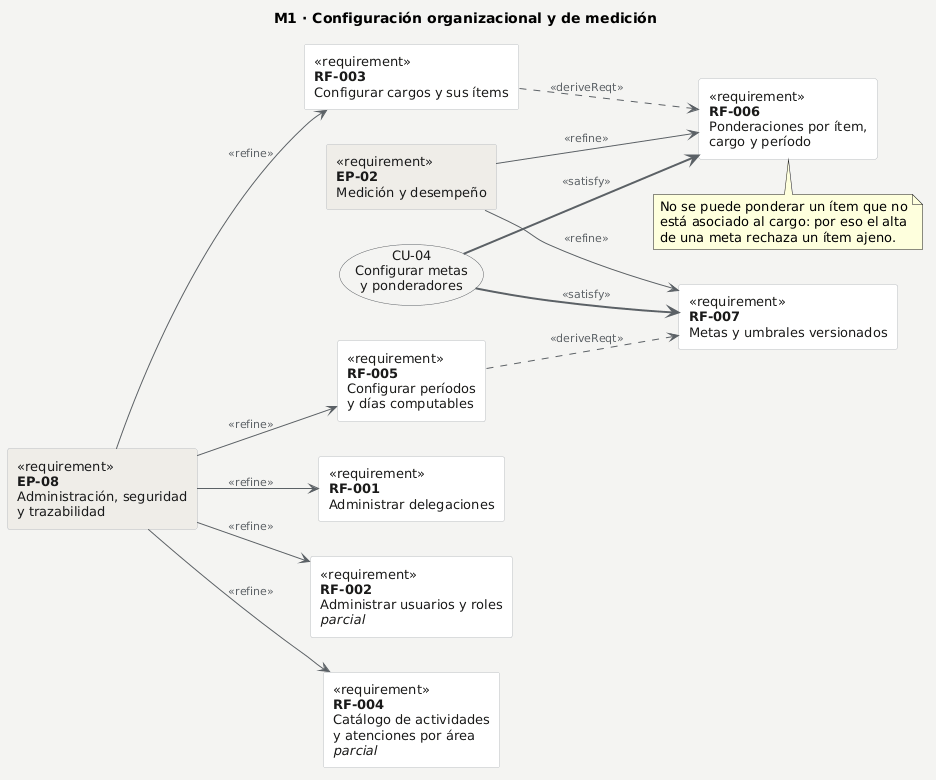
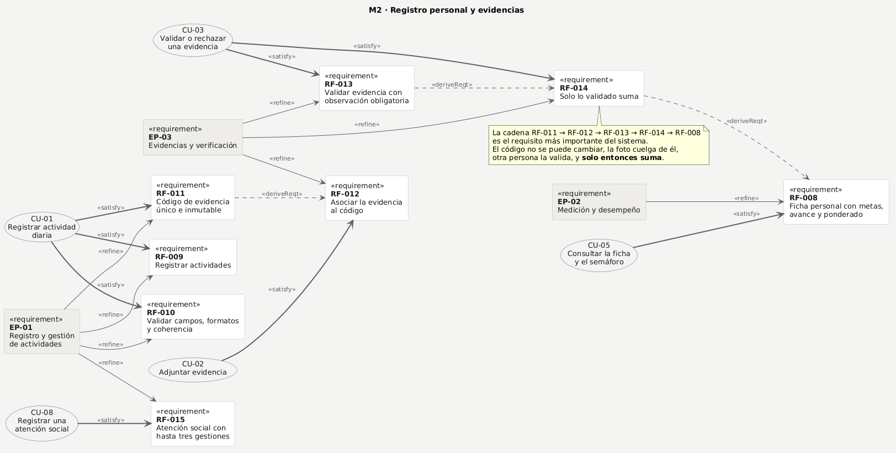
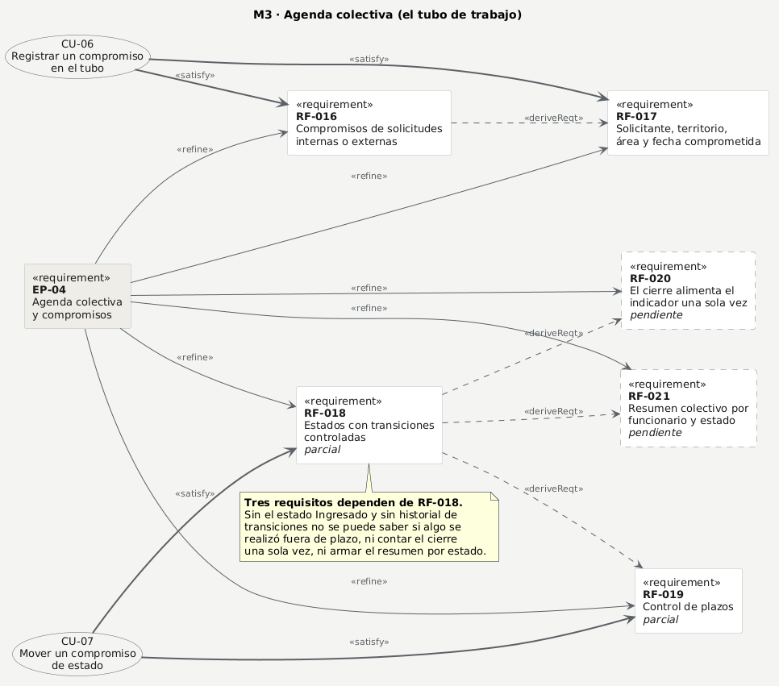
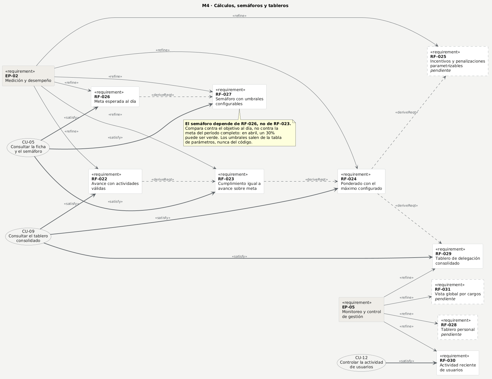
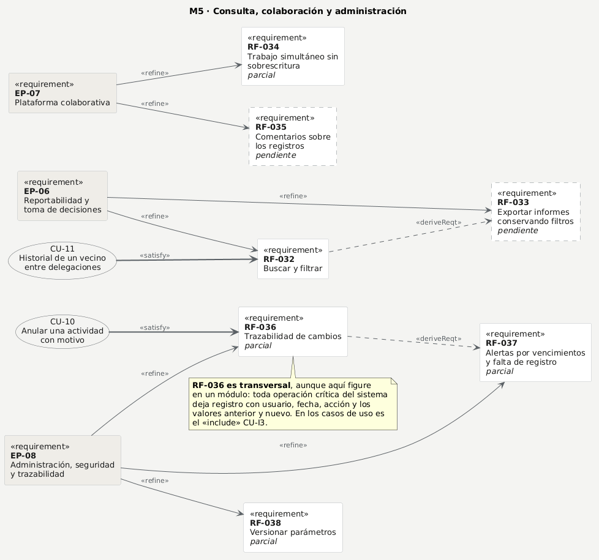
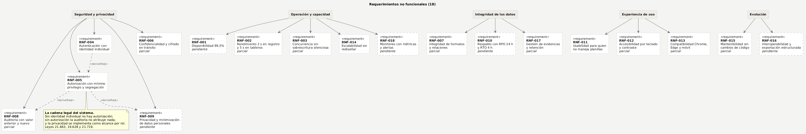

# Diagrama de requerimientos — SGR

**Criterio 2 de la rúbrica — 10 puntos.** 9 de septiembre de 2026 · Equipo Origami SpA

Los **38 requerimientos funcionales** y los **18 no funcionales** de la especificación oficial, con código único, agrupados por épica y por módulo, relacionados con sus actores y trazados hacia los casos de uso.

**La fuente es [../requerimientos-oficiales.md](../requerimientos-oficiales.md)**, que transcribe el PDF de los profesores. Aquí no se agrega ni se quita ningún requisito: se organiza y se dibuja lo que ahí está.

---

## 1. Cómo se lee

La notación es la del documento «Relación entre los artefactos»: bloques `«requirement»` con su código y su enunciado, unidos por relaciones que dicen cómo se descompone el sistema.

| Relación | Significa |
|---|---|
| `«contains»` | El de arriba **agrupa** al de abajo. El sistema contiene sus épicas |
| `«refine»` | La épica **se descompone** en un requisito más específico y verificable |
| `«deriveReqt»` | Un requisito **nace de** otro: sin el primero, el segundo no tiene sentido |
| `«satisfy»` | Un **caso de uso** cumple el requisito. Es la trazabilidad hacia las funcionalidades |

**Los estereotipos van en inglés a propósito.** Son notación de UML y SysML, no texto: por la misma razón no se traducen `+` de público ni `1..*` de cardinalidad. Y es como los muestra el documento del docente, que es la fuente que se evalúa. Todo lo demás —títulos, actores, enunciados y notas— está en español. La convención completa está en [puml/_estilo.md](puml/_estilo.md).

Y en cada bloque:

| Marca | Estado en el código |
|---|---|
| Borde continuo | **Implementado y verificado.** Son 23 RF |
| Borde continuo + *parcial* | Implementado en parte. Son 8 RF |
| **Borde punteado** + *pendiente* | **No implementado en esta iteración.** Son 7 RF |

> **Por qué aparecen los pendientes.** El diagrama de requerimientos describe **qué necesita el sistema**, no qué alcanzamos a construir. Ocultar los siete pendientes daría una imagen falsa del alcance y rompería la trazabilidad con el Product Backlog oficial, que sí los contiene. Van marcados, que es lo honesto y además lo útil: se ve de un vistazo qué queda por delante.

El enunciado completo de cada requisito está en la **tabla de trazabilidad del §12**. En los diagramas va la forma corta, para que se lean.

---

## 2. Los seis actores

Del PDF §3. La columna de la derecha es el nombre técnico del rol en el código, que no siempre coincide con el municipal.

| Actor | Qué hace | Rol en el sistema |
|---|---|---|
| **Administrador** | Configura delegaciones, usuarios, cargos, catálogos, períodos, metas, ponderaciones y permisos | `admin` |
| **Coordinador del sistema** | Supervisa la operación transversal, revisa indicadores y resuelve criterios | `supervisor` |
| **Delegado o jefatura** | Consulta su delegación, asigna y revisa compromisos | `gerente` |
| **Funcionario** | Registra actividades, compromisos, avances, contactos, servicios y evidencias | `usuario` |
| **Verificador** | Revisa evidencias, valida o rechaza y deja trazabilidad | `verificador` |
| **Usuario de consulta** | Accede a tableros e informes, sin modificar | `consulta` |

**El Verificador es un actor separado a propósito**, aunque en la práctica pueda ser la misma persona que el Coordinador: RNF-005 exige **segregación de funciones**, y de ahí sale la regla de que nadie valida su propia evidencia.

---

## 3. Los módulos y las épicas

Dos agrupaciones distintas, y las dos vienen del PDF. Conviene no confundirlas:

- **Módulo** — cómo el PDF ordena los 38 RF (§3.1 a §3.5). Es una división por **parte del sistema**.
- **Épica** — cómo el Product Backlog oficial (§7) ordena las 31 historias en 8 épicas. Es una división por **valor entregado**.

| Módulo | RF | Épicas que lo atraviesan |
|---|---|---|
| **M1 · Configuración organizacional y de medición** | RF-001 … RF-007 | EP-02, EP-08 |
| **M2 · Registro personal y evidencias** | RF-008 … RF-015 | EP-01, EP-02, EP-03 |
| **M3 · Agenda colectiva (tubo de trabajo)** | RF-016 … RF-021 | EP-04 |
| **M4 · Cálculos, semáforos y tableros** | RF-022 … RF-031 | EP-02, EP-05 |
| **M5 · Consulta, colaboración y administración** | RF-032 … RF-038 | EP-06, EP-07, EP-08 |

| Épica | Nombre | Historias |
|---|---|---|
| EP-01 | Registro y gestión de actividades | HU-01 a HU-04 |
| EP-02 | Medición y desempeño | HU-05 a HU-08 |
| EP-03 | Evidencias y verificación | HU-09 a HU-11 |
| EP-04 | Agenda colectiva y compromisos | HU-12 a HU-15 |
| EP-05 | Monitoreo y control de gestión | HU-16 a HU-19 |
| EP-06 | Reportabilidad y toma de decisiones | HU-20 a HU-22 |
| EP-07 | Plataforma colaborativa | HU-23 a HU-25 |
| EP-08 | Administración, seguridad y trazabilidad | HU-26 a HU-31 |

---

## 4. Panorama: el sistema y sus ocho épicas



> Fuente: [`puml/01-panorama.puml`](puml/01-panorama.puml) — se edita ahí y se regenera.

Las flechas continuas son `«contains»`: el sistema agrupa sus ocho épicas. **Las punteadas son las dependencias**, y son la columna vertebral del sistema: explican el orden en que se construyó.

- **EP-02 depende de EP-01 y de EP-03**: no se puede medir desempeño sin actividades registradas *y* sin evidencia validada. Es RN-009 dibujada: solo lo validado suma.
- **EP-05 depende de EP-02**: no se puede monitorear lo que todavía no se mide.
- **EP-06 depende de EP-05**: no se reporta lo que no se monitorea.

---

## 5. Quién necesita qué

Relación actor ↔ épica. Un actor aparece unido a una épica cuando **la ejecuta o la consume**, no cuando simplemente puede verla.



> Fuente: [`puml/02-actores.puml`](puml/02-actores.puml) — se edita ahí y se regenera.

**Lo que hay que mirar en este mapa** es lo que *no* está unido:

- El **Verificador toca una sola épica**. Es mínimo privilegio (RNF-005) hecho dibujo: valida evidencias y nada más. No ve el tubo, no ve fichas de vecinos, no consulta desempeño ajeno.
- El **Usuario de consulta** solo llega a EP-06, y siempre en lectura.
- **Nadie fuera de Administrador y Coordinador toca EP-08.** Ahí vive el control de actividad de usuarios (RF-030), que es un dato de desempeño de funcionarios públicos: por proporcionalidad, el acceso es restringido y queda auditado (ADR-015).

---

## 6. M1 · Configuración organizacional y de medición



> Fuente: [`puml/03-m1-configuracion.puml`](puml/03-m1-configuracion.puml) — se edita ahí y se regenera.

**Las dos dependencias que este módulo hace explícitas** son las que más se olvidan al programar:

- **RF-006 depende de RF-003**: no se puede ponderar un ítem que no está asociado al cargo. Por eso el alta de una meta rechaza un ítem que no pertenece al cargo del funcionario.
- **RF-007 depende de RF-005**: el versionado de las metas **es el período**. La meta cuelga del período, así que reconfigurar el trimestre siguiente nunca toca el cerrado (RN-013).

---

## 7. M2 · Registro personal y evidencias

Es el corazón del sistema: aquí nace el dato que después se mide.



> Fuente: [`puml/04-m2-registro-evidencias.puml`](puml/04-m2-registro-evidencias.puml) — se edita ahí y se regenera.

**La cadena `RF-011 → RF-012 → RF-013 → RF-014 → RF-008` es el requisito más importante del sistema**, y se lee así: el código se genera y no se puede cambiar; la foto cuelga de ese código; alguien distinto la valida; solo entonces suma; y recién ahí se ve en la ficha.

Romper cualquier eslabón rompe la confianza en el número final. Por eso el código lleva un *trigger* en la base que impide modificarlo, y por eso una aprobación no se revierte: se anula la actividad con motivo.

---

## 8. M3 · Agenda colectiva (el tubo de trabajo)



> Fuente: [`puml/05-m3-agenda-colectiva.puml`](puml/05-m3-agenda-colectiva.puml) — se edita ahí y se regenera.

**Tres requisitos dependen de RF-018**, y eso explica por qué es el más caro de los pendientes: sin el estado «Ingresado» y sin historial de transiciones no se puede saber si algo se realizó **fuera de plazo** (RF-019), ni contar el cierre **una sola vez** (RF-020), ni armar el resumen por estado (RF-021).

---

## 9. M4 · Cálculos, semáforos y tableros



> Fuente: [`puml/06-m4-calculos-tableros.puml`](puml/06-m4-calculos-tableros.puml) — se edita ahí y se regenera.

**Este módulo tiene una sola cadena de cálculo, y es deliberado**: `RF-022 → RF-023 → RF-024 → RF-029`. El avance se calcula **por funcionario** y la delegación es el promedio de su gente; no hay una segunda fórmula agregada por separado.

Dos consecuencias que se ven en el dibujo:

- **RF-027 depende de RF-026, no de RF-023.** El semáforo compara contra el **objetivo al día**, no contra la meta del período completo: en abril, un 30% puede ser verde. Los umbrales salen de la tabla de parámetros, nunca del código.
- **Una delegación sin nadie con metas se informa como «sin medición», no como 0%.** Un promedio de cero elementos no es cero: es indefinido, y decir 0% acusaría a una delegación de no trabajar cuando lo que falta es su configuración.

---

## 10. M5 · Consulta, colaboración y administración



> Fuente: [`puml/07-m5-consulta-administracion.puml`](puml/07-m5-consulta-administracion.puml) — se edita ahí y se regenera.

**RF-036 es transversal aunque aquí aparezca en un módulo.** Toda operación crítica de todo el sistema deja registro con usuario, fecha, acción, valor anterior y valor nuevo. En los casos de uso esto se modela como el «include» **CU-I3 Registrar en la bitácora de auditoría**, que se repite en casi todos.

**Y RF-038 es la razón de una regla del proyecto**: ningún valor de negocio se escribe en el código. Los topes, los umbrales y los días computables viven en una tabla con vigencia, porque cambiar un umbral hoy no puede alterar un trimestre ya cerrado.

---

## 11. Los 18 requerimientos no funcionales



> Fuente: [`puml/08-rnf.puml`](puml/08-rnf.puml) — se edita ahí y se regenera.

**Las tres dependencias punteadas son la cadena legal del sistema.** Trata datos personales de vecinos y datos de desempeño de funcionarios de un organismo público, así que aplican la Ley 21.663 de ciberseguridad y las Leyes 19.628 y 21.719 de protección de datos personales:

- **RNF-005 depende de RNF-004**: no hay autorización posible sin identidad individual. Nada de cuentas compartidas por delegación.
- **RNF-008 depende de RNF-005**: la auditoría solo tiene sentido si cada acción se atribuye a una persona concreta.
- **RNF-009 depende de RNF-005**: la privacidad se implementa como alcance por rol. Por eso el Verificador no ve la ficha de un vecino y el detalle de una atención de otra delegación viaja reducido.

**Cinco RNF tienen evidencia verificable hoy**, y son los que se pueden demostrar en la defensa: RNF-005 (alcance por rol en 191 comprobaciones de la API), RNF-008 (auditoría en cada write crítico), RNF-012 (83 comprobaciones de contraste), RNF-015 (los valores de negocio salen de la tabla de parámetros) y RNF-017 (formatos y tamaño máximo desde el catálogo y el parámetro).

---

## 12. Tabla de trazabilidad

Las columnas son las que muestra el ejemplo del PDF: `ID | Requerimiento | Actor | Módulo | Trazabilidad`, más el estado real en el código.

### 12.1 Requerimientos funcionales

| ID | Requerimiento | Actor | Módulo | Épica | Caso de uso | Estado |
|---|---|---|---|---|---|---|
| RF-001 | Administrar delegaciones, con alta, modificación y desactivación | Administrador | M1 | EP-08 | — | ✅ |
| RF-002 | Administrar usuarios y roles, con estado, cargo y delegación | Administrador | M1 | EP-08 | — | 🟡 |
| RF-003 | Configurar cargos y asociar a cada uno los ítems que se le miden | Administrador | M1 | EP-08 | — | ✅ |
| RF-004 | Catálogo de actividades, servicios, atenciones y subatenciones por área | Administrador | M1 | EP-08 | CU-06, CU-08 | 🟡 |
| RF-005 | Configurar períodos con inicio, término, estado y días computables | Administrador | M1 | EP-08 | — | ✅ |
| RF-006 | Configurar ponderaciones por ítem, cargo y período | Administrador · Coordinador | M1 | EP-02 | **CU-04** | ✅ |
| RF-007 | Configurar metas y umbrales versionados, que rigen desde el período | Administrador · Coordinador | M1 | EP-02 | **CU-04** | ✅ |
| RF-008 | Ficha personal con funcionario, cargo, delegación, ítems, metas y avance | Funcionario | M2 | EP-02 | **CU-05** | ✅ |
| RF-009 | Registrar actividades con fecha, acción, contacto, ítem e ingreso al tubo | Funcionario | M2 | EP-01 | **CU-01** | ✅ |
| RF-010 | Validar campos en obligatoriedad, formato y coherencia | Funcionario | M2 | EP-01 | **CU-01**, CU-I1 | ✅ |
| RF-011 | Generar un código de evidencia único e inmutable | Funcionario · Sistema | M2 | EP-01 | **CU-01**, CU-I2 | ✅ |
| RF-012 | Asociar la evidencia fotográfica al código, con fecha y autor de carga | Funcionario | M2 | EP-03 | **CU-02** | ✅ |
| RF-013 | Validar la evidencia aprobando, rechazando o pidiendo corrección | Verificador | M2 | EP-03 | **CU-03**, CU-E2 | ✅ |
| RF-014 | Solo lo validado suma al avance | Sistema | M2 | EP-03 | **CU-03** | ✅ |
| RF-015 | Atención social con hasta tres gestiones para la misma persona | Funcionario | M2 | EP-01 | **CU-08** | ✅ |
| RF-016 | Crear compromisos derivados de solicitudes internas o externas | Funcionario · Delegado | M3 | EP-04 | **CU-06** | ✅ |
| RF-017 | Asignar solicitante, territorio, responsable, área y fecha comprometida | Funcionario · Delegado | M3 | EP-04 | **CU-06** | ✅ |
| RF-018 | Estados Ingresado, Pendiente, En proceso y Realizado, controlados | Funcionario · Delegado | M3 | EP-04 | **CU-07** | 🟡 |
| RF-019 | Controlar plazos con próximos a vencer, vencidos y fuera de plazo | Delegado | M3 | EP-04 | **CU-07** | 🟡 |
| RF-020 | El cierre de un compromiso alimenta el indicador una sola vez | Sistema | M3 | EP-04 | — | ⬜ |
| RF-021 | Resumen colectivo por funcionario y estado, con porcentaje realizado | Delegado | M3 | EP-04 | — | ⬜ |
| RF-022 | Calcular avance con actividades válidas por ítem, funcionario y período | Sistema | M4 | EP-02 | **CU-09** | ✅ |
| RF-023 | Porcentaje de cumplimiento igual a avance dividido por meta | Sistema | M4 | EP-02 | **CU-05** | ✅ |
| RF-024 | Cumplimiento ponderado respetando el máximo configurado | Sistema | M4 | EP-02 | **CU-09** | ✅ |
| RF-025 | Incentivos y penalizaciones parametrizables por felicitación o reclamo | Coordinador | M4 | EP-02 | — | ⬜ |
| RF-026 | Meta esperada al día según días transcurridos y duración del período | Sistema | M4 | EP-02 | **CU-05** | ✅ |
| RF-027 | Semáforo verde, ámbar y rojo con umbrales configurables | Sistema | M4 | EP-02 | **CU-05**, CU-E6 | ✅ |
| RF-028 | Tablero personal con metas, avance, evidencias y compromisos | Funcionario | M4 | EP-05 | — | ⬜ |
| RF-029 | Tablero de delegación consolidado | Delegado · Consulta | M4 | EP-05 | **CU-09**, CU-E6 | ✅ |
| RF-030 | Actividad reciente con último ingreso, días sin ingreso y promedio | Administrador · Coordinador | M4 | EP-05 | **CU-12**, CU-E5 | ✅ |
| RF-031 | Vista global por cargos | Coordinador | M4 | EP-05 | — | ⬜ |
| RF-032 | Buscar y filtrar por delegación, área, funcionario, cargo, período y fechas | Todos | M5 | EP-06 | **CU-11**, CU-E1 | ✅ |
| RF-033 | Generar y exportar informes conservando filtros y encabezados | Usuario de consulta | M5 | EP-06 | — | ⬜ |
| RF-034 | Trabajo simultáneo sin sobrescritura silenciosa | Sistema | M5 | EP-07 | **CU-07**, CU-E4 | 🟡 |
| RF-035 | Comentarios y observaciones asociados a los registros | Funcionario | M5 | EP-07 | — | ⬜ |
| RF-036 | Trazabilidad de altas, modificaciones, validaciones y cambios de estado | Sistema | M5 | EP-08 | **CU-10**, CU-I3 | 🟡 |
| RF-037 | Alertas por vencimientos, evidencias pendientes y falta de registros | Sistema | M5 | EP-08 | — | 🟡 |
| RF-038 | Versionar parámetros, sin alterar los períodos cerrados | Administrador | M5 | EP-08 | — | 🟡 |

**38 RF — 23 ✅ implementados y verificados · 8 🟡 parciales · 7 ⬜ pendientes.**

### 12.2 Requerimientos no funcionales

| ID | Atributo | Exigencia | Se verifica en | Estado |
|---|---|---|---|---|
| RNF-001 | Disponibilidad | 99,5% mensual, con registro de indisponibilidades | Fase de despliegue | ⬜ |
| RNF-002 | Rendimiento | Registro y consulta ≤ 2 s, tableros ≤ 5 s | Pruebas de carga, pendientes | 🟡 |
| RNF-003 | Concurrencia | Sin pérdida, duplicación ni sobrescritura silenciosa | Bloqueo optimista con conflicto explícito | 🟡 |
| RNF-004 | Autenticación | Identidad individual | Contraseña cifrada y sesión por persona | ✅ |
| RNF-005 | Autorización | Rol, delegación y operación, con mínimo privilegio | **191 comprobaciones de alcance por rol** | ✅ |
| RNF-006 | Confidencialidad | Cifrado en tránsito y protección de evidencias | Fase de despliegue | 🟡 |
| RNF-007 | Integridad | Formatos, relaciones, duplicados y concurrencia | Restricciones en la base de datos | 🟡 |
| RNF-008 | Auditoría | Usuario, fecha, origen, acción y valores anterior y nuevo | **Registro en cada operación crítica** | 🟡 |
| RNF-009 | Privacidad | Minimizar datos personales y definir conservación | Alcance por rol, documentado como decisión legal | ⬜ |
| RNF-010 | Respaldo | RPO 24 h, RTO 4 h | Fase de despliegue | ⬜ |
| RNF-011 | Usabilidad | Etiquetas comprensibles y validación contextual | Revisión con las seis cuentas de prueba | ✅ |
| RNF-012 | Accesibilidad | Teclado, contraste y textos alternativos | **83 comprobaciones de contraste** | 🟡 |
| RNF-013 | Compatibilidad | Chrome y Edge, escritorio y móvil | Falta la prueba explícita en Edge | 🟡 |
| RNF-014 | Escalabilidad | Nuevas delegaciones, cargos y períodos sin rediseñar | Arquitectura multi-organización | ✅ |
| RNF-015 | Mantenibilidad | Metas, estados, catálogos y umbrales sin tocar código | **Los valores salen de la tabla de parámetros** | 🟡 |
| RNF-016 | Interoperabilidad | Exportación estructurada e integración futura | Depende de RF-033 | ⬜ |
| RNF-017 | Gestión de evidencias | Formatos, tamaño, metadatos, acceso y retención | Formatos y tamaño desde catálogo y parámetro | 🟡 |
| RNF-018 | Monitoreo | Métricas y alertas sobre errores y capacidad | Fase de despliegue | ⬜ |

**18 RNF — 4 ✅ · 9 🟡 · 5 ⬜.** El antivirus de RNF-017 queda **declarado fuera de alcance** por la restricción de costo cero del proyecto.

---

## 13. Qué queda fuera de esta iteración, y por qué

Los siete RF pendientes no son olvidos: son una decisión de alcance tomada para llegar con lo esencial construido y verificado.

| RF | Por qué queda fuera |
|---|---|
| RF-020, RF-021 | Dependen de RF-018, que necesita el estado «Ingresado» y el historial de transiciones. Es un cambio de modelo, no una pantalla |
| RF-025 | La entidad existe en el modelo de datos, sin API. Afecta al cálculo, y el cálculo debía estabilizarse primero |
| RF-028 | La ficha personal ya entrega lo esencial. El tablero personal es presentación sobre datos que ya se calculan |
| RF-031 | El consolidado ya agrupa por área del cargo; la vista por cargos es un corte más del mismo motor |
| RF-033 | Exportación. No aporta a la evaluación de análisis y diseño y sí consume tiempo de formato |
| RF-035 | La entidad existe en el modelo, sin API |

Ninguno de los siete está en el **alcance mínimo exigido** del PDF §13.2.

---

## 14. Consistencia con los demás artefactos

La rúbrica evalúa la coherencia entre artefactos como criterio transversal. Estas son las correspondencias que hay que poder defender:

| Este diagrama dice | Y tiene que coincidir con |
|---|---|
| Seis actores | Los seis del caso de uso general |
| Cada RF con su caso de uso | La tabla de trazabilidad del informe y las 12 fichas |
| «Solo lo validado suma» (RF-014) | El flujo principal de CU-03 y la clase del motor de cumplimiento |
| «Código único e inmutable» (RF-011) | La restricción de la entidad de evidencia en el DER y en el script |
| Los siete pendientes | Las tareas marcadas «Pendiente» en el Planner |

---

## 15. Cómo se regenera

**La fuente de cada diagrama es su archivo `.puml`** en [puml/](puml/). Los PNG se generan desde ahí y **nunca se editan a mano**. Hay dos formas, y dan lo mismo:

**A mano**, que es lo más simple: abrir el enlace «Abrir en plantuml.com» del [índice de puml/](puml/README.md), que lleva el diagrama ya cargado en el editor, y exportar el PNG. También sirve pegar el contenido del `.puml`.

**Con el script**, que además comprueba que los ocho compilan:

```powershell
cd frontend
npm run puml -- ../docs/entrega/puml          # comprueba y actualiza los enlaces
npm run puml -- ../docs/entrega/puml --png    # además descarga los PNG
```

Sin `--png` el script no toca la red: el enlace se calcula localmente. Con `--png` usa el servidor público de PlantUML, que es gratuito. Los diagramas no llevan ningún dato personal.

Los `.png` hacen falta porque en Planner se adjuntan archivos, y porque el docente pidió que el trabajo se vea también en GitHub, donde Markdown no ejecuta diagramas.

> **Por qué PlantUML y no mermaid.** Estos diagramas se dibujaron primero en mermaid y se rehicieron. Su `requirementDiagram` tiene dos límites que chocan con la exigencia de legibilidad de la rúbrica: los valores de `id`, `type` y `docref` **no admiten guiones sin comillas** (hay que escribir `id: "RF-001"`), y el texto se parte **cada 30 caracteres cortando palabras a la mitad**, sin importar el ancho de la caja. PlantUML deja controlar el salto de línea, el estilo del borde y las notas, y su notación `«requirement»` es exactamente la del ejemplo del docente.
>
> Además, es la herramienta que el equipo ya usa: el resto de la entrega —casos de uso con `«include»` y `«extend»`, diagrama de clases con visibilidad, DER— sale del mismo lugar.
