# Mockups de las pantallas — SGR

**Generados desde la aplicación real corriendo**, con `node scripts/mockups.mjs` (en `frontend/`). No son dibujos: son la aplicación, congelada.

Son **dos familias**, porque la [rúbrica §6](../rubrica-entrega-15-septiembre.md) pide las dos —«los mockups deben representar las pantallas necesarias para ejecutar los casos de uso **y también contemplar los escenarios alternativos modelados**»—:

| Familia | Cuáles | Qué muestran |
|---|---|---|
| **Camino feliz** | `01` a `08` | Cada pantalla tal como se abre |
| **Escenarios alternativos** | `09` a `17` | Los `«include»` y `«extend»` de [casos-uso-general.md §7 y §8](../entrega/casos-uso-general.md). El mapa CU → mockup está en su [§8.1](../entrega/casos-uso-general.md) |

Cada pantalla está dos veces, y cada formato sirve para una cosa distinta:

| Formato | Para qué |
|---|---|
| **`.html`** | Se adjunta a la tarea de Planner. Se abre con doble clic —sin instalar nada, sin servidor, sin base de datos y sin internet— y se ve exactamente como la aplicación. |
| **`.png`** | Para que la pantalla **se vea en GitHub**: Markdown muestra imágenes, pero no ejecuta HTML. Son las que aparecen más abajo. |

> Los `.html` son **estáticos**: los botones no responden. Es una fotografía navegable, no la aplicación. Cada uno lo dice en una franja al pie, para que nadie crea que algo está roto.

**Todos los datos son ficticios** (regla 12 del proyecto). Las imágenes de evidencia son ilustraciones sintéticas generadas por el seed (`backend/prisma/imagen-demo.ts`), no fotografías.

## Cómo se regeneran

```powershell
# con el backend en :4000 y el frontend en :5173
cd frontend
node scripts/mockups.mjs           # .html + .png de las diecisiete pantallas
node scripts/verificar-mockups.mjs # los abre desde file:// con la red bloqueada
```

`verificar-mockups.mjs` es la prueba del entregable: comprueba que cada archivo lleva su CSS dentro, que no queda ningún `<script>`, que todas las imágenes cargan y que la barra conserva el rojo heráldico **sin conexión a internet**. Si un mockup dependiera de algo externo, ahí se cae.

---

## 1. Ingreso al sistema

La identidad se juega aquí: el Faro Monumental de La Serena, la frase del producto y el formulario sobre superficie sólida. El faro gira e ilumina el mar (el `.html` conserva la animación; el `.png` es un instante).

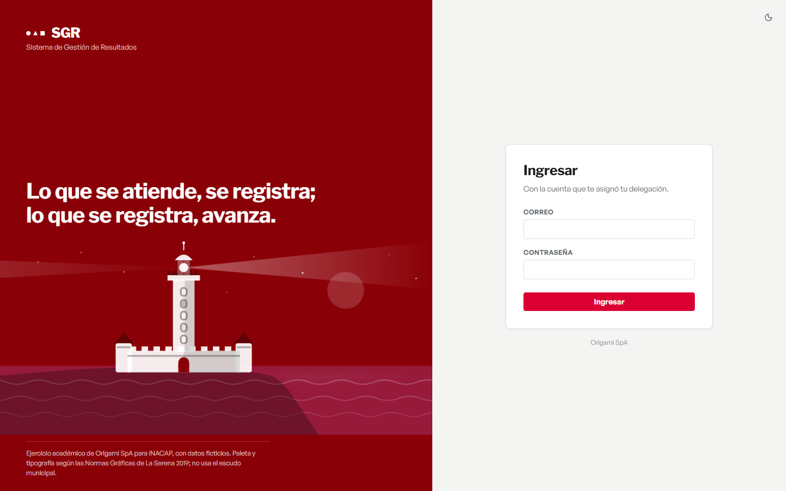

## 2. Tubo de trabajo

La agenda colectiva de la delegación (EP-04). Tablero kanban con arrastre, tiempo real y presencia. **El libro de cada delegación es privado de su equipo.**

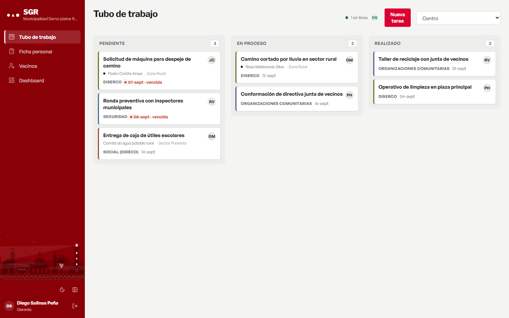

## 3. Ficha personal — la pantalla más importante

Donde cada funcionario ve su medición y registra su trabajo (RF-008). Cabecera con el semáforo, tabla de ítems medidos y el registro del día a día. Una actividad **solo suma cuando su evidencia está validada** (RN-009).

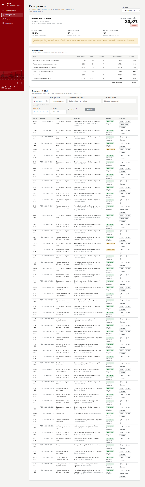

## 4. Bandeja del verificador

La cola de evidencias por revisar (RF-013, HU-11): foto grande, tres decisiones equidistantes y atajos de teclado. **Nadie valida su propia evidencia** (RNF-005).

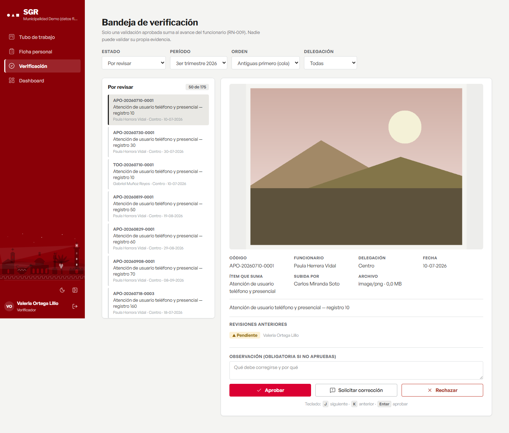

## 5. Configuración de metas

Qué se le mide a cada persona y con qué peso (RF-006, RF-007). El totalizador de RN-001 está siempre visible: la suma debe cuadrar en 100% **antes** de guardar, no al guardar.

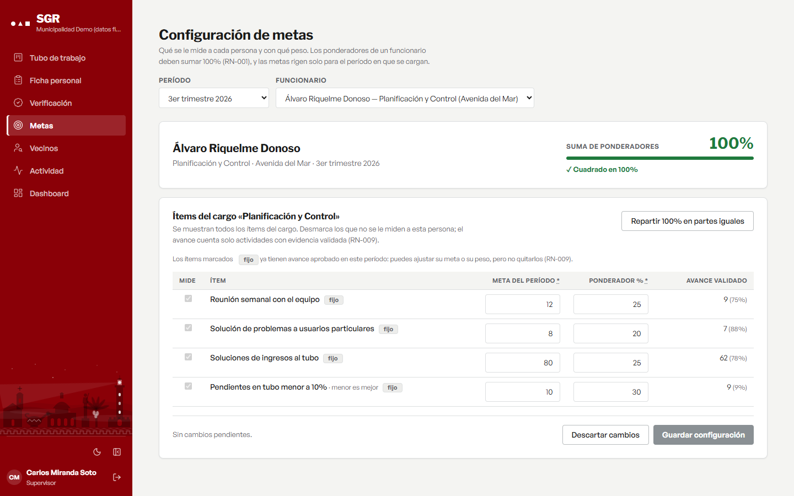

## 6. Ficha del vecino — el control que el cliente vino a buscar

El caso real: un niño pidió el mismo regalo de Navidad en cinco delegaciones y el sistema no lo detectaba. Aquí se busca a la persona por RUT o por nombre y se ve su historial **cruzando delegaciones**, con un aviso ámbar cuando hay atenciones del mismo tipo en distintas delegaciones dentro de una ventana configurable (ADR-008, CA-04). El aviso **informa; no bloquea ni acusa**.

Es la pantalla con más datos personales del sistema, así que dice en voz alta lo que no muestra: para un funcionario, una atención de otra delegación aparece con su fecha, su delegación y su tipo, y el detalle queda reservado (ADR-012, Leyes 19.628 y 21.719).

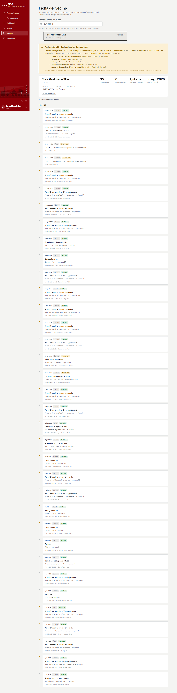

## 7. Tablero de control

Semáforo por delegación, avance por **área del cargo**, proyección al cierre y detalle (EP-05). Desde el Bloque C consolida el motor por funcionario: la delegación es el promedio de su gente y una delegación sin nadie con metas se informa como **sin medición**, no como 0% (ADR-014). Los gráficos leen los tokens vivos, así que siguen el tema claro/oscuro solos.

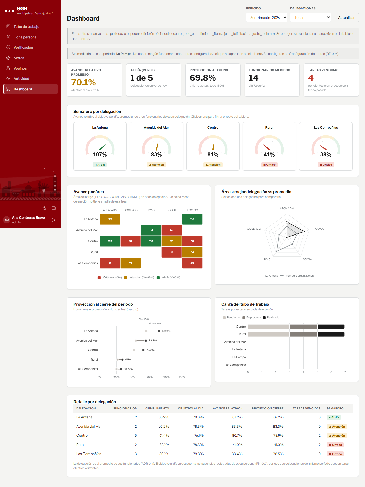

## 8. Control de actividad

Lo que el docente pidió en clase (RF-030, HU-19): quién registró trabajo, **quién no** y quién está en la plataforma ahora. Lo ven solo el administrador y el coordinador.

La tabla se ordena por **quien necesita atención primero**, no alfabéticamente, y separa lo *registrado* de lo *validado*: quien subió cuarenta actividades que esperan al verificador sí está registrando. La conexión en vivo es un punto y nada más —sin minutos acumulados ni historial de sesiones—, y la finalidad del panel está escrita en la propia pantalla: acompañar a quien se está quedando atrás, no vigilar (ADR-015, Leyes 19.628 y 21.719).

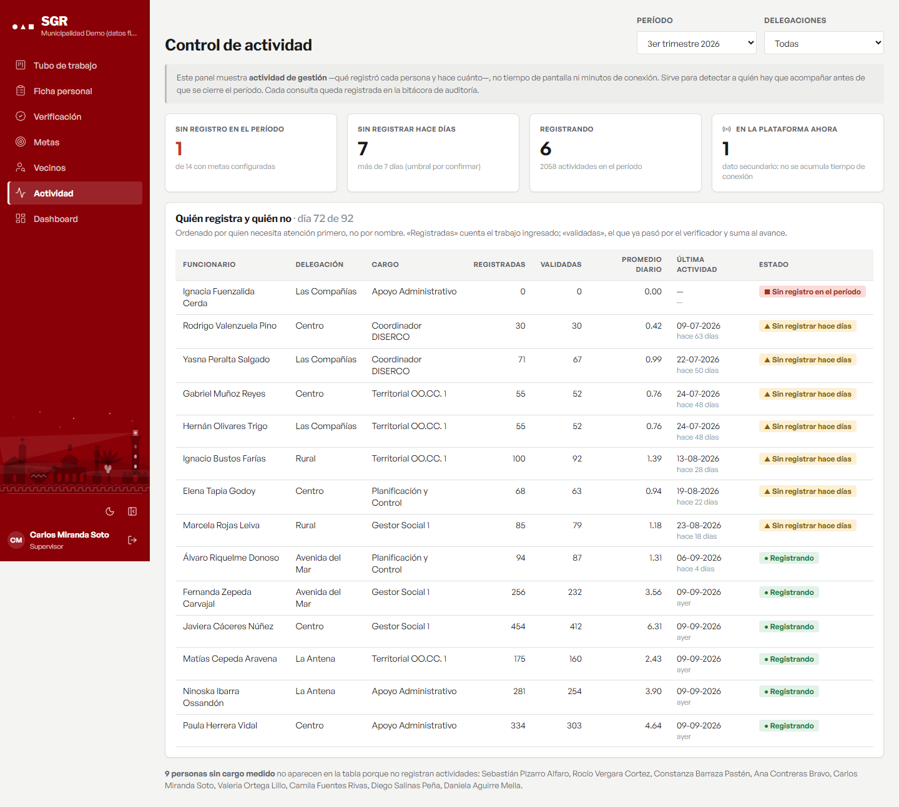

---

# Los escenarios alternativos

Lo que pasa **cuando algo no va por el camino feliz**: el dato mal escrito, la decisión sin justificar, el permiso que no alcanza, los dos que guardan a la vez. Cada uno corresponde a un `«include»` o un `«extend»` del [caso de uso general](../entrega/casos-uso-general.md), y su casilla del mapa está en el §8.1 de ese documento.

**No están simulados.** El script abre la pantalla con la cuenta que corresponde y **opera la aplicación**: escribe en el campo, sale de él, aprieta el botón. Donde hace falta una segunda persona —el conflicto de versión— abre una segunda sesión contra la API que guarda primero. Si en la imagen se lee un 403 o un 409, es porque el servidor lo devolvió.

Estos PNG van **recortados a una franja** alrededor del mensaje, no a la página entera: un aviso de campo obligatorio dentro de una ficha de 9.000 px de alto es ilegible en GitHub, y el aviso *es* el entregable. El `.html` sigue trayendo la pantalla completa.

## 9. CU-I1 · Validar los datos del registro

Los dos controles de RF-010 a la vez. El **formato** se avisa al salir del campo, no al enviar (DESIGN §8.2): quien escribe se entera donde se equivocó, no tres campos después. La **obligatoriedad** mantiene el botón Registrar deshabilitado mientras falte «Actividad o solicitud», que es la única forma de no ofrecer una acción que va a fallar.

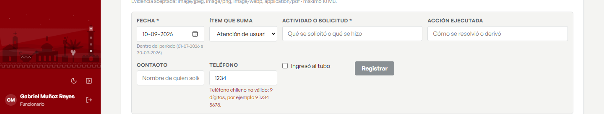

## 10. CU-E1 · Aviso de posible atención duplicada

El control que el cliente vino a buscar (ADR-008, CA-04). **Informa; no bloquea ni acusa**: puede ser perfectamente correcto que dos delegaciones atiendan a la misma persona. La ventana de comparación se declara **provisional** en la propia pantalla, porque su valor todavía espera respuesta del docente (consulta abierta nº 12) y fingir que está definido sería peor que decirlo.

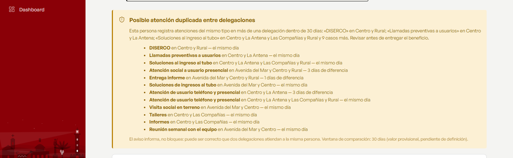

## 11. CU-E2 · Exigir observación de la decisión

Rechazar sin decir por qué no es trazabilidad (RF-013, CA-02). El aviso se arma en el cliente y el foco vuelve al campo: el backend lo exige igual, pero avisar antes ahorra el viaje al servidor.

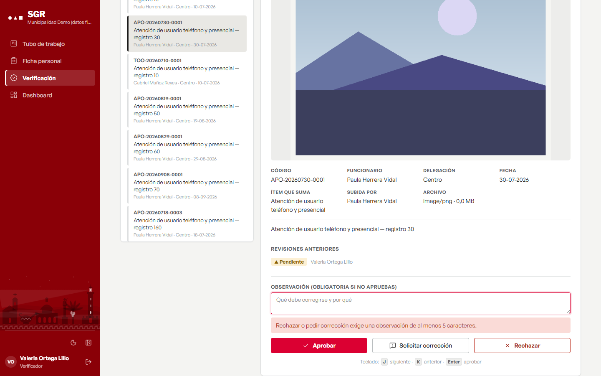

## 12. CU-E3 · Rechazar la validación propia

**Segregación de funciones (RNF-005)**: nadie valida lo suyo, aunque su rol se lo permita. Es la garantía de que el «1» que suma al puntaje lo pone otra persona. Acá el coordinador subió la evidencia —lo dice «Subida por»— y el servidor le responde 403 con la regla escrita.

> Este caso está **armado a propósito en el seed**, como La Pampa sin medición. Las tres cuentas que validan no tienen cargo, así que ninguna de las evidencias sembradas les pertenecía y la regla quedaba sin poder demostrarse.

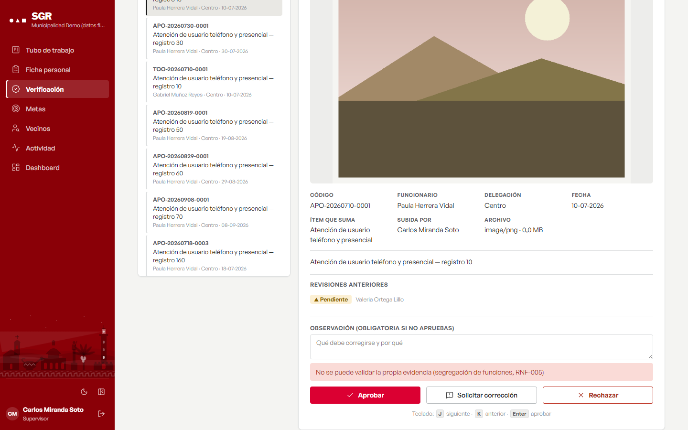

## 13. CU-E4 · Informar conflicto de versión

El **409** de RF-034 y CA-08: alguien guardó primero y lo escrito no se sobrescribe **ni se revierte en silencio**. La pantalla lo dice y ofrece ver lo vigente. La segunda sesión escribió los mismos valores, así que lo único que cambió fue la versión: el conflicto es real y el dato del vecino queda intacto.

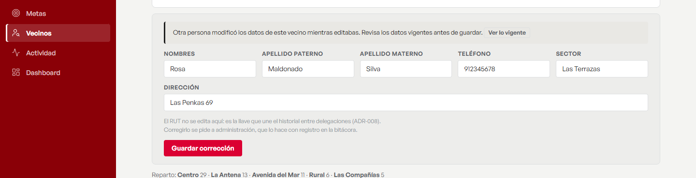

## 14 y 15. CU-E5 · Denegar por alcance, con el motivo escrito

Dos veces el mismo escenario, desde los dos lados. **Un «sin permisos» a secas se lee como una falla del sistema**; acá el 403 llega con su motivo redactado, porque el alcance de estos datos es una decisión legal y no de interfaz (ADR-012, ADR-015, Leyes 19.628 y 21.719).

El verificador no accede a la ficha del vecino: valida evidencias, no necesita la identidad de nadie (RNF-005).


Y el panel de actividad lo ven solo el administrador y el coordinador. A un funcionario le responde 403 y la pantalla muestra **ese** texto, no uno inventado por la interfaz.


## 16. CU-E6 · Informar delegación sin medición

Una delegación sin nadie con metas **no cumple 0%: no tiene medición** (ADR-014). Un 0% diría que trabajaron y no cumplieron; la verdad es que no hay nada que medir. Se dice cuál es y dónde se corrige.

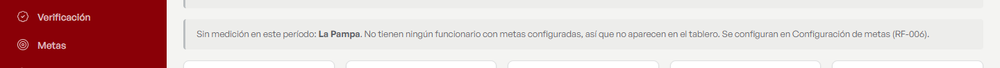

## 17. ADR-012 · Alcance reducido entre delegaciones

No es uno de los nueve escenarios modelados, pero es el mismo tipo y sale de la misma decisión legal. Para un delegado, la atención de otra delegación aparece con su fecha, su delegación y su tipo, y el detalle queda reservado: **el libro de cada delegación es privado, y la trazabilidad del vecino no lo abre**.

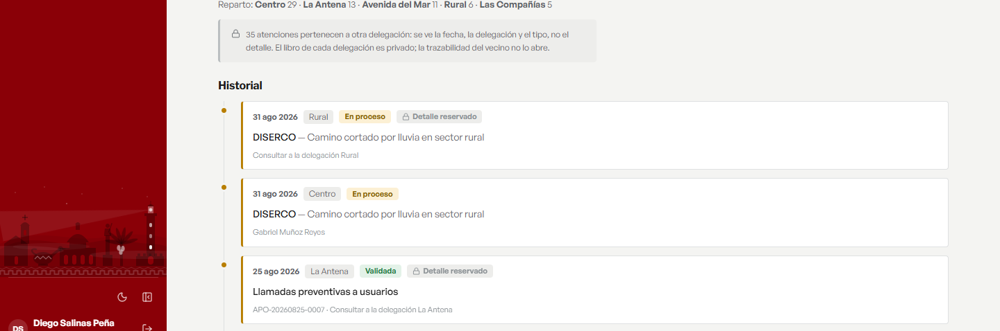

---

Los diagramas del sistema (contexto, casos de uso, ERD y secuencia) están en [../diagramas/](../diagramas/), también en PNG para adjuntar.
