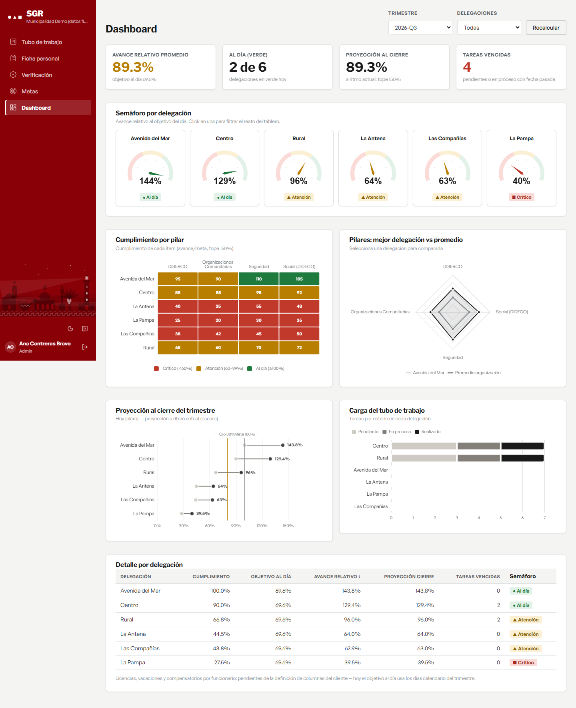

# Mockups de las pantallas — SGR

**Generados el 2 de septiembre de 2026** desde la aplicación real corriendo, con `node scripts/mockups.mjs` (en `frontend/`). No son dibujos: son la aplicación, congelada.

Cada pantalla está dos veces, y cada formato sirve para una cosa distinta:

| Formato | Para qué |
|---|---|
| **`.html`** | Se adjunta a la tarea de Planner. Se abre con doble clic —sin instalar nada, sin servidor, sin base de datos y sin internet— y se ve exactamente como la aplicación. |
| **`.png`** | Para que la pantalla **se vea en GitHub**: Markdown muestra imágenes, pero no ejecuta HTML. Son las que aparecen más abajo. |

> Los `.html` son **estáticos**: los botones no responden. Es una fotografía navegable, no la aplicación. Cada uno lo dice en una franja al pie, para que nadie crea que algo está roto.

**Todos los datos son ficticios** (regla 12 del proyecto). Las imágenes de evidencia son ilustraciones sintéticas generadas por el seed (`backend/prisma/imagen-demo.ts`), no fotografías.

## Cómo se regeneran

```powershell
# con el backend en :4000 y el frontend en :5173
cd frontend
node scripts/mockups.mjs           # .html + .png de las seis pantallas
node scripts/verificar-mockups.mjs # los abre desde file:// con la red bloqueada
```

`verificar-mockups.mjs` es la prueba del entregable: comprueba que cada archivo lleva su CSS dentro, que no queda ningún `<script>`, que todas las imágenes cargan y que la barra conserva el rojo heráldico **sin conexión a internet**. Si un mockup dependiera de algo externo, ahí se cae.

---

## 1. Ingreso al sistema

La identidad se juega aquí: el Faro Monumental de La Serena, la frase del producto y el formulario sobre superficie sólida. El faro gira e ilumina el mar (el `.html` conserva la animación; el `.png` es un instante).


## 2. Tubo de trabajo

La agenda colectiva de la delegación (EP-04). Tablero kanban con arrastre, tiempo real y presencia. **El libro de cada delegación es privado de su equipo.**


## 3. Ficha personal — la pantalla más importante

Donde cada funcionario ve su medición y registra su trabajo (RF-008). Cabecera con el semáforo, tabla de ítems medidos y el registro del día a día. Una actividad **solo suma cuando su evidencia está validada** (RN-009).


## 4. Bandeja del verificador

La cola de evidencias por revisar (RF-013, HU-11): foto grande, tres decisiones equidistantes y atajos de teclado. **Nadie valida su propia evidencia** (RNF-005).


## 5. Configuración de metas

Qué se le mide a cada persona y con qué peso (RF-006, RF-007). El totalizador de RN-001 está siempre visible: la suma debe cuadrar en 100% **antes** de guardar, no al guardar.


## 6. Tablero de control

Semáforo por delegación, cumplimiento por pilar, proyección al cierre y detalle (EP-05). Los gráficos leen los tokens vivos, así que siguen el tema claro/oscuro solos.



---

Los diagramas del sistema (contexto, casos de uso, ERD y secuencia) están en [../diagramas/](../diagramas/), también en PNG para adjuntar.
